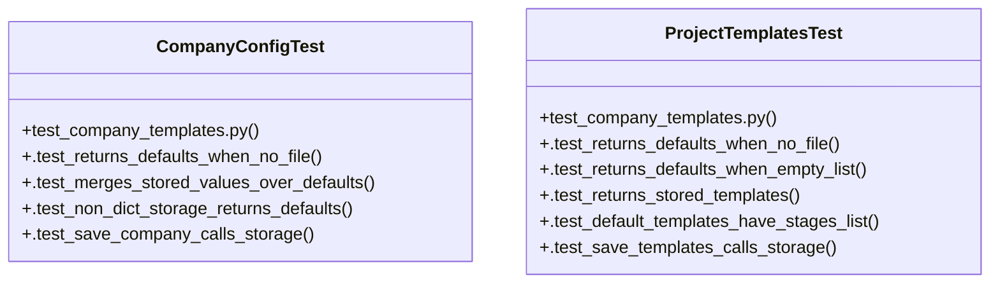

# Community 0

> 156 nodes · cohesion 0.03

## Key Concepts

- [load()](file:///Users/macbook/ProjectTracker/tracker/storage.py#L37) (114 connections)
- [save()](file:///Users/macbook/ProjectTracker/tracker/storage.py#L46) (74 connections)
- [admin.py](file:///Users/macbook/ProjectTracker/tracker/routes/admin.py#L1) (67 connections)
- [today()](file:///Users/macbook/ProjectTracker/tracker/storage.py#L63) (53 connections)
- [projects.py](file:///Users/macbook/ProjectTracker/tracker/routes/projects.py#L1) (26 connections)
- [storage.py](file:///Users/macbook/ProjectTracker/tracker/storage.py#L1) (22 connections)
- [__init__.py](file:///Users/macbook/ProjectTracker/tracker/__init__.py#L1) (18 connections)
- [new_id()](file:///Users/macbook/ProjectTracker/tracker/storage.py#L59) (16 connections)
- [quotes_mobile.py](file:///Users/macbook/ProjectTracker/tracker/routes/quotes_mobile.py#L1) (16 connections)
- [deletions.py](file:///Users/macbook/ProjectTracker/tracker/deletions.py#L1) (12 connections)
- [add_bundle_version_route()](file:///Users/macbook/ProjectTracker/tracker/routes/admin.py#L527) (11 connections)
- [bundles()](file:///Users/macbook/ProjectTracker/tracker/routes/admin.py#L442) (10 connections)
- [mobile_generate_pdf()](file:///Users/macbook/ProjectTracker/tracker/routes/quotes_mobile.py#L166) (10 connections)
- [catalogo()](file:///Users/macbook/ProjectTracker/tracker/routes/admin.py#L175) (9 connections)
- [update_bundle_version()](file:///Users/macbook/ProjectTracker/tracker/routes/admin.py#L505) (9 connections)
- [fichas()](file:///Users/macbook/ProjectTracker/tracker/routes/admin.py#L647) (8 connections)
- [proveedores()](file:///Users/macbook/ProjectTracker/tracker/routes/admin.py#L584) (8 connections)
- [team()](file:///Users/macbook/ProjectTracker/tracker/routes/admin.py#L722) (8 connections)
- [create_app()](file:///Users/macbook/ProjectTracker/tracker/__init__.py#L47) (8 connections)
- [get_project_templates()](file:///Users/macbook/ProjectTracker/tracker/templates_config.py#L17) (8 connections)
- [catalog_search.py](file:///Users/macbook/ProjectTracker/tracker/catalog_search.py#L1) (8 connections)
- [update_bundle()](file:///Users/macbook/ProjectTracker/tracker/routes/admin.py#L472) (7 connections)
- [_normalize()](file:///Users/macbook/ProjectTracker/tracker/catalog_search.py#L25) (7 connections)
- [get_company()](file:///Users/macbook/ProjectTracker/tracker/company_config.py#L15) (7 connections)
- [new_project()](file:///Users/macbook/ProjectTracker/tracker/routes/projects.py#L70) (7 connections)
- *... and 131 more nodes in this community*

## Class Diagram

## Relationships

- No strong cross-community connections detected

## Source Files

- [/Users/macbook/ProjectTracker/tests/test_avance_routes.py](file:///Users/macbook/ProjectTracker/tests/test_avance_routes.py)
- [/Users/macbook/ProjectTracker/tests/test_company_templates.py](file:///Users/macbook/ProjectTracker/tests/test_company_templates.py)
- [/Users/macbook/ProjectTracker/tests/test_deletions.py](file:///Users/macbook/ProjectTracker/tests/test_deletions.py)
- [/Users/macbook/ProjectTracker/tracker/__init__.py](file:///Users/macbook/ProjectTracker/tracker/__init__.py)
- [/Users/macbook/ProjectTracker/tracker/catalog.py](file:///Users/macbook/ProjectTracker/tracker/catalog.py)
- [/Users/macbook/ProjectTracker/tracker/catalog_search.py](file:///Users/macbook/ProjectTracker/tracker/catalog_search.py)
- [/Users/macbook/ProjectTracker/tracker/company_config.py](file:///Users/macbook/ProjectTracker/tracker/company_config.py)
- [/Users/macbook/ProjectTracker/tracker/deletions.py](file:///Users/macbook/ProjectTracker/tracker/deletions.py)
- [/Users/macbook/ProjectTracker/tracker/domain.py](file:///Users/macbook/ProjectTracker/tracker/domain.py)
- [/Users/macbook/ProjectTracker/tracker/extensions.py](file:///Users/macbook/ProjectTracker/tracker/extensions.py)
- [/Users/macbook/ProjectTracker/tracker/routes/admin.py](file:///Users/macbook/ProjectTracker/tracker/routes/admin.py)
- [/Users/macbook/ProjectTracker/tracker/routes/materials.py](file:///Users/macbook/ProjectTracker/tracker/routes/materials.py)
- [/Users/macbook/ProjectTracker/tracker/routes/projects.py](file:///Users/macbook/ProjectTracker/tracker/routes/projects.py)
- [/Users/macbook/ProjectTracker/tracker/routes/quotes.py](file:///Users/macbook/ProjectTracker/tracker/routes/quotes.py)
- [/Users/macbook/ProjectTracker/tracker/routes/quotes_mobile.py](file:///Users/macbook/ProjectTracker/tracker/routes/quotes_mobile.py)
- [/Users/macbook/ProjectTracker/tracker/storage.py](file:///Users/macbook/ProjectTracker/tracker/storage.py)
- [/Users/macbook/ProjectTracker/tracker/templates_config.py](file:///Users/macbook/ProjectTracker/tracker/templates_config.py)

## Audit Trail

- EXTRACTED: 469 (47%)
- INFERRED: 521 (53%)
- AMBIGUOUS: 0 (0%)

---

*Part of the graphify knowledge wiki. See [[index]] to navigate.*