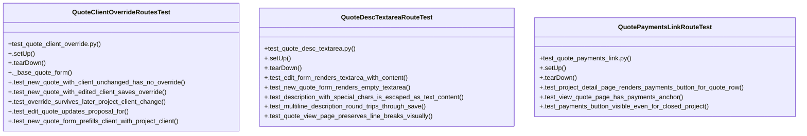

# Community 0

> 148 nodes · cohesion 0.04

## Key Concepts

- [load()](file:///Users/macbook/ProjectTracker/tracker/storage.py#L40) (147 connections)
- [save()](file:///Users/macbook/ProjectTracker/tracker/storage.py#L49) (110 connections)
- [admin.py](file:///Users/macbook/ProjectTracker/tracker/routes/admin.py#L1) (66 connections)
- [today()](file:///Users/macbook/ProjectTracker/tracker/storage.py#L66) (57 connections)
- [materials.py](file:///Users/macbook/ProjectTracker/tracker/routes/materials.py#L1) (48 connections)
- [projects.py](file:///Users/macbook/ProjectTracker/tracker/routes/projects.py#L1) (29 connections)
- [_clean()](file:///Users/macbook/ProjectTracker/tracker/quote_csv_import.py#L49) (27 connections)
- [new_id()](file:///Users/macbook/ProjectTracker/tracker/storage.py#L62) (20 connections)
- [import_ldm_csv_upload()](file:///Users/macbook/ProjectTracker/tracker/routes/materials.py#L267) (15 connections)
- [hydrate_ldm()](file:///Users/macbook/ProjectTracker/tracker/catalog.py#L470) (12 connections)
- [_find_project()](file:///Users/macbook/ProjectTracker/tracker/routes/materials.py#L31) (12 connections)
- [add_bundle_version_route()](file:///Users/macbook/ProjectTracker/tracker/routes/admin.py#L513) (11 connections)
- [import_ldm_pdf_create()](file:///Users/macbook/ProjectTracker/tracker/routes/materials.py#L773) (11 connections)
- [sync_ldm_bundles()](file:///Users/macbook/ProjectTracker/tracker/routes/materials.py#L444) (11 connections)
- [bundles()](file:///Users/macbook/ProjectTracker/tracker/routes/admin.py#L428) (10 connections)
- [new_ldm()](file:///Users/macbook/ProjectTracker/tracker/routes/materials.py#L219) (10 connections)
- [update_bundle_version()](file:///Users/macbook/ProjectTracker/tracker/routes/admin.py#L491) (9 connections)
- [edit_ldm()](file:///Users/macbook/ProjectTracker/tracker/routes/materials.py#L380) (9 connections)
- [import_ldm_pdf_map()](file:///Users/macbook/ProjectTracker/tracker/routes/materials.py#L745) (9 connections)
- [_parse_float()](file:///Users/macbook/ProjectTracker/tracker/quote_csv_import.py#L75) (9 connections)
- [QuoteClientOverrideRoutesTest](file:///Users/macbook/ProjectTracker/tests/test_quote_client_override.py#L95) (9 connections)
- [catalogo()](file:///Users/macbook/ProjectTracker/tracker/routes/admin.py#L165) (8 connections)
- [_bundle_suggestion_ldm()](file:///Users/macbook/ProjectTracker/tracker/routes/materials.py#L157) (8 connections)
- [QuoteDescTextareaRouteTest](file:///Users/macbook/ProjectTracker/tests/test_quote_desc_textarea.py#L64) (8 connections)
- [fichas()](file:///Users/macbook/ProjectTracker/tracker/routes/admin.py#L628) (7 connections)
- *... and 123 more nodes in this community*

## Class Diagram

```mermaid
classDiagram
    class QuoteClientOverrideRoutesTest {
        +test_quote_client_override.py()
        +.setUp()
        +.tearDown()
        +._base_quote_form()
        +.test_new_quote_with_client_unchanged_has_no_override()
        +.test_new_quote_with_edited_client_saves_override()
        +.test_override_survives_later_project_client_change()
        +.test_edit_quote_updates_proposal_for()
        +.test_new_quote_form_prefills_client_with_project_client()
    }
    class QuoteDescTextareaRouteTest {
        +test_quote_desc_textarea.py()
        +.setUp()
        +.tearDown()
        +.test_edit_form_renders_textarea_with_content()
        +.test_new_quote_form_renders_empty_textarea()
        +.test_description_with_special_chars_is_escaped_as_text_content()
        +.test_multiline_description_round_trips_through_save()
        +.test_quote_view_page_preserves_line_breaks_visually()
    }
    class QuotePaymentsLinkRouteTest {
        +test_quote_payments_link.py()
        +.setUp()
        +.tearDown()
        +.test_project_detail_page_renders_payments_button_for_quote_row()
        +.test_view_quote_page_has_payments_anchor()
        +.test_payments_button_visible_even_for_closed_project()
    }
```

## Relationships

- [[Community 9]] (1 shared connections)

## Source Files

- [/Users/macbook/ProjectTracker/tests/test_quote_client_override.py](file:///Users/macbook/ProjectTracker/tests/test_quote_client_override.py)
- [/Users/macbook/ProjectTracker/tests/test_quote_desc_textarea.py](file:///Users/macbook/ProjectTracker/tests/test_quote_desc_textarea.py)
- [/Users/macbook/ProjectTracker/tests/test_quote_payments_link.py](file:///Users/macbook/ProjectTracker/tests/test_quote_payments_link.py)
- [/Users/macbook/ProjectTracker/tracker/catalog.py](file:///Users/macbook/ProjectTracker/tracker/catalog.py)
- [/Users/macbook/ProjectTracker/tracker/domain.py](file:///Users/macbook/ProjectTracker/tracker/domain.py)
- [/Users/macbook/ProjectTracker/tracker/form_models.py](file:///Users/macbook/ProjectTracker/tracker/form_models.py)
- [/Users/macbook/ProjectTracker/tracker/quote_csv_import.py](file:///Users/macbook/ProjectTracker/tracker/quote_csv_import.py)
- [/Users/macbook/ProjectTracker/tracker/routes/admin.py](file:///Users/macbook/ProjectTracker/tracker/routes/admin.py)
- [/Users/macbook/ProjectTracker/tracker/routes/materials.py](file:///Users/macbook/ProjectTracker/tracker/routes/materials.py)
- [/Users/macbook/ProjectTracker/tracker/routes/projects.py](file:///Users/macbook/ProjectTracker/tracker/routes/projects.py)
- [/Users/macbook/ProjectTracker/tracker/routes/quotes.py](file:///Users/macbook/ProjectTracker/tracker/routes/quotes.py)
- [/Users/macbook/ProjectTracker/tracker/storage.py](file:///Users/macbook/ProjectTracker/tracker/storage.py)

## Audit Trail

- EXTRACTED: 493 (43%)
- INFERRED: 645 (57%)
- AMBIGUOUS: 0 (0%)

---

*Part of the graphify knowledge wiki. See [[index]] to navigate.*