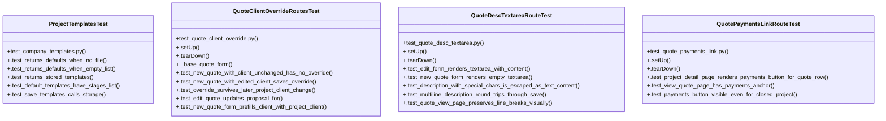

# Community 0

> 182 nodes · cohesion 0.03

## Key Concepts

- [load()](file:///Users/macbook/ProjectTracker/tracker/storage.py#L40) (146 connections)
- [save()](file:///Users/macbook/ProjectTracker/tracker/storage.py#L49) (109 connections)
- [admin.py](file:///Users/macbook/ProjectTracker/tracker/routes/admin.py#L1) (66 connections)
- [today()](file:///Users/macbook/ProjectTracker/tracker/storage.py#L66) (57 connections)
- [projects.py](file:///Users/macbook/ProjectTracker/tracker/routes/projects.py#L1) (29 connections)
- [storage.py](file:///Users/macbook/ProjectTracker/tracker/storage.py#L1) (25 connections)
- [create_app()](file:///Users/macbook/ProjectTracker/tracker/__init__.py#L53) (20 connections)
- [new_id()](file:///Users/macbook/ProjectTracker/tracker/storage.py#L62) (20 connections)
- [domain.py](file:///Users/macbook/ProjectTracker/tracker/domain.py#L1) (19 connections)
- [__init__.py](file:///Users/macbook/ProjectTracker/tracker/__init__.py#L1) (18 connections)
- [deletions.py](file:///Users/macbook/ProjectTracker/tracker/deletions.py#L1) (12 connections)
- [add_bundle_version_route()](file:///Users/macbook/ProjectTracker/tracker/routes/admin.py#L513) (11 connections)
- [bundles()](file:///Users/macbook/ProjectTracker/tracker/routes/admin.py#L428) (10 connections)
- [update_bundle_version()](file:///Users/macbook/ProjectTracker/tracker/routes/admin.py#L491) (9 connections)
- [QuoteClientOverrideRoutesTest](file:///Users/macbook/ProjectTracker/tests/test_quote_client_override.py#L95) (9 connections)
- [catalogo()](file:///Users/macbook/ProjectTracker/tracker/routes/admin.py#L165) (8 connections)
- [get_project_templates()](file:///Users/macbook/ProjectTracker/tracker/templates_config.py#L17) (8 connections)
- [QuoteDescTextareaRouteTest](file:///Users/macbook/ProjectTracker/tests/test_quote_desc_textarea.py#L64) (8 connections)
- [catalog_search.py](file:///Users/macbook/ProjectTracker/tracker/catalog_search.py#L1) (8 connections)
- [fichas()](file:///Users/macbook/ProjectTracker/tracker/routes/admin.py#L628) (7 connections)
- [proveedores()](file:///Users/macbook/ProjectTracker/tracker/routes/admin.py#L570) (7 connections)
- [team()](file:///Users/macbook/ProjectTracker/tracker/routes/admin.py#L699) (7 connections)
- [update_bundle()](file:///Users/macbook/ProjectTracker/tracker/routes/admin.py#L458) (7 connections)
- [_normalize()](file:///Users/macbook/ProjectTracker/tracker/catalog_search.py#L25) (7 connections)
- [kanban()](file:///Users/macbook/ProjectTracker/tracker/routes/projects.py#L71) (7 connections)
- *... and 157 more nodes in this community*

## Class Diagram

```mermaid
classDiagram
    class ProjectTemplatesTest {
        +test_company_templates.py()
        +.test_returns_defaults_when_no_file()
        +.test_returns_defaults_when_empty_list()
        +.test_returns_stored_templates()
        +.test_default_templates_have_stages_list()
        +.test_save_templates_calls_storage()
    }
    class QuoteClientOverrideRoutesTest {
        +test_quote_client_override.py()
        +.setUp()
        +.tearDown()
        +._base_quote_form()
        +.test_new_quote_with_client_unchanged_has_no_override()
        +.test_new_quote_with_edited_client_saves_override()
        +.test_override_survives_later_project_client_change()
        +.test_edit_quote_updates_proposal_for()
        +.test_new_quote_form_prefills_client_with_project_client()
    }
    class QuoteDescTextareaRouteTest {
        +test_quote_desc_textarea.py()
        +.setUp()
        +.tearDown()
        +.test_edit_form_renders_textarea_with_content()
        +.test_new_quote_form_renders_empty_textarea()
        +.test_description_with_special_chars_is_escaped_as_text_content()
        +.test_multiline_description_round_trips_through_save()
        +.test_quote_view_page_preserves_line_breaks_visually()
    }
    class QuotePaymentsLinkRouteTest {
        +test_quote_payments_link.py()
        +.setUp()
        +.tearDown()
        +.test_project_detail_page_renders_payments_button_for_quote_row()
        +.test_view_quote_page_has_payments_anchor()
        +.test_payments_button_visible_even_for_closed_project()
    }
```

## Relationships

- No strong cross-community connections detected

## Source Files

- [/Users/macbook/ProjectTracker/tests/test_avance_routes.py](file:///Users/macbook/ProjectTracker/tests/test_avance_routes.py)
- [/Users/macbook/ProjectTracker/tests/test_company_templates.py](file:///Users/macbook/ProjectTracker/tests/test_company_templates.py)
- [/Users/macbook/ProjectTracker/tests/test_deletions.py](file:///Users/macbook/ProjectTracker/tests/test_deletions.py)
- [/Users/macbook/ProjectTracker/tests/test_kanban.py](file:///Users/macbook/ProjectTracker/tests/test_kanban.py)
- [/Users/macbook/ProjectTracker/tests/test_payments.py](file:///Users/macbook/ProjectTracker/tests/test_payments.py)
- [/Users/macbook/ProjectTracker/tests/test_payments_summary.py](file:///Users/macbook/ProjectTracker/tests/test_payments_summary.py)
- [/Users/macbook/ProjectTracker/tests/test_project_financial_card_payments.py](file:///Users/macbook/ProjectTracker/tests/test_project_financial_card_payments.py)
- [/Users/macbook/ProjectTracker/tests/test_quote_client_override.py](file:///Users/macbook/ProjectTracker/tests/test_quote_client_override.py)
- [/Users/macbook/ProjectTracker/tests/test_quote_client_sync.py](file:///Users/macbook/ProjectTracker/tests/test_quote_client_sync.py)
- [/Users/macbook/ProjectTracker/tests/test_quote_desc_textarea.py](file:///Users/macbook/ProjectTracker/tests/test_quote_desc_textarea.py)
- [/Users/macbook/ProjectTracker/tests/test_quote_payments_link.py](file:///Users/macbook/ProjectTracker/tests/test_quote_payments_link.py)
- [/Users/macbook/ProjectTracker/tests/test_quote_status_labels.py](file:///Users/macbook/ProjectTracker/tests/test_quote_status_labels.py)
- [/Users/macbook/ProjectTracker/tests/test_quote_status_select.py](file:///Users/macbook/ProjectTracker/tests/test_quote_status_select.py)
- [/Users/macbook/ProjectTracker/tracker/__init__.py](file:///Users/macbook/ProjectTracker/tracker/__init__.py)
- [/Users/macbook/ProjectTracker/tracker/catalog.py](file:///Users/macbook/ProjectTracker/tracker/catalog.py)
- [/Users/macbook/ProjectTracker/tracker/catalog_search.py](file:///Users/macbook/ProjectTracker/tracker/catalog_search.py)
- [/Users/macbook/ProjectTracker/tracker/deletions.py](file:///Users/macbook/ProjectTracker/tracker/deletions.py)
- [/Users/macbook/ProjectTracker/tracker/domain.py](file:///Users/macbook/ProjectTracker/tracker/domain.py)
- [/Users/macbook/ProjectTracker/tracker/routes/admin.py](file:///Users/macbook/ProjectTracker/tracker/routes/admin.py)
- [/Users/macbook/ProjectTracker/tracker/routes/materials.py](file:///Users/macbook/ProjectTracker/tracker/routes/materials.py)

## Audit Trail

- EXTRACTED: 497 (43%)
- INFERRED: 650 (57%)
- AMBIGUOUS: 0 (0%)

---

*Part of the graphify knowledge wiki. See [[index]] to navigate.*