# Community 1

> 109 nodes · cohesion 0.04

## Key Concepts

- [quotes.py](file:///Users/macbook/ProjectTracker/tracker/routes/quotes.py#L1) (49 connections)
- [catalog.py](file:///Users/macbook/ProjectTracker/tracker/catalog.py#L1) (42 connections)
- [catalog_maps()](file:///Users/macbook/ProjectTracker/tracker/catalog.py#L180) (32 connections)
- [hydrate_quote()](file:///Users/macbook/ProjectTracker/tracker/catalog.py#L410) (24 connections)
- [catalog_name_key()](file:///Users/macbook/ProjectTracker/tracker/catalog.py#L165) (17 connections)
- [quote_type_key()](file:///Users/macbook/ProjectTracker/tracker/catalog.py#L65) (14 connections)
- [safe_float()](file:///Users/macbook/ProjectTracker/tracker/catalog.py#L193) (14 connections)
- [_render_quote_form()](file:///Users/macbook/ProjectTracker/tracker/routes/quotes.py#L66) (14 connections)
- [compute_quote_totals()](file:///Users/macbook/ProjectTracker/tracker/catalog.py#L340) (13 connections)
- [_hydrate_quote_for_display()](file:///Users/macbook/ProjectTracker/tracker/routes/quotes.py#L49) (13 connections)
- [quote_pdf_editor()](file:///Users/macbook/ProjectTracker/tracker/routes/quotes.py#L1084) (13 connections)
- [next_quote_number()](file:///Users/macbook/ProjectTracker/tracker/catalog.py#L483) (12 connections)
- [_build_quote_workbook()](file:///Users/macbook/ProjectTracker/tracker/routes/quotes.py#L588) (12 connections)
- [new_quote()](file:///Users/macbook/ProjectTracker/tracker/routes/quotes.py#L186) (12 connections)
- [deletions.py](file:///Users/macbook/ProjectTracker/tracker/deletions.py#L1) (12 connections)
- [export_data()](file:///Users/macbook/ProjectTracker/tracker/routes/admin.py#L954) (10 connections)
- [hydrate_quote_item()](file:///Users/macbook/ProjectTracker/tracker/catalog.py#L279) (10 connections)
- [_build_resumen()](file:///Users/macbook/ProjectTracker/tracker/routes/quotes.py#L172) (10 connections)
- [edit_quote()](file:///Users/macbook/ProjectTracker/tracker/routes/quotes.py#L318) (10 connections)
- [view_quote()](file:///Users/macbook/ProjectTracker/tracker/routes/quotes.py#L376) (10 connections)
- [QuoteSectionsTest](file:///Users/macbook/ProjectTracker/tests/test_quote_sections.py#L7) (10 connections)
- [quote_section_groups()](file:///Users/macbook/ProjectTracker/tracker/catalog.py#L236) (9 connections)
- [import_quote_csv()](file:///Users/macbook/ProjectTracker/tracker/routes/quotes.py#L257) (9 connections)
- [_quote_preview_from_csv()](file:///Users/macbook/ProjectTracker/tracker/routes/quotes.py#L135) (8 connections)
- [hydrate_ldm_item()](file:///Users/macbook/ProjectTracker/tracker/catalog.py#L439) (7 connections)
- *... and 84 more nodes in this community*

## Class Diagram

```mermaid
classDiagram
    class NextQuoteNumberTest {
        +test_catalog_approval.py()
        +._project()
        +.test_no_collision_preliminar_then_proyecto()
        +.test_first_proyecto_in_clean_project()
        +.test_obra_independent_counter()
        +.test_servicio_counter()
        +.test_does_not_count_other_project_quotes()
    }
    class DeletionsTest {
        +test_deletions.py()
        +.test_delete_project_cascades_and_unlinks_fichas()
        +.test_delete_catalog_items_marks_quote_and_ldm_refs_as_deleted_snapshots()
        +.test_hydrate_items_flags_deleted_catalog_snapshot_without_relinking()
        +.test_purge_deleted_catalog_items_removes_only_marked_rows()
    }
    class QuoteWorkbookClientSyncTest {
        +test_quote_client_sync.py()
        +.test_workbook_uses_live_project_client_and_name()
        +.test_workbook_falls_back_to_snapshot_when_project_missing_data()
    }
    class ComputeQuoteTotalsTest {
        +test_quote_discount.py()
        +.test_no_discount_no_tax()
        +.test_tax_only_no_discount()
        +.test_discount_applied_before_tax()
        +.test_discount_without_tax()
        +.test_discount_pct_is_clamped_to_0_100()
        +.test_full_discount_zeroes_total_even_with_tax()
    }
    class HydrateQuoteDiscountTest {
        +test_quote_discount.py()
        +.test_hydrate_quote_applies_discount_before_tax()
        +.test_hydrate_quote_defaults_discount_to_zero()
    }
    class QuoteSectionsTest {
        +test_quote_sections.py()
        +.test_quote_section_groups_preserve_contiguous_order()
        +.test_quote_section_groups_preserve_empty_section_markers()
        +.test_hydrate_quote_keeps_section_markers_out_of_totals()
        +.test_quote_form_rebuilds_repeated_section_headers()
        +.test_quote_form_has_quick_copy_to_selected_section()
        +.test_quote_form_has_integrantes_editor()
        +.test_quote_views_render_bundle_breakdown_without_price_columns()
        +.test_quote_form_has_named_template_selector_and_catalog_application()
        +.test_quote_templates_admin_edits_items_without_prices()
    }
```

## Relationships

- No strong cross-community connections detected

## Source Files

- [/Users/macbook/ProjectTracker/tests/test_catalog_approval.py](file:///Users/macbook/ProjectTracker/tests/test_catalog_approval.py)
- [/Users/macbook/ProjectTracker/tests/test_deletions.py](file:///Users/macbook/ProjectTracker/tests/test_deletions.py)
- [/Users/macbook/ProjectTracker/tests/test_quote_client_sync.py](file:///Users/macbook/ProjectTracker/tests/test_quote_client_sync.py)
- [/Users/macbook/ProjectTracker/tests/test_quote_discount.py](file:///Users/macbook/ProjectTracker/tests/test_quote_discount.py)
- [/Users/macbook/ProjectTracker/tests/test_quote_sections.py](file:///Users/macbook/ProjectTracker/tests/test_quote_sections.py)
- [/Users/macbook/ProjectTracker/tracker/catalog.py](file:///Users/macbook/ProjectTracker/tracker/catalog.py)
- [/Users/macbook/ProjectTracker/tracker/deletions.py](file:///Users/macbook/ProjectTracker/tracker/deletions.py)
- [/Users/macbook/ProjectTracker/tracker/form_models.py](file:///Users/macbook/ProjectTracker/tracker/form_models.py)
- [/Users/macbook/ProjectTracker/tracker/routes/admin.py](file:///Users/macbook/ProjectTracker/tracker/routes/admin.py)
- [/Users/macbook/ProjectTracker/tracker/routes/materials.py](file:///Users/macbook/ProjectTracker/tracker/routes/materials.py)
- [/Users/macbook/ProjectTracker/tracker/routes/quotes.py](file:///Users/macbook/ProjectTracker/tracker/routes/quotes.py)

## Audit Trail

- EXTRACTED: 363 (57%)
- INFERRED: 269 (43%)
- AMBIGUOUS: 0 (0%)

---

*Part of the graphify knowledge wiki. See [[index]] to navigate.*