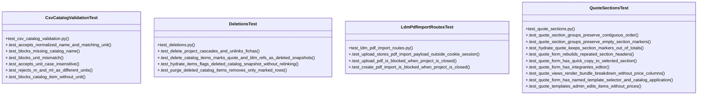

# Community 1

> 99 nodes · cohesion 0.04

## Key Concepts

- [materials.py](file:///Users/macbook/Documents/ProjectTracker/tracker/routes/materials.py#L1) (48 connections)
- [catalog.py](file:///Users/macbook/Documents/ProjectTracker/tracker/catalog.py#L1) (43 connections)
- [catalog_name_key()](file:///Users/macbook/Documents/ProjectTracker/tracker/catalog.py#L176) (17 connections)
- [safe_float()](file:///Users/macbook/Documents/ProjectTracker/tracker/catalog.py#L204) (14 connections)
- [validate_csv_catalog_items()](file:///Users/macbook/Documents/ProjectTracker/tracker/csv_catalog_validation.py#L21) (14 connections)
- [hydrate_ldm()](file:///Users/macbook/Documents/ProjectTracker/tracker/catalog.py#L481) (12 connections)
- [_find_project()](file:///Users/macbook/Documents/ProjectTracker/tracker/routes/materials.py#L31) (12 connections)
- [sync_ldm_bundles()](file:///Users/macbook/Documents/ProjectTracker/tracker/routes/materials.py#L444) (11 connections)
- [pdf_ldm_import.py](file:///Users/macbook/Documents/ProjectTracker/tracker/pdf_ldm_import.py#L1) (11 connections)
- [hydrate_quote_item()](file:///Users/macbook/Documents/ProjectTracker/tracker/catalog.py#L290) (10 connections)
- [QuoteSectionsTest](file:///Users/macbook/Documents/ProjectTracker/tests/test_quote_sections.py#L7) (10 connections)
- [quote_section_groups()](file:///Users/macbook/Documents/ProjectTracker/tracker/catalog.py#L247) (9 connections)
- [edit_ldm()](file:///Users/macbook/Documents/ProjectTracker/tracker/routes/materials.py#L380) (9 connections)
- [import_ldm_pdf_map()](file:///Users/macbook/Documents/ProjectTracker/tracker/routes/materials.py#L750) (9 connections)
- [extract_items_from_pdf()](file:///Users/macbook/Documents/ProjectTracker/tracker/pdf_ldm_import.py#L291) (8 connections)
- [hydrate_ldm_item()](file:///Users/macbook/Documents/ProjectTracker/tracker/catalog.py#L450) (7 connections)
- [_clear_pdf_import()](file:///Users/macbook/Documents/ProjectTracker/tracker/routes/materials.py#L655) (7 connections)
- [import_ldm_pdf_upload()](file:///Users/macbook/Documents/ProjectTracker/tracker/routes/materials.py#L693) (7 connections)
- [ldm_pdf_editor()](file:///Users/macbook/Documents/ProjectTracker/tracker/routes/materials.py#L588) (7 connections)
- [_load_pdf_import()](file:///Users/macbook/Documents/ProjectTracker/tracker/routes/materials.py#L672) (7 connections)
- [CsvCatalogValidationTest](file:///Users/macbook/Documents/ProjectTracker/tests/test_csv_catalog_validation.py#L30) (7 connections)
- [csv_catalog_validation.py](file:///Users/macbook/Documents/ProjectTracker/tracker/csv_catalog_validation.py#L1) (7 connections)
- [_bundle_sync_suggestions()](file:///Users/macbook/Documents/ProjectTracker/tracker/routes/materials.py#L194) (6 connections)
- [_ldm_csv_response()](file:///Users/macbook/Documents/ProjectTracker/tracker/routes/materials.py#L122) (6 connections)
- [ldm_pdf()](file:///Users/macbook/Documents/ProjectTracker/tracker/routes/materials.py#L561) (6 connections)
- *... and 74 more nodes in this community*

## Class Diagram

```mermaid
classDiagram
    class CsvCatalogValidationTest {
        +test_csv_catalog_validation.py()
        +.test_accepts_normalized_name_and_matching_unit()
        +.test_blocks_missing_catalog_name()
        +.test_blocks_unit_mismatch()
        +.test_accepts_unit_case_insensitive()
        +.test_rejects_m_and_ml_as_different_units()
        +.test_blocks_catalog_item_without_unit()
    }
    class DeletionsTest {
        +test_deletions.py()
        +.test_delete_project_cascades_and_unlinks_fichas()
        +.test_delete_catalog_items_marks_quote_and_ldm_refs_as_deleted_snapshots()
        +.test_hydrate_items_flags_deleted_catalog_snapshot_without_relinking()
        +.test_purge_deleted_catalog_items_removes_only_marked_rows()
    }
    class LdmPdfImportRoutesTest {
        +test_ldm_pdf_import_routes.py()
        +.test_upload_stores_pdf_import_payload_outside_cookie_session()
        +.test_upload_pdf_is_blocked_when_project_is_closed()
        +.test_create_pdf_import_is_blocked_when_project_is_closed()
    }
    class QuoteSectionsTest {
        +test_quote_sections.py()
        +.test_quote_section_groups_preserve_contiguous_order()
        +.test_quote_section_groups_preserve_empty_section_markers()
        +.test_hydrate_quote_keeps_section_markers_out_of_totals()
        +.test_quote_form_rebuilds_repeated_section_headers()
        +.test_quote_form_has_quick_copy_to_selected_section()
        +.test_quote_form_has_integrantes_editor()
        +.test_quote_views_render_bundle_breakdown_without_price_columns()
        +.test_quote_form_has_named_template_selector_and_catalog_application()
        +.test_quote_templates_admin_edits_items_without_prices()
    }
```

## Relationships

- [[Community 26]] (4 shared connections)
- [[Community 0]] (2 shared connections)
- [[Community 25]] (1 shared connections)

## Source Files

- [/Users/macbook/Documents/ProjectTracker/tests/test_csv_catalog_validation.py](file:///Users/macbook/Documents/ProjectTracker/tests/test_csv_catalog_validation.py)
- [/Users/macbook/Documents/ProjectTracker/tests/test_deletions.py](file:///Users/macbook/Documents/ProjectTracker/tests/test_deletions.py)
- [/Users/macbook/Documents/ProjectTracker/tests/test_ldm_pdf_import_routes.py](file:///Users/macbook/Documents/ProjectTracker/tests/test_ldm_pdf_import_routes.py)
- [/Users/macbook/Documents/ProjectTracker/tests/test_quote_sections.py](file:///Users/macbook/Documents/ProjectTracker/tests/test_quote_sections.py)
- [/Users/macbook/Documents/ProjectTracker/tracker/catalog.py](file:///Users/macbook/Documents/ProjectTracker/tracker/catalog.py)
- [/Users/macbook/Documents/ProjectTracker/tracker/csv_catalog_validation.py](file:///Users/macbook/Documents/ProjectTracker/tracker/csv_catalog_validation.py)
- [/Users/macbook/Documents/ProjectTracker/tracker/pdf_ldm_import.py](file:///Users/macbook/Documents/ProjectTracker/tracker/pdf_ldm_import.py)
- [/Users/macbook/Documents/ProjectTracker/tracker/routes/materials.py](file:///Users/macbook/Documents/ProjectTracker/tracker/routes/materials.py)
- [/Users/macbook/ProjectTracker/tracker/csv_catalog_validation.py](file:///Users/macbook/ProjectTracker/tracker/csv_catalog_validation.py)
- [/Users/macbook/ProjectTracker/tracker/pdf_ldm_import.py](file:///Users/macbook/ProjectTracker/tracker/pdf_ldm_import.py)
- [/Users/macbook/ProjectTracker/tracker/routes/materials.py](file:///Users/macbook/ProjectTracker/tracker/routes/materials.py)

## Audit Trail

- EXTRACTED: 378 (76%)
- INFERRED: 118 (24%)
- AMBIGUOUS: 0 (0%)

---

*Part of the graphify knowledge wiki. See [[index]] to navigate.*