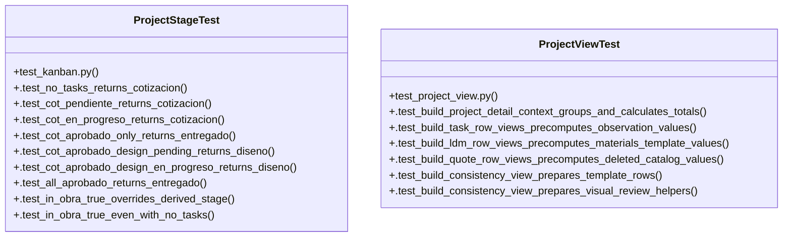

# Community 10

> 45 nodes · cohesion 0.08

## Key Concepts

- [build_project_detail_context()](file:///Users/macbook/ProjectTracker/tracker/project_view.py#L163) (17 connections)
- [domain.py](file:///Users/macbook/ProjectTracker/tracker/domain.py#L1) (16 connections)
- [project_view.py](file:///Users/macbook/ProjectTracker/tracker/project_view.py#L1) (16 connections)
- [project_stage()](file:///Users/macbook/ProjectTracker/tracker/domain.py#L70) (12 connections)
- [ProjectStageTest](file:///Users/macbook/ProjectTracker/tests/test_kanban.py#L39) (11 connections)
- [_task()](file:///Users/macbook/ProjectTracker/tests/test_kanban.py#L23) (9 connections)
- [build_consistency_view()](file:///Users/macbook/ProjectTracker/tracker/project_view.py#L134) (7 connections)
- [ProjectViewTest](file:///Users/macbook/ProjectTracker/tests/test_project_view.py#L13) (7 connections)
- [get_alcances()](file:///Users/macbook/ProjectTracker/tracker/domain.py#L20) (5 connections)
- [build_quote_row_views()](file:///Users/macbook/ProjectTracker/tracker/project_view.py#L62) (5 connections)
- [check_blocked()](file:///Users/macbook/ProjectTracker/tracker/domain.py#L62) (4 connections)
- [get_alcances_by_id()](file:///Users/macbook/ProjectTracker/tracker/domain.py#L27) (4 connections)
- [build_ldm_row_views()](file:///Users/macbook/ProjectTracker/tracker/project_view.py#L47) (4 connections)
- [build_task_row_views()](file:///Users/macbook/ProjectTracker/tracker/project_view.py#L114) (4 connections)
- [get_progress()](file:///Users/macbook/ProjectTracker/tracker/domain.py#L94) (3 connections)
- [_deleted_catalog_items()](file:///Users/macbook/ProjectTracker/tracker/project_view.py#L31) (3 connections)
- [.test_all_aprobado_returns_entregado()](file:///Users/macbook/ProjectTracker/tests/test_kanban.py#L71) (3 connections)
- [.test_cot_aprobado_design_en_progreso_returns_diseno()](file:///Users/macbook/ProjectTracker/tests/test_kanban.py#L63) (3 connections)
- [.test_cot_aprobado_design_pending_returns_diseno()](file:///Users/macbook/ProjectTracker/tests/test_kanban.py#L56) (3 connections)
- [.test_cot_aprobado_only_returns_entregado()](file:///Users/macbook/ProjectTracker/tests/test_kanban.py#L52) (3 connections)
- [.test_cot_en_progreso_returns_cotizacion()](file:///Users/macbook/ProjectTracker/tests/test_kanban.py#L48) (3 connections)
- [.test_cot_pendiente_returns_cotizacion()](file:///Users/macbook/ProjectTracker/tests/test_kanban.py#L44) (3 connections)
- [.test_in_obra_true_overrides_derived_stage()](file:///Users/macbook/ProjectTracker/tests/test_kanban.py#L79) (3 connections)
- [.test_subtasks_not_counted()](file:///Users/macbook/ProjectTracker/tests/test_kanban.py#L88) (3 connections)
- [alcances_admin()](file:///Users/macbook/ProjectTracker/tracker/routes/admin.py#L1176) (2 connections)
- *... and 20 more nodes in this community*

## Class Diagram

## Relationships

- No strong cross-community connections detected

## Source Files

- [/Users/macbook/ProjectTracker/tests/test_kanban.py](file:///Users/macbook/ProjectTracker/tests/test_kanban.py)
- [/Users/macbook/ProjectTracker/tests/test_project_view.py](file:///Users/macbook/ProjectTracker/tests/test_project_view.py)
- [/Users/macbook/ProjectTracker/tracker/domain.py](file:///Users/macbook/ProjectTracker/tracker/domain.py)
- [/Users/macbook/ProjectTracker/tracker/project_view.py](file:///Users/macbook/ProjectTracker/tracker/project_view.py)
- [/Users/macbook/ProjectTracker/tracker/routes/admin.py](file:///Users/macbook/ProjectTracker/tracker/routes/admin.py)

## Audit Trail

- EXTRACTED: 135 (72%)
- INFERRED: 53 (28%)
- AMBIGUOUS: 0 (0%)

---

*Part of the graphify knowledge wiki. See [[index]] to navigate.*