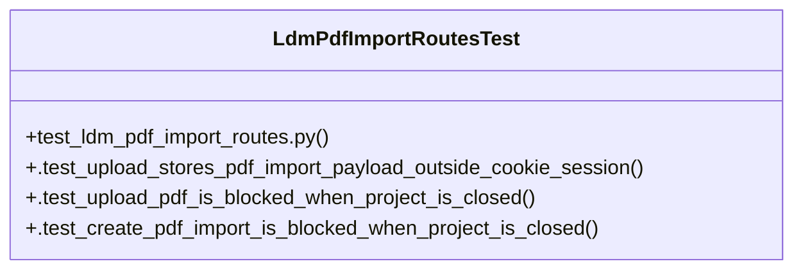

# Community 10

> 37 nodes · cohesion 0.11

## Key Concepts

- [materials.py](file:///Users/macbook/ProjectTracker/tracker/routes/materials.py#L1) (47 connections)
- [import_ldm_csv_upload()](file:///Users/macbook/ProjectTracker/tracker/routes/materials.py#L266) (15 connections)
- [_find_project()](file:///Users/macbook/ProjectTracker/tracker/routes/materials.py#L31) (11 connections)
- [import_ldm_pdf_create()](file:///Users/macbook/ProjectTracker/tracker/routes/materials.py#L732) (11 connections)
- [edit_ldm()](file:///Users/macbook/ProjectTracker/tracker/routes/materials.py#L379) (9 connections)
- [import_ldm_pdf_map()](file:///Users/macbook/ProjectTracker/tracker/routes/materials.py#L704) (9 connections)
- [_clear_pdf_import()](file:///Users/macbook/ProjectTracker/tracker/routes/materials.py#L609) (7 connections)
- [import_ldm_pdf_upload()](file:///Users/macbook/ProjectTracker/tracker/routes/materials.py#L647) (7 connections)
- [_load_pdf_import()](file:///Users/macbook/ProjectTracker/tracker/routes/materials.py#L626) (7 connections)
- [_ldm_csv_response()](file:///Users/macbook/ProjectTracker/tracker/routes/materials.py#L122) (6 connections)
- [_pdf_import_path()](file:///Users/macbook/ProjectTracker/tracker/routes/materials.py#L602) (6 connections)
- [_render_ldm_form()](file:///Users/macbook/ProjectTracker/tracker/routes/materials.py#L146) (6 connections)
- [_clean_form_text()](file:///Users/macbook/ProjectTracker/tracker/routes/materials.py#L27) (5 connections)
- [_store_pdf_import()](file:///Users/macbook/ProjectTracker/tracker/routes/materials.py#L617) (5 connections)
- [_csv_already_imported()](file:///Users/macbook/ProjectTracker/tracker/routes/materials.py#L59) (4 connections)
- [delete_ldm()](file:///Users/macbook/ProjectTracker/tracker/routes/materials.py#L509) (4 connections)
- [_hydrate_import_items()](file:///Users/macbook/ProjectTracker/tracker/routes/materials.py#L70) (4 connections)
- [ldm_csv()](file:///Users/macbook/ProjectTracker/tracker/routes/materials.py#L425) (4 connections)
- [_pdf_import_session_key()](file:///Users/macbook/ProjectTracker/tracker/routes/materials.py#L592) (4 connections)
- [_redirect_closed_pdf_import()](file:///Users/macbook/ProjectTracker/tracker/routes/materials.py#L641) (4 connections)
- [set_ldm_cot()](file:///Users/macbook/ProjectTracker/tracker/routes/materials.py#L548) (4 connections)
- [LdmPdfImportRoutesTest](file:///Users/macbook/ProjectTracker/tests/test_ldm_pdf_import_routes.py#L14) (4 connections)
- [_attach_csv_item_metadata()](file:///Users/macbook/ProjectTracker/tracker/routes/materials.py#L93) (3 connections)
- [_csv_item_lookup()](file:///Users/macbook/ProjectTracker/tracker/routes/materials.py#L85) (3 connections)
- [_csv_number()](file:///Users/macbook/ProjectTracker/tracker/routes/materials.py#L118) (3 connections)
- *... and 12 more nodes in this community*

## Class Diagram

## Relationships

- No strong cross-community connections detected

## Source Files

- [/Users/macbook/ProjectTracker/tests/test_ldm_pdf_import_routes.py](file:///Users/macbook/ProjectTracker/tests/test_ldm_pdf_import_routes.py)
- [/Users/macbook/ProjectTracker/tracker/routes/materials.py](file:///Users/macbook/ProjectTracker/tracker/routes/materials.py)

## Audit Trail

- EXTRACTED: 168 (79%)
- INFERRED: 45 (21%)
- AMBIGUOUS: 0 (0%)

---

*Part of the graphify knowledge wiki. See [[index]] to navigate.*