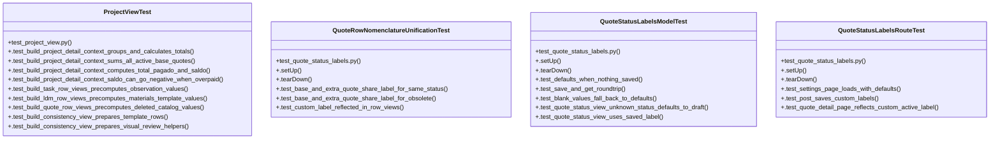

# Community 10

> 49 nodes · cohesion 0.07

## Key Concepts

- [build_project_detail_context()](file:///Users/macbook/ProjectTracker/tracker/project_view.py#L153) (24 connections)
- [project_view.py](file:///Users/macbook/ProjectTracker/tracker/project_view.py#L1) (18 connections)
- [ProjectViewTest](file:///Users/macbook/ProjectTracker/tests/test_project_view.py#L13) (10 connections)
- [build_quote_row_views()](file:///Users/macbook/ProjectTracker/tracker/project_view.py#L64) (9 connections)
- [get_quote_status_labels()](file:///Users/macbook/ProjectTracker/tracker/quote_status_labels.py#L33) (9 connections)
- [quote_status_view()](file:///Users/macbook/ProjectTracker/tracker/quote_status_labels.py#L56) (9 connections)
- [QuoteStatusLabelsModelTest](file:///Users/macbook/ProjectTracker/tests/test_quote_status_labels.py#L47) (8 connections)
- [build_consistency_view()](file:///Users/macbook/ProjectTracker/tracker/project_view.py#L124) (7 connections)
- [save_quote_status_labels()](file:///Users/macbook/ProjectTracker/tracker/quote_status_labels.py#L48) (7 connections)
- [QuoteRowNomenclatureUnificationTest](file:///Users/macbook/ProjectTracker/tests/test_quote_status_labels.py#L85) (7 connections)
- [QuoteStatusLabelsRouteTest](file:///Users/macbook/ProjectTracker/tests/test_quote_status_labels.py#L121) (6 connections)
- [quote_status_labels_admin()](file:///Users/macbook/ProjectTracker/tracker/routes/quotes.py#L968) (5 connections)
- [build_ldm_row_views()](file:///Users/macbook/ProjectTracker/tracker/project_view.py#L49) (4 connections)
- [build_task_row_views()](file:///Users/macbook/ProjectTracker/tracker/project_view.py#L104) (4 connections)
- [all_quotes()](file:///Users/macbook/ProjectTracker/tracker/routes/quotes.py#L987) (4 connections)
- [_deleted_catalog_items()](file:///Users/macbook/ProjectTracker/tracker/project_view.py#L33) (3 connections)
- [.test_custom_label_reflected_in_row_views()](file:///Users/macbook/ProjectTracker/tests/test_quote_status_labels.py#L113) (3 connections)
- [.test_blank_values_fall_back_to_defaults()](file:///Users/macbook/ProjectTracker/tests/test_quote_status_labels.py#L65) (3 connections)
- [.test_quote_status_view_uses_saved_label()](file:///Users/macbook/ProjectTracker/tests/test_quote_status_labels.py#L77) (3 connections)
- [.test_save_and_get_roundtrip()](file:///Users/macbook/ProjectTracker/tests/test_quote_status_labels.py#L58) (3 connections)
- [test_quote_status_labels.py](file:///Users/macbook/ProjectTracker/tests/test_quote_status_labels.py#L1) (3 connections)
- [_coverage_color()](file:///Users/macbook/ProjectTracker/tracker/project_view.py#L145) (2 connections)
- [_observation_view()](file:///Users/macbook/ProjectTracker/tracker/project_view.py#L93) (2 connections)
- [_status_color()](file:///Users/macbook/ProjectTracker/tracker/project_view.py#L24) (2 connections)
- [_status_icon()](file:///Users/macbook/ProjectTracker/tracker/project_view.py#L28) (2 connections)
- *... and 24 more nodes in this community*

## Class Diagram

```mermaid
classDiagram
    class ProjectViewTest {
        +test_project_view.py()
        +.test_build_project_detail_context_groups_and_calculates_totals()
        +.test_build_project_detail_context_sums_all_active_base_quotes()
        +.test_build_project_detail_context_computes_total_pagado_and_saldo()
        +.test_build_project_detail_context_saldo_can_go_negative_when_overpaid()
        +.test_build_task_row_views_precomputes_observation_values()
        +.test_build_ldm_row_views_precomputes_materials_template_values()
        +.test_build_quote_row_views_precomputes_deleted_catalog_values()
        +.test_build_consistency_view_prepares_template_rows()
        +.test_build_consistency_view_prepares_visual_review_helpers()
    }
    class QuoteRowNomenclatureUnificationTest {
        +test_quote_status_labels.py()
        +.setUp()
        +.tearDown()
        +.test_base_and_extra_quote_share_label_for_same_status()
        +.test_base_and_extra_quote_share_label_for_obsolete()
        +.test_custom_label_reflected_in_row_views()
    }
    class QuoteStatusLabelsModelTest {
        +test_quote_status_labels.py()
        +.setUp()
        +.tearDown()
        +.test_defaults_when_nothing_saved()
        +.test_save_and_get_roundtrip()
        +.test_blank_values_fall_back_to_defaults()
        +.test_quote_status_view_unknown_status_defaults_to_draft()
        +.test_quote_status_view_uses_saved_label()
    }
    class QuoteStatusLabelsRouteTest {
        +test_quote_status_labels.py()
        +.setUp()
        +.tearDown()
        +.test_settings_page_loads_with_defaults()
        +.test_post_saves_custom_labels()
        +.test_quote_detail_page_reflects_custom_active_label()
    }
```

## Relationships

- No strong cross-community connections detected

## Source Files

- [/Users/macbook/ProjectTracker/tests/test_project_view.py](file:///Users/macbook/ProjectTracker/tests/test_project_view.py)
- [/Users/macbook/ProjectTracker/tests/test_quote_status_labels.py](file:///Users/macbook/ProjectTracker/tests/test_quote_status_labels.py)
- [/Users/macbook/ProjectTracker/tracker/project_view.py](file:///Users/macbook/ProjectTracker/tracker/project_view.py)
- [/Users/macbook/ProjectTracker/tracker/quote_status_labels.py](file:///Users/macbook/ProjectTracker/tracker/quote_status_labels.py)
- [/Users/macbook/ProjectTracker/tracker/routes/quotes.py](file:///Users/macbook/ProjectTracker/tracker/routes/quotes.py)

## Audit Trail

- EXTRACTED: 119 (60%)
- INFERRED: 80 (40%)
- AMBIGUOUS: 0 (0%)

---

*Part of the graphify knowledge wiki. See [[index]] to navigate.*