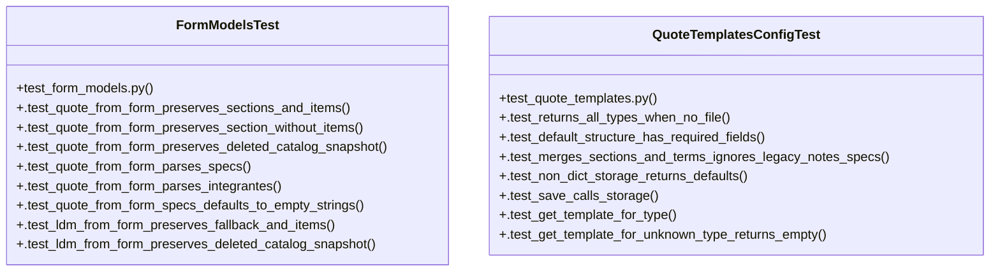

# Community 11

> 34 nodes · cohesion 0.10

## Key Concepts

- [quote_templates_config.py](file:///Users/macbook/ProjectTracker/tracker/quote_templates_config.py#L1) (13 connections)
- [quote_from_form()](file:///Users/macbook/ProjectTracker/tracker/form_models.py#L24) (12 connections)
- [form_models.py](file:///Users/macbook/ProjectTracker/tracker/form_models.py#L1) (11 connections)
- [get_quote_templates()](file:///Users/macbook/ProjectTracker/tracker/quote_templates_config.py#L102) (9 connections)
- [FormModelsTest](file:///Users/macbook/ProjectTracker/tests/test_form_models.py#L8) (9 connections)
- [QuoteTemplatesConfigTest](file:///Users/macbook/ProjectTracker/tests/test_quote_templates.py#L5) (8 connections)
- [ldm_from_form()](file:///Users/macbook/ProjectTracker/tracker/form_models.py#L131) (6 connections)
- [normalize_contact_rows()](file:///Users/macbook/ProjectTracker/tracker/quote_templates_config.py#L83) (5 connections)
- [get_template_for_type()](file:///Users/macbook/ProjectTracker/tracker/quote_templates_config.py#L116) (4 connections)
- [_normalize()](file:///Users/macbook/ProjectTracker/tracker/quote_templates_config.py#L87) (4 connections)
- [quote_templates()](file:///Users/macbook/ProjectTracker/tracker/routes/admin.py#L932) (3 connections)
- [_normalize_contacts()](file:///Users/macbook/ProjectTracker/tracker/quote_templates_config.py#L70) (3 connections)
- [save_quote_templates()](file:///Users/macbook/ProjectTracker/tracker/quote_templates_config.py#L112) (3 connections)
- [_to_float()](file:///Users/macbook/ProjectTracker/tracker/form_models.py#L174) (2 connections)
- [_normalize_terms()](file:///Users/macbook/ProjectTracker/tracker/quote_templates_config.py#L49) (2 connections)
- [.test_ldm_from_form_preserves_deleted_catalog_snapshot()](file:///Users/macbook/ProjectTracker/tests/test_form_models.py#L169) (2 connections)
- [.test_ldm_from_form_preserves_fallback_and_items()](file:///Users/macbook/ProjectTracker/tests/test_form_models.py#L149) (2 connections)
- [.test_quote_from_form_parses_integrantes()](file:///Users/macbook/ProjectTracker/tests/test_form_models.py#L108) (2 connections)
- [.test_quote_from_form_parses_specs()](file:///Users/macbook/ProjectTracker/tests/test_form_models.py#L85) (2 connections)
- [.test_quote_from_form_preserves_deleted_catalog_snapshot()](file:///Users/macbook/ProjectTracker/tests/test_form_models.py#L62) (2 connections)
- [.test_quote_from_form_preserves_section_without_items()](file:///Users/macbook/ProjectTracker/tests/test_form_models.py#L45) (2 connections)
- [.test_quote_from_form_preserves_sections_and_items()](file:///Users/macbook/ProjectTracker/tests/test_form_models.py#L9) (2 connections)
- [.test_quote_from_form_specs_defaults_to_empty_strings()](file:///Users/macbook/ProjectTracker/tests/test_form_models.py#L135) (2 connections)
- [.test_default_structure_has_required_fields()](file:///Users/macbook/ProjectTracker/tests/test_quote_templates.py#L15) (2 connections)
- [.test_get_template_for_type()](file:///Users/macbook/ProjectTracker/tests/test_quote_templates.py#L85) (2 connections)
- *... and 9 more nodes in this community*

## Class Diagram

## Relationships

- No strong cross-community connections detected

## Source Files

- [/Users/macbook/ProjectTracker/tests/test_form_models.py](file:///Users/macbook/ProjectTracker/tests/test_form_models.py)
- [/Users/macbook/ProjectTracker/tests/test_quote_templates.py](file:///Users/macbook/ProjectTracker/tests/test_quote_templates.py)
- [/Users/macbook/ProjectTracker/tracker/form_models.py](file:///Users/macbook/ProjectTracker/tracker/form_models.py)
- [/Users/macbook/ProjectTracker/tracker/quote_templates_config.py](file:///Users/macbook/ProjectTracker/tracker/quote_templates_config.py)
- [/Users/macbook/ProjectTracker/tracker/routes/admin.py](file:///Users/macbook/ProjectTracker/tracker/routes/admin.py)

## Audit Trail

- EXTRACTED: 83 (65%)
- INFERRED: 45 (35%)
- AMBIGUOUS: 0 (0%)

---

*Part of the graphify knowledge wiki. See [[index]] to navigate.*