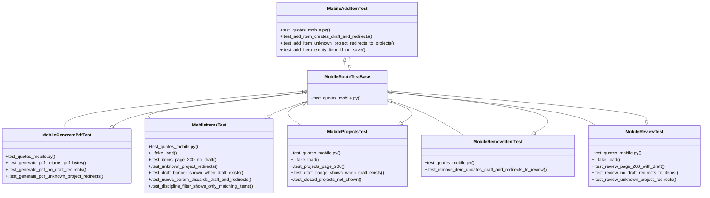

# Community 12

> 31 nodes · cohesion 0.08

## Key Concepts

- [test_quotes_mobile.py](file:///Users/macbook/ProjectTracker/tests/test_quotes_mobile.py#L1) (9 connections)
- [MobileItemsTest](file:///Users/macbook/ProjectTracker/tests/test_quotes_mobile.py#L122) (8 connections)
- [MobileRouteTestBase](file:///Users/macbook/ProjectTracker/tests/test_quotes_mobile.py#L69) (7 connections)
- [MobileProjectsTest](file:///Users/macbook/ProjectTracker/tests/test_quotes_mobile.py#L83) (6 connections)
- [MobileReviewTest](file:///Users/macbook/ProjectTracker/tests/test_quotes_mobile.py#L305) (6 connections)
- [MobileAddItemTest](file:///Users/macbook/ProjectTracker/tests/test_quotes_mobile.py#L209) (5 connections)
- [MobileGeneratePdfTest](file:///Users/macbook/ProjectTracker/tests/test_quotes_mobile.py#L343) (5 connections)
- [MobileRemoveItemTest](file:///Users/macbook/ProjectTracker/tests/test_quotes_mobile.py#L274) (3 connections)
- [.test_add_item_creates_draft_and_redirects()](file:///Users/macbook/ProjectTracker/tests/test_quotes_mobile.py#L210) (1 connections)
- [.test_add_item_empty_item_id_no_save()](file:///Users/macbook/ProjectTracker/tests/test_quotes_mobile.py#L248) (1 connections)
- [.test_add_item_unknown_project_redirects_to_projects()](file:///Users/macbook/ProjectTracker/tests/test_quotes_mobile.py#L239) (1 connections)
- [.test_generate_pdf_no_draft_redirects()](file:///Users/macbook/ProjectTracker/tests/test_quotes_mobile.py#L369) (1 connections)
- [.test_generate_pdf_returns_pdf_bytes()](file:///Users/macbook/ProjectTracker/tests/test_quotes_mobile.py#L344) (1 connections)
- [.test_generate_pdf_unknown_project_redirects()](file:///Users/macbook/ProjectTracker/tests/test_quotes_mobile.py#L382) (1 connections)
- [._fake_load()](file:///Users/macbook/ProjectTracker/tests/test_quotes_mobile.py#L123) (1 connections)
- [.test_discipline_filter_shows_only_matching_items()](file:///Users/macbook/ProjectTracker/tests/test_quotes_mobile.py#L183) (1 connections)
- [.test_draft_banner_shown_when_draft_exists()](file:///Users/macbook/ProjectTracker/tests/test_quotes_mobile.py#L144) (1 connections)
- [.test_items_page_200_no_draft()](file:///Users/macbook/ProjectTracker/tests/test_quotes_mobile.py#L132) (1 connections)
- [.test_nueva_param_discards_draft_and_redirects()](file:///Users/macbook/ProjectTracker/tests/test_quotes_mobile.py#L159) (1 connections)
- [.test_unknown_project_redirects()](file:///Users/macbook/ProjectTracker/tests/test_quotes_mobile.py#L138) (1 connections)
- [._fake_load()](file:///Users/macbook/ProjectTracker/tests/test_quotes_mobile.py#L84) (1 connections)
- [.test_closed_projects_not_shown()](file:///Users/macbook/ProjectTracker/tests/test_quotes_mobile.py#L110) (1 connections)
- [.test_draft_badge_shown_when_draft_exists()](file:///Users/macbook/ProjectTracker/tests/test_quotes_mobile.py#L97) (1 connections)
- [.test_projects_page_200()](file:///Users/macbook/ProjectTracker/tests/test_quotes_mobile.py#L91) (1 connections)
- [.test_remove_item_updates_draft_and_redirects_to_review()](file:///Users/macbook/ProjectTracker/tests/test_quotes_mobile.py#L275) (1 connections)
- *... and 6 more nodes in this community*

## Class Diagram

## Relationships

- No strong cross-community connections detected

## Source Files

- [/Users/macbook/ProjectTracker/tests/test_quotes_mobile.py](file:///Users/macbook/ProjectTracker/tests/test_quotes_mobile.py)

## Audit Trail

- EXTRACTED: 72 (100%)
- INFERRED: 0 (0%)
- AMBIGUOUS: 0 (0%)

---

*Part of the graphify knowledge wiki. See [[index]] to navigate.*