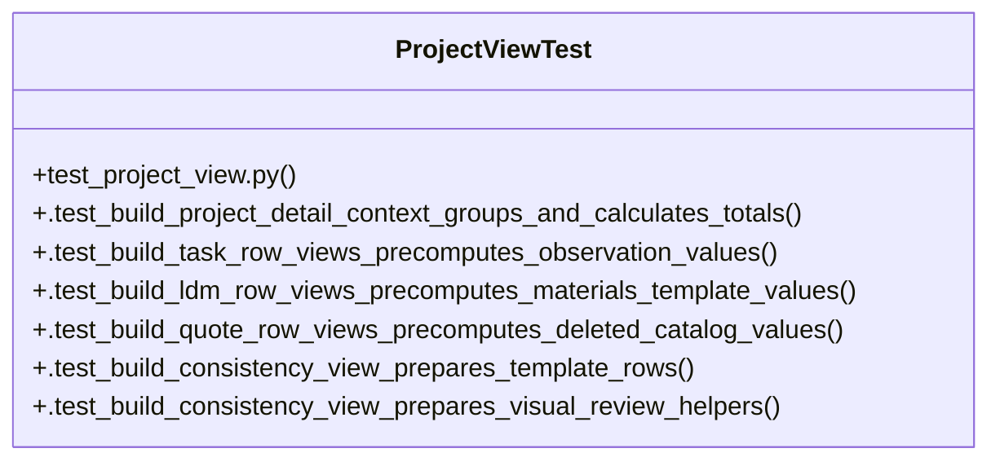

# Community 13

> 30 nodes · cohesion 0.11

## Key Concepts

- [build_project_detail_context()](file:///Users/macbook/ProjectTracker/tracker/project_view.py#L163) (17 connections)
- [domain.py](file:///Users/macbook/ProjectTracker/tracker/domain.py#L1) (16 connections)
- [project_view.py](file:///Users/macbook/ProjectTracker/tracker/project_view.py#L1) (16 connections)
- [build_consistency_view()](file:///Users/macbook/ProjectTracker/tracker/project_view.py#L134) (7 connections)
- [ProjectViewTest](file:///Users/macbook/ProjectTracker/tests/test_project_view.py#L13) (7 connections)
- [get_alcances()](file:///Users/macbook/ProjectTracker/tracker/domain.py#L20) (5 connections)
- [build_quote_row_views()](file:///Users/macbook/ProjectTracker/tracker/project_view.py#L62) (5 connections)
- [check_blocked()](file:///Users/macbook/ProjectTracker/tracker/domain.py#L62) (4 connections)
- [get_alcances_by_id()](file:///Users/macbook/ProjectTracker/tracker/domain.py#L27) (4 connections)
- [build_ldm_row_views()](file:///Users/macbook/ProjectTracker/tracker/project_view.py#L47) (4 connections)
- [build_task_row_views()](file:///Users/macbook/ProjectTracker/tracker/project_view.py#L114) (4 connections)
- [get_progress()](file:///Users/macbook/ProjectTracker/tracker/domain.py#L94) (3 connections)
- [_deleted_catalog_items()](file:///Users/macbook/ProjectTracker/tracker/project_view.py#L31) (3 connections)
- [alcances_admin()](file:///Users/macbook/ProjectTracker/tracker/routes/admin.py#L1099) (2 connections)
- [get_info_ext_excluded()](file:///Users/macbook/ProjectTracker/tracker/domain.py#L31) (2 connections)
- [today_short()](file:///Users/macbook/ProjectTracker/tracker/domain.py#L127) (2 connections)
- [_coverage_color()](file:///Users/macbook/ProjectTracker/tracker/project_view.py#L155) (2 connections)
- [_observation_view()](file:///Users/macbook/ProjectTracker/tracker/project_view.py#L103) (2 connections)
- [_status_color()](file:///Users/macbook/ProjectTracker/tracker/project_view.py#L22) (2 connections)
- [_status_icon()](file:///Users/macbook/ProjectTracker/tracker/project_view.py#L26) (2 connections)
- [.test_build_consistency_view_prepares_template_rows()](file:///Users/macbook/ProjectTracker/tests/test_project_view.py#L148) (2 connections)
- [.test_build_consistency_view_prepares_visual_review_helpers()](file:///Users/macbook/ProjectTracker/tests/test_project_view.py#L159) (2 connections)
- [.test_build_ldm_row_views_precomputes_materials_template_values()](file:///Users/macbook/ProjectTracker/tests/test_project_view.py#L112) (2 connections)
- [.test_build_project_detail_context_groups_and_calculates_totals()](file:///Users/macbook/ProjectTracker/tests/test_project_view.py#L14) (2 connections)
- [.test_build_quote_row_views_precomputes_deleted_catalog_values()](file:///Users/macbook/ProjectTracker/tests/test_project_view.py#L130) (2 connections)
- *... and 5 more nodes in this community*

## Class Diagram

## Relationships

- No strong cross-community connections detected

## Source Files

- [/Users/macbook/ProjectTracker/tests/test_project_view.py](file:///Users/macbook/ProjectTracker/tests/test_project_view.py)
- [/Users/macbook/ProjectTracker/tracker/domain.py](file:///Users/macbook/ProjectTracker/tracker/domain.py)
- [/Users/macbook/ProjectTracker/tracker/project_view.py](file:///Users/macbook/ProjectTracker/tracker/project_view.py)
- [/Users/macbook/ProjectTracker/tracker/routes/admin.py](file:///Users/macbook/ProjectTracker/tracker/routes/admin.py)

## Audit Trail

- EXTRACTED: 92 (74%)
- INFERRED: 33 (26%)
- AMBIGUOUS: 0 (0%)

---

*Part of the graphify knowledge wiki. See [[index]] to navigate.*