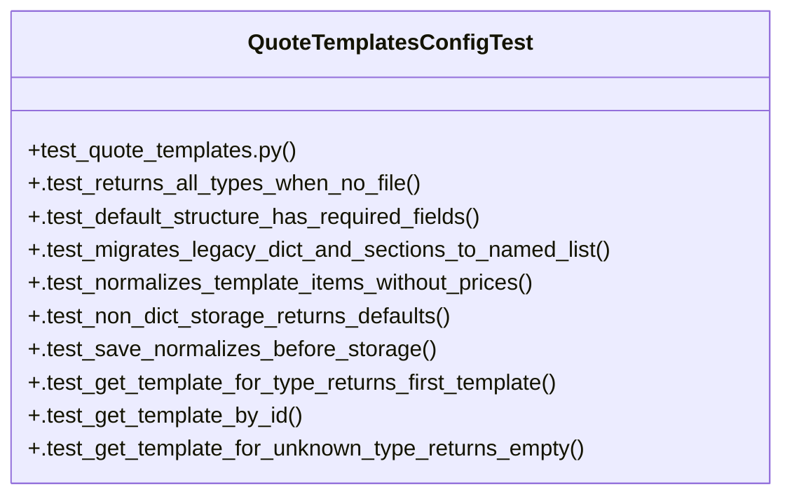

# Community 13

> 28 nodes · cohesion 0.14

## Key Concepts

- [quote_templates_config.py](file:///Users/macbook/ProjectTracker/tracker/quote_templates_config.py#L1) (20 connections)
- [get_quote_templates()](file:///Users/macbook/ProjectTracker/tracker/quote_templates_config.py#L230) (11 connections)
- [QuoteTemplatesConfigTest](file:///Users/macbook/ProjectTracker/tests/test_quote_templates.py#L5) (10 connections)
- [_make_default_template()](file:///Users/macbook/ProjectTracker/tracker/quote_templates_config.py#L187) (7 connections)
- [_normalize_template()](file:///Users/macbook/ProjectTracker/tracker/quote_templates_config.py#L200) (7 connections)
- [get_template_for_type()](file:///Users/macbook/ProjectTracker/tracker/quote_templates_config.py#L244) (5 connections)
- [_normalize()](file:///Users/macbook/ProjectTracker/tracker/quote_templates_config.py#L213) (5 connections)
- [normalize_contact_rows()](file:///Users/macbook/ProjectTracker/tracker/quote_templates_config.py#L138) (5 connections)
- [_normalize_contacts()](file:///Users/macbook/ProjectTracker/tracker/quote_templates_config.py#L125) (4 connections)
- [_normalize_sections()](file:///Users/macbook/ProjectTracker/tracker/quote_templates_config.py#L177) (4 connections)
- [save_quote_templates()](file:///Users/macbook/ProjectTracker/tracker/quote_templates_config.py#L240) (4 connections)
- [get_template_by_id()](file:///Users/macbook/ProjectTracker/tracker/quote_templates_config.py#L249) (3 connections)
- [_new_id()](file:///Users/macbook/ProjectTracker/tracker/quote_templates_config.py#L100) (3 connections)
- [_normalize_section()](file:///Users/macbook/ProjectTracker/tracker/quote_templates_config.py#L160) (3 connections)
- [_normalize_terms()](file:///Users/macbook/ProjectTracker/tracker/quote_templates_config.py#L104) (3 connections)
- [_normalize_template_item()](file:///Users/macbook/ProjectTracker/tracker/quote_templates_config.py#L142) (2 connections)
- [.test_default_structure_has_required_fields()](file:///Users/macbook/ProjectTracker/tests/test_quote_templates.py#L15) (2 connections)
- [.test_get_template_by_id()](file:///Users/macbook/ProjectTracker/tests/test_quote_templates.py#L145) (2 connections)
- [.test_get_template_for_type_returns_first_template()](file:///Users/macbook/ProjectTracker/tests/test_quote_templates.py#L128) (2 connections)
- [.test_get_template_for_unknown_type_returns_empty()](file:///Users/macbook/ProjectTracker/tests/test_quote_templates.py#L157) (2 connections)
- [.test_migrates_legacy_dict_and_sections_to_named_list()](file:///Users/macbook/ProjectTracker/tests/test_quote_templates.py#L40) (2 connections)
- [.test_non_dict_storage_returns_defaults()](file:///Users/macbook/ProjectTracker/tests/test_quote_templates.py#L113) (2 connections)
- [.test_normalizes_template_items_without_prices()](file:///Users/macbook/ProjectTracker/tests/test_quote_templates.py#L80) (2 connections)
- [.test_returns_all_types_when_no_file()](file:///Users/macbook/ProjectTracker/tests/test_quote_templates.py#L7) (2 connections)
- [.test_save_normalizes_before_storage()](file:///Users/macbook/ProjectTracker/tests/test_quote_templates.py#L120) (2 connections)
- *... and 3 more nodes in this community*

## Class Diagram

## Relationships

- No strong cross-community connections detected

## Source Files

- [/Users/macbook/ProjectTracker/tests/test_quote_templates.py](file:///Users/macbook/ProjectTracker/tests/test_quote_templates.py)
- [/Users/macbook/ProjectTracker/tracker/quote_templates_config.py](file:///Users/macbook/ProjectTracker/tracker/quote_templates_config.py)

## Audit Trail

- EXTRACTED: 92 (79%)
- INFERRED: 25 (21%)
- AMBIGUOUS: 0 (0%)

---

*Part of the graphify knowledge wiki. See [[index]] to navigate.*