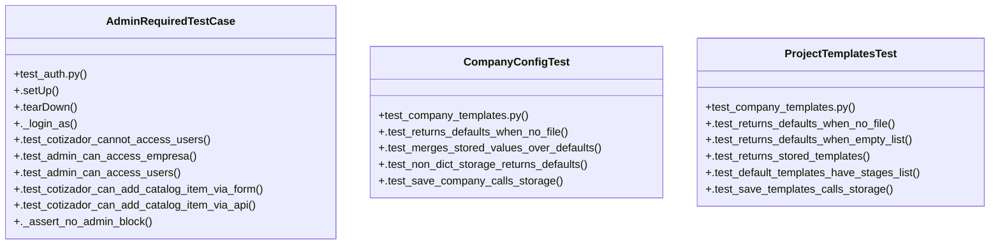

# Community 13

> 37 nodes · cohesion 0.09

## Key Concepts

- [AdminRequiredTestCase](file:///Users/macbook/ProjectTracker/tests/test_auth.py#L107) (17 connections)
- [._login_as()](file:///Users/macbook/ProjectTracker/tests/test_auth.py#L133) (13 connections)
- [get_company()](file:///Users/macbook/ProjectTracker/tracker/company_config.py#L15) (9 connections)
- [get_project_templates()](file:///Users/macbook/ProjectTracker/tracker/templates_config.py#L17) (8 connections)
- [._assert_no_admin_block()](file:///Users/macbook/ProjectTracker/tests/test_auth.py#L175) (6 connections)
- [ProjectTemplatesTest](file:///Users/macbook/ProjectTracker/tests/test_company_templates.py#L41) (6 connections)
- [CompanyConfigTest](file:///Users/macbook/ProjectTracker/tests/test_company_templates.py#L5) (5 connections)
- [empresa()](file:///Users/macbook/ProjectTracker/tracker/routes/admin.py#L787) (4 connections)
- [save_company()](file:///Users/macbook/ProjectTracker/tracker/company_config.py#L25) (4 connections)
- [.test_cotizador_can_view_empresa_but_only_edit_address()](file:///Users/macbook/ProjectTracker/tests/test_auth.py#L255) (4 connections)
- [company_config.py](file:///Users/macbook/ProjectTracker/tracker/company_config.py#L1) (4 connections)
- [templates_config.py](file:///Users/macbook/ProjectTracker/tracker/templates_config.py#L1) (4 connections)
- [save_project_templates()](file:///Users/macbook/ProjectTracker/tracker/templates_config.py#L27) (3 connections)
- [.test_admin_can_edit_all_empresa_fields()](file:///Users/macbook/ProjectTracker/tests/test_auth.py#L278) (3 connections)
- [.test_cotizador_can_access_system_pages_except_admin_only_ones()](file:///Users/macbook/ProjectTracker/tests/test_auth.py#L230) (3 connections)
- [.test_cotizador_can_delete_project_and_approve_quote()](file:///Users/macbook/ProjectTracker/tests/test_auth.py#L222) (3 connections)
- [.test_cotizador_can_edit_and_delete_catalog_items()](file:///Users/macbook/ProjectTracker/tests/test_auth.py#L179) (3 connections)
- [.test_cotizador_can_manage_proveedores_fichas_team()](file:///Users/macbook/ProjectTracker/tests/test_auth.py#L199) (3 connections)
- [_company_logo_version()](file:///Users/macbook/ProjectTracker/tracker/routes/admin.py#L762) (2 connections)
- [empresa_logo_file()](file:///Users/macbook/ProjectTracker/tracker/routes/admin.py#L774) (2 connections)
- [.test_admin_can_access_empresa()](file:///Users/macbook/ProjectTracker/tests/test_auth.py#L144) (2 connections)
- [.test_admin_can_access_export_and_reset_data()](file:///Users/macbook/ProjectTracker/tests/test_auth.py#L247) (2 connections)
- [.test_admin_can_access_users()](file:///Users/macbook/ProjectTracker/tests/test_auth.py#L149) (2 connections)
- [.test_cotizador_can_add_catalog_item_via_api()](file:///Users/macbook/ProjectTracker/tests/test_auth.py#L166) (2 connections)
- [.test_cotizador_can_add_catalog_item_via_form()](file:///Users/macbook/ProjectTracker/tests/test_auth.py#L154) (2 connections)
- *... and 12 more nodes in this community*

## Class Diagram

```mermaid
classDiagram
    class AdminRequiredTestCase {
        +test_auth.py()
        +.setUp()
        +.tearDown()
        +._login_as()
        +.test_cotizador_cannot_access_users()
        +.test_admin_can_access_empresa()
        +.test_admin_can_access_users()
        +.test_cotizador_can_add_catalog_item_via_form()
        +.test_cotizador_can_add_catalog_item_via_api()
        +._assert_no_admin_block()
    }
    class CompanyConfigTest {
        +test_company_templates.py()
        +.test_returns_defaults_when_no_file()
        +.test_merges_stored_values_over_defaults()
        +.test_non_dict_storage_returns_defaults()
        +.test_save_company_calls_storage()
    }
    class ProjectTemplatesTest {
        +test_company_templates.py()
        +.test_returns_defaults_when_no_file()
        +.test_returns_defaults_when_empty_list()
        +.test_returns_stored_templates()
        +.test_default_templates_have_stages_list()
        +.test_save_templates_calls_storage()
    }
```

## Relationships

- No strong cross-community connections detected

## Source Files

- [/Users/macbook/ProjectTracker/tests/test_auth.py](file:///Users/macbook/ProjectTracker/tests/test_auth.py)
- [/Users/macbook/ProjectTracker/tests/test_company_templates.py](file:///Users/macbook/ProjectTracker/tests/test_company_templates.py)
- [/Users/macbook/ProjectTracker/tracker/company_config.py](file:///Users/macbook/ProjectTracker/tracker/company_config.py)
- [/Users/macbook/ProjectTracker/tracker/routes/admin.py](file:///Users/macbook/ProjectTracker/tracker/routes/admin.py)
- [/Users/macbook/ProjectTracker/tracker/templates_config.py](file:///Users/macbook/ProjectTracker/tracker/templates_config.py)

## Audit Trail

- EXTRACTED: 105 (76%)
- INFERRED: 33 (24%)
- AMBIGUOUS: 0 (0%)

---

*Part of the graphify knowledge wiki. See [[index]] to navigate.*