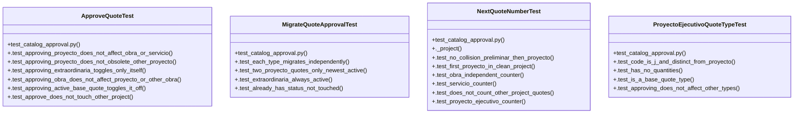

# Community 13

> 29 nodes · cohesion 0.15

## Key Concepts

- [next_quote_number()](file:///Users/macbook/Documents/ProjectTracker/tracker/catalog.py#L494) (13 connections)
- [_q()](file:///Users/macbook/Documents/ProjectTracker/tests/test_catalog_approval.py#L16) (12 connections)
- [approve_quote()](file:///Users/macbook/Documents/ProjectTracker/tracker/catalog.py#L137) (10 connections)
- [migrate_quote_approval()](file:///Users/macbook/Documents/ProjectTracker/tracker/catalog.py#L99) (9 connections)
- [NextQuoteNumberTest](file:///Users/macbook/Documents/ProjectTracker/tests/test_catalog_approval.py#L129) (8 connections)
- [ApproveQuoteTest](file:///Users/macbook/Documents/ProjectTracker/tests/test_catalog_approval.py#L23) (7 connections)
- [._project()](file:///Users/macbook/Documents/ProjectTracker/tests/test_catalog_approval.py#L130) (7 connections)
- [MigrateQuoteApprovalTest](file:///Users/macbook/Documents/ProjectTracker/tests/test_catalog_approval.py#L87) (5 connections)
- [ProyectoEjecutivoQuoteTypeTest](file:///Users/macbook/Documents/ProjectTracker/tests/test_catalog_approval.py#L171) (5 connections)
- [test_catalog_approval.py](file:///Users/macbook/Documents/ProjectTracker/tests/test_catalog_approval.py#L1) (5 connections)
- [.test_approve_does_not_touch_other_project()](file:///Users/macbook/Documents/ProjectTracker/tests/test_catalog_approval.py#L77) (3 connections)
- [.test_approving_active_base_quote_toggles_it_off()](file:///Users/macbook/Documents/ProjectTracker/tests/test_catalog_approval.py#L70) (3 connections)
- [.test_approving_extraordinaria_toggles_only_itself()](file:///Users/macbook/Documents/ProjectTracker/tests/test_catalog_approval.py#L48) (3 connections)
- [.test_approving_obra_does_not_affect_proyecto_or_other_obra()](file:///Users/macbook/Documents/ProjectTracker/tests/test_catalog_approval.py#L58) (3 connections)
- [.test_approving_proyecto_does_not_affect_obra_or_servicio()](file:///Users/macbook/Documents/ProjectTracker/tests/test_catalog_approval.py#L24) (3 connections)
- [.test_approving_proyecto_does_not_obsolete_other_proyecto()](file:///Users/macbook/Documents/ProjectTracker/tests/test_catalog_approval.py#L36) (3 connections)
- [.test_already_has_status_not_touched()](file:///Users/macbook/Documents/ProjectTracker/tests/test_catalog_approval.py#L120) (3 connections)
- [.test_each_type_migrates_independently()](file:///Users/macbook/Documents/ProjectTracker/tests/test_catalog_approval.py#L88) (3 connections)
- [.test_extraordinaria_always_active()](file:///Users/macbook/Documents/ProjectTracker/tests/test_catalog_approval.py#L111) (3 connections)
- [.test_two_proyecto_quotes_only_newest_active()](file:///Users/macbook/Documents/ProjectTracker/tests/test_catalog_approval.py#L101) (3 connections)
- [.test_does_not_count_other_project_quotes()](file:///Users/macbook/Documents/ProjectTracker/tests/test_catalog_approval.py#L159) (3 connections)
- [.test_first_proyecto_in_clean_project()](file:///Users/macbook/Documents/ProjectTracker/tests/test_catalog_approval.py#L141) (3 connections)
- [.test_no_collision_preliminar_then_proyecto()](file:///Users/macbook/Documents/ProjectTracker/tests/test_catalog_approval.py#L133) (3 connections)
- [.test_obra_independent_counter()](file:///Users/macbook/Documents/ProjectTracker/tests/test_catalog_approval.py#L146) (3 connections)
- [.test_proyecto_ejecutivo_counter()](file:///Users/macbook/Documents/ProjectTracker/tests/test_catalog_approval.py#L165) (3 connections)
- *... and 4 more nodes in this community*

## Class Diagram

```mermaid
classDiagram
    class ApproveQuoteTest {
        +test_catalog_approval.py()
        +.test_approving_proyecto_does_not_affect_obra_or_servicio()
        +.test_approving_proyecto_does_not_obsolete_other_proyecto()
        +.test_approving_extraordinaria_toggles_only_itself()
        +.test_approving_obra_does_not_affect_proyecto_or_other_obra()
        +.test_approving_active_base_quote_toggles_it_off()
        +.test_approve_does_not_touch_other_project()
    }
    class MigrateQuoteApprovalTest {
        +test_catalog_approval.py()
        +.test_each_type_migrates_independently()
        +.test_two_proyecto_quotes_only_newest_active()
        +.test_extraordinaria_always_active()
        +.test_already_has_status_not_touched()
    }
    class NextQuoteNumberTest {
        +test_catalog_approval.py()
        +._project()
        +.test_no_collision_preliminar_then_proyecto()
        +.test_first_proyecto_in_clean_project()
        +.test_obra_independent_counter()
        +.test_servicio_counter()
        +.test_does_not_count_other_project_quotes()
        +.test_proyecto_ejecutivo_counter()
    }
    class ProyectoEjecutivoQuoteTypeTest {
        +test_catalog_approval.py()
        +.test_code_is_j_and_distinct_from_proyecto()
        +.test_has_no_quantities()
        +.test_is_a_base_quote_type()
        +.test_approving_does_not_affect_other_types()
    }
```

## Relationships

- No strong cross-community connections detected

## Source Files

- [/Users/macbook/Documents/ProjectTracker/tests/test_catalog_approval.py](file:///Users/macbook/Documents/ProjectTracker/tests/test_catalog_approval.py)
- [/Users/macbook/Documents/ProjectTracker/tracker/catalog.py](file:///Users/macbook/Documents/ProjectTracker/tracker/catalog.py)

## Audit Trail

- EXTRACTED: 94 (70%)
- INFERRED: 40 (30%)
- AMBIGUOUS: 0 (0%)

---

*Part of the graphify knowledge wiki. See [[index]] to navigate.*