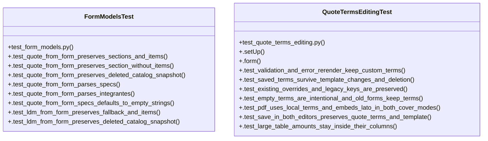

# Community 13

> 39 nodes · cohesion 0.09

## Key Concepts

- [quote_from_form()](file:///Users/macbook/ProjectTracker/tracker/form_models.py#L28) (18 connections)
- [terms_templates_config.py](file:///Users/macbook/ProjectTracker/tracker/terms_templates_config.py#L1) (12 connections)
- [resolve_quote_terms()](file:///Users/macbook/ProjectTracker/tracker/terms_templates_config.py#L94) (11 connections)
- [QuoteTermsEditingTest](file:///Users/macbook/ProjectTracker/tests/test_quote_terms_editing.py#L20) (10 connections)
- [FormModelsTest](file:///Users/macbook/Documents/ProjectTracker/tests/test_form_models.py#L8) (9 connections)
- [get_terms_templates()](file:///Users/macbook/ProjectTracker/tracker/terms_templates_config.py#L72) (7 connections)
- [quote_terms_from_form()](file:///Users/macbook/ProjectTracker/tracker/terms_templates_config.py#L127) (6 connections)
- [.form()](file:///Users/macbook/ProjectTracker/tests/test_quote_terms_editing.py#L27) (6 connections)
- [_normalize()](file:///Users/macbook/ProjectTracker/tracker/terms_templates_config.py#L62) (5 connections)
- [form_models.py](file:///Users/macbook/ProjectTracker/tracker/form_models.py#L1) (5 connections)
- [terms_templates()](file:///Users/macbook/ProjectTracker/tracker/routes/quotes.py#L1304) (4 connections)
- [_normalize_template()](file:///Users/macbook/ProjectTracker/tracker/terms_templates_config.py#L46) (4 connections)
- [_normalize_term()](file:///Users/macbook/ProjectTracker/tracker/terms_templates_config.py#L31) (4 connections)
- [.test_large_table_amounts_stay_inside_their_columns()](file:///Users/macbook/ProjectTracker/tests/test_quote_terms_editing.py#L126) (4 connections)
- [.test_pdf_uses_local_terms_and_embeds_lato_in_both_cover_modes()](file:///Users/macbook/ProjectTracker/tests/test_quote_terms_editing.py#L76) (4 connections)
- [.test_saved_terms_survive_template_changes_and_deletion()](file:///Users/macbook/ProjectTracker/tests/test_quote_terms_editing.py#L48) (4 connections)
- [.test_validation_and_error_rerender_keep_custom_terms()](file:///Users/macbook/ProjectTracker/tests/test_quote_terms_editing.py#L39) (4 connections)
- [get_terms_template_by_id()](file:///Users/macbook/ProjectTracker/tracker/terms_templates_config.py#L86) (3 connections)
- [_new_id()](file:///Users/macbook/ProjectTracker/tracker/terms_templates_config.py#L16) (3 connections)
- [save_terms_templates()](file:///Users/macbook/ProjectTracker/tracker/terms_templates_config.py#L82) (3 connections)
- [_seed_terms_template()](file:///Users/macbook/ProjectTracker/tracker/terms_templates_config.py#L20) (3 connections)
- [.test_empty_terms_are_intentional_and_old_forms_keep_terms()](file:///Users/macbook/ProjectTracker/tests/test_quote_terms_editing.py#L70) (3 connections)
- [.test_save_in_both_editors_preserves_quote_terms_and_template()](file:///Users/macbook/ProjectTracker/tests/test_quote_terms_editing.py#L103) (3 connections)
- [_to_float()](file:///Users/macbook/ProjectTracker/tracker/form_models.py#L188) (2 connections)
- [.test_ldm_from_form_preserves_deleted_catalog_snapshot()](file:///Users/macbook/Documents/ProjectTracker/tests/test_form_models.py#L169) (2 connections)
- *... and 14 more nodes in this community*

## Class Diagram

```mermaid
classDiagram
    class FormModelsTest {
        +test_form_models.py()
        +.test_quote_from_form_preserves_sections_and_items()
        +.test_quote_from_form_preserves_section_without_items()
        +.test_quote_from_form_preserves_deleted_catalog_snapshot()
        +.test_quote_from_form_parses_specs()
        +.test_quote_from_form_parses_integrantes()
        +.test_quote_from_form_specs_defaults_to_empty_strings()
        +.test_ldm_from_form_preserves_fallback_and_items()
        +.test_ldm_from_form_preserves_deleted_catalog_snapshot()
    }
    class QuoteTermsEditingTest {
        +test_quote_terms_editing.py()
        +.setUp()
        +.form()
        +.test_validation_and_error_rerender_keep_custom_terms()
        +.test_saved_terms_survive_template_changes_and_deletion()
        +.test_existing_overrides_and_legacy_keys_are_preserved()
        +.test_empty_terms_are_intentional_and_old_forms_keep_terms()
        +.test_pdf_uses_local_terms_and_embeds_lato_in_both_cover_modes()
        +.test_save_in_both_editors_preserves_quote_terms_and_template()
        +.test_large_table_amounts_stay_inside_their_columns()
    }
```

## Relationships

- [[Community 14]] (3 shared connections)

## Source Files

- [/Users/macbook/Documents/ProjectTracker/tests/test_form_models.py](file:///Users/macbook/Documents/ProjectTracker/tests/test_form_models.py)
- [/Users/macbook/ProjectTracker/tests/test_quote_terms_editing.py](file:///Users/macbook/ProjectTracker/tests/test_quote_terms_editing.py)
- [/Users/macbook/ProjectTracker/tracker/form_models.py](file:///Users/macbook/ProjectTracker/tracker/form_models.py)
- [/Users/macbook/ProjectTracker/tracker/routes/quotes.py](file:///Users/macbook/ProjectTracker/tracker/routes/quotes.py)
- [/Users/macbook/ProjectTracker/tracker/terms_templates_config.py](file:///Users/macbook/ProjectTracker/tracker/terms_templates_config.py)

## Audit Trail

- EXTRACTED: 109 (68%)
- INFERRED: 52 (32%)
- AMBIGUOUS: 0 (0%)

---

*Part of the graphify knowledge wiki. See [[index]] to navigate.*