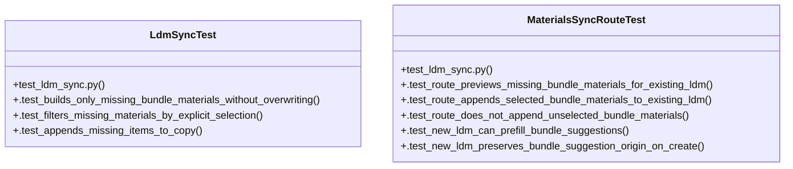

# Community 14

> 25 nodes · cohesion 0.12

## Key Concepts

- [missing_ldm_items_from_bundles()](file:///Users/macbook/ProjectTracker/tracker/ldm_sync.py#L52) (12 connections)
- [ldm_sync.py](file:///Users/macbook/ProjectTracker/tracker/ldm_sync.py#L1) (10 connections)
- [MaterialsSyncRouteTest](file:///Users/macbook/ProjectTracker/tests/test_ldm_sync.py#L80) (6 connections)
- [_aggregate_ldm_qty_by_catalog()](file:///Users/macbook/ProjectTracker/tracker/ldm_sync.py#L25) (5 connections)
- [selected_missing_bundle_items()](file:///Users/macbook/ProjectTracker/tracker/ldm_sync.py#L95) (5 connections)
- [append_missing_bundle_items_to_ldm()](file:///Users/macbook/ProjectTracker/tracker/ldm_sync.py#L107) (4 connections)
- [_clean()](file:///Users/macbook/ProjectTracker/tracker/ldm_sync.py#L21) (4 connections)
- [_safe_float()](file:///Users/macbook/ProjectTracker/tracker/ldm_sync.py#L10) (4 connections)
- [LdmSyncTest](file:///Users/macbook/ProjectTracker/tests/test_ldm_sync.py#L50) (4 connections)
- [test_ldm_sync.py](file:///Users/macbook/ProjectTracker/tests/test_ldm_sync.py#L1) (4 connections)
- [_round()](file:///Users/macbook/ProjectTracker/tracker/ldm_sync.py#L17) (3 connections)
- [.test_filters_missing_materials_by_explicit_selection()](file:///Users/macbook/ProjectTracker/tests/test_ldm_sync.py#L62) (3 connections)
- [.test_appends_missing_items_to_copy()](file:///Users/macbook/ProjectTracker/tests/test_ldm_sync.py#L72) (2 connections)
- [.test_builds_only_missing_bundle_materials_without_overwriting()](file:///Users/macbook/ProjectTracker/tests/test_ldm_sync.py#L51) (2 connections)
- [Sincronizacion parcial de LDM desde bundles de COT.](file:///Users/macbook/ProjectTracker/tracker/ldm_sync.py#L1) (1 connections)
- [Anexa faltantes a una LDM y devuelve (copia_actualizada, agregados).](file:///Users/macbook/ProjectTracker/tracker/ldm_sync.py#L114) (1 connections)
- [Devuelve filas LDM faltantes derivadas de la expansion tecnica.      No modifica](file:///Users/macbook/ProjectTracker/tracker/ldm_sync.py#L58) (1 connections)
- [Filtra faltantes por seleccion explicita de catalog_item_id.](file:///Users/macbook/ProjectTracker/tracker/ldm_sync.py#L96) (1 connections)
- [.test_new_ldm_can_prefill_bundle_suggestions()](file:///Users/macbook/ProjectTracker/tests/test_ldm_sync.py#L165) (1 connections)
- [.test_new_ldm_preserves_bundle_suggestion_origin_on_create()](file:///Users/macbook/ProjectTracker/tests/test_ldm_sync.py#L185) (1 connections)
- [.test_route_appends_selected_bundle_materials_to_existing_ldm()](file:///Users/macbook/ProjectTracker/tests/test_ldm_sync.py#L112) (1 connections)
- [.test_route_does_not_append_unselected_bundle_materials()](file:///Users/macbook/ProjectTracker/tests/test_ldm_sync.py#L141) (1 connections)
- [.test_route_previews_missing_bundle_materials_for_existing_ldm()](file:///Users/macbook/ProjectTracker/tests/test_ldm_sync.py#L90) (1 connections)
- [Pruebas de sincronizacion parcial LDM desde bundles.](file:///Users/macbook/ProjectTracker/tests/test_ldm_sync.py#L1) (1 connections)
- [setUpClass()](file:///Users/macbook/ProjectTracker/tests/test_ldm_sync.py#L82) (1 connections)

## Class Diagram

## Relationships

- No strong cross-community connections detected

## Source Files

- [/Users/macbook/ProjectTracker/tests/test_ldm_sync.py](file:///Users/macbook/ProjectTracker/tests/test_ldm_sync.py)
- [/Users/macbook/ProjectTracker/tracker/ldm_sync.py](file:///Users/macbook/ProjectTracker/tracker/ldm_sync.py)

## Audit Trail

- EXTRACTED: 66 (84%)
- INFERRED: 13 (16%)
- AMBIGUOUS: 0 (0%)

---

*Part of the graphify knowledge wiki. See [[index]] to navigate.*