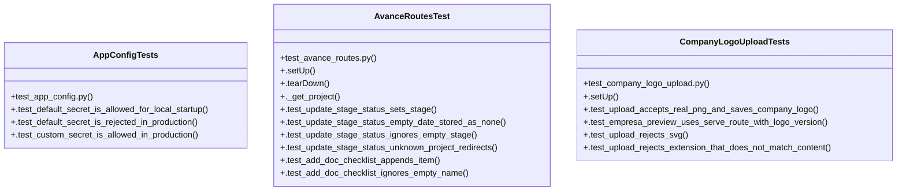

# Community 14

> 33 nodes · cohesion 0.08

## Key Concepts

- [AvanceRoutesTest](file:///Users/macbook/Documents/ProjectTracker/tests/test_avance_routes.py#L25) (19 connections)
- [._get_project()](file:///Users/macbook/Documents/ProjectTracker/tests/test_avance_routes.py#L41) (13 connections)
- [CompanyLogoUploadTests](file:///Users/macbook/Documents/ProjectTracker/tests/test_company_logo_upload.py#L8) (7 connections)
- [_requires_configured_secret_key()](file:///Users/macbook/Documents/ProjectTracker/tracker/__init__.py#L49) (6 connections)
- [AppConfigTests](file:///Users/macbook/Documents/ProjectTracker/tests/test_app_config.py#L8) (5 connections)
- [.test_update_stage_budget_skips_without_template()](file:///Users/macbook/Documents/ProjectTracker/tests/test_avance_routes.py#L180) (4 connections)
- **TestCase** (3 connections)
- [.test_custom_secret_is_allowed_in_production()](file:///Users/macbook/Documents/ProjectTracker/tests/test_app_config.py#L17) (2 connections)
- [.test_default_secret_is_allowed_for_local_startup()](file:///Users/macbook/Documents/ProjectTracker/tests/test_app_config.py#L9) (2 connections)
- [.test_default_secret_is_rejected_in_production()](file:///Users/macbook/Documents/ProjectTracker/tests/test_app_config.py#L13) (2 connections)
- [.tearDown()](file:///Users/macbook/Documents/ProjectTracker/tests/test_avance_routes.py#L38) (2 connections)
- [.test_add_doc_checklist_appends_item()](file:///Users/macbook/Documents/ProjectTracker/tests/test_avance_routes.py#L83) (2 connections)
- [.test_add_doc_checklist_ignores_empty_name()](file:///Users/macbook/Documents/ProjectTracker/tests/test_avance_routes.py#L95) (2 connections)
- [.test_add_multiple_docs_independent()](file:///Users/macbook/Documents/ProjectTracker/tests/test_avance_routes.py#L137) (2 connections)
- [.test_delete_doc_checklist_removes_item()](file:///Users/macbook/Documents/ProjectTracker/tests/test_avance_routes.py#L125) (2 connections)
- [.test_toggle_doc_checklist_flips_done()](file:///Users/macbook/Documents/ProjectTracker/tests/test_avance_routes.py#L104) (2 connections)
- [.test_update_stage_budget_handles_missing_values_as_zero()](file:///Users/macbook/Documents/ProjectTracker/tests/test_avance_routes.py#L168) (2 connections)
- [.test_update_stage_budget_persists_values()](file:///Users/macbook/Documents/ProjectTracker/tests/test_avance_routes.py#L147) (2 connections)
- [.test_update_stage_status_empty_date_stored_as_none()](file:///Users/macbook/Documents/ProjectTracker/tests/test_avance_routes.py#L56) (2 connections)
- [.test_update_stage_status_ignores_empty_stage()](file:///Users/macbook/Documents/ProjectTracker/tests/test_avance_routes.py#L65) (2 connections)
- [.test_update_stage_status_sets_stage()](file:///Users/macbook/Documents/ProjectTracker/tests/test_avance_routes.py#L46) (2 connections)
- [.test_progress_pdf_returns_pdf_content()](file:///Users/macbook/Documents/ProjectTracker/tests/test_avance_routes.py#L201) (1 connections)
- [.test_progress_pdf_unknown_project_404()](file:///Users/macbook/Documents/ProjectTracker/tests/test_avance_routes.py#L207) (1 connections)
- [.test_update_stage_budget_unknown_project_redirects()](file:///Users/macbook/Documents/ProjectTracker/tests/test_avance_routes.py#L195) (1 connections)
- [.test_update_stage_status_unknown_project_redirects()](file:///Users/macbook/Documents/ProjectTracker/tests/test_avance_routes.py#L74) (1 connections)
- *... and 8 more nodes in this community*

## Class Diagram

```mermaid
classDiagram
    class AppConfigTests {
        +test_app_config.py()
        +.test_default_secret_is_allowed_for_local_startup()
        +.test_default_secret_is_rejected_in_production()
        +.test_custom_secret_is_allowed_in_production()
    }
    class AvanceRoutesTest {
        +test_avance_routes.py()
        +.setUp()
        +.tearDown()
        +._get_project()
        +.test_update_stage_status_sets_stage()
        +.test_update_stage_status_empty_date_stored_as_none()
        +.test_update_stage_status_ignores_empty_stage()
        +.test_update_stage_status_unknown_project_redirects()
        +.test_add_doc_checklist_appends_item()
        +.test_add_doc_checklist_ignores_empty_name()
    }
    class CompanyLogoUploadTests {
        +test_company_logo_upload.py()
        +.setUp()
        +.test_upload_accepts_real_png_and_saves_company_logo()
        +.test_empresa_preview_uses_serve_route_with_logo_version()
        +.test_upload_rejects_svg()
        +.test_upload_rejects_extension_that_does_not_match_content()
    }
```

## Relationships

- No strong cross-community connections detected

## Source Files

- [/Users/macbook/Documents/ProjectTracker/tests/test_app_config.py](file:///Users/macbook/Documents/ProjectTracker/tests/test_app_config.py)
- [/Users/macbook/Documents/ProjectTracker/tests/test_avance_routes.py](file:///Users/macbook/Documents/ProjectTracker/tests/test_avance_routes.py)
- [/Users/macbook/Documents/ProjectTracker/tests/test_company_logo_upload.py](file:///Users/macbook/Documents/ProjectTracker/tests/test_company_logo_upload.py)
- [/Users/macbook/Documents/ProjectTracker/tracker/__init__.py](file:///Users/macbook/Documents/ProjectTracker/tracker/__init__.py)

## Audit Trail

- EXTRACTED: 87 (90%)
- INFERRED: 10 (10%)
- AMBIGUOUS: 0 (0%)

---

*Part of the graphify knowledge wiki. See [[index]] to navigate.*