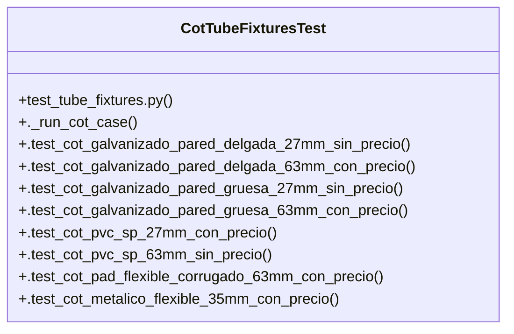

# Community 15

> 23 nodes · cohesion 0.15

## Key Concepts

- [CotTubeFixturesTest](file:///Users/macbook/ProjectTracker/tests/test_tube_fixtures.py#L282) (16 connections)
- [._run_cot_case()](file:///Users/macbook/ProjectTracker/tests/test_tube_fixtures.py#L284) (14 connections)
- [_write_cot()](file:///Users/macbook/ProjectTracker/tests/test_tube_fixtures.py#L67) (6 connections)
- [test_tube_fixtures.py](file:///Users/macbook/ProjectTracker/tests/test_tube_fixtures.py#L1) (5 connections)
- [.test_cot_mixed_tubes_single_file()](file:///Users/macbook/ProjectTracker/tests/test_tube_fixtures.py#L353) (4 connections)
- [.test_cot_total_rounding_two_decimals()](file:///Users/macbook/ProjectTracker/tests/test_tube_fixtures.py#L373) (4 connections)
- [.test_cot_with_metadata_proyecto_clave_and_quote_type()](file:///Users/macbook/ProjectTracker/tests/test_tube_fixtures.py#L337) (4 connections)
- [.test_cot_flexible_licuatite_35mm_con_precio()](file:///Users/macbook/ProjectTracker/tests/test_tube_fixtures.py#L331) (2 connections)
- [.test_cot_flexible_licuatite_63mm_con_precio()](file:///Users/macbook/ProjectTracker/tests/test_tube_fixtures.py#L334) (2 connections)
- [.test_cot_galvanizado_pared_delgada_27mm_sin_precio()](file:///Users/macbook/ProjectTracker/tests/test_tube_fixtures.py#L304) (2 connections)
- [.test_cot_galvanizado_pared_delgada_63mm_con_precio()](file:///Users/macbook/ProjectTracker/tests/test_tube_fixtures.py#L307) (2 connections)
- [.test_cot_galvanizado_pared_gruesa_27mm_sin_precio()](file:///Users/macbook/ProjectTracker/tests/test_tube_fixtures.py#L310) (2 connections)
- [.test_cot_galvanizado_pared_gruesa_63mm_con_precio()](file:///Users/macbook/ProjectTracker/tests/test_tube_fixtures.py#L313) (2 connections)
- [.test_cot_metalico_flexible_35mm_con_precio()](file:///Users/macbook/ProjectTracker/tests/test_tube_fixtures.py#L325) (2 connections)
- [.test_cot_metalico_flexible_63mm_sin_precio()](file:///Users/macbook/ProjectTracker/tests/test_tube_fixtures.py#L328) (2 connections)
- [.test_cot_pad_flexible_corrugado_63mm_con_precio()](file:///Users/macbook/ProjectTracker/tests/test_tube_fixtures.py#L322) (2 connections)
- [.test_cot_pvc_sp_27mm_con_precio()](file:///Users/macbook/ProjectTracker/tests/test_tube_fixtures.py#L316) (2 connections)
- [.test_cot_pvc_sp_63mm_sin_precio()](file:///Users/macbook/ProjectTracker/tests/test_tube_fixtures.py#L319) (2 connections)
- [Tests parametrizados para importación CSV de tubería conduit.  Cubre los 6 tipos](file:///Users/macbook/ProjectTracker/tests/test_tube_fixtures.py#L1) (1 connections)
- [Metadata #proyecto_clave y #quote_type del archivo COT LISP.](file:///Users/macbook/ProjectTracker/tests/test_tube_fixtures.py#L338) (1 connections)
- [Múltiples tipos y diámetros en un solo archivo COT.](file:///Users/macbook/ProjectTracker/tests/test_tube_fixtures.py#L354) (1 connections)
- [total = round(qty * price, 2) — sin acumulación de error flotante.](file:///Users/macbook/ProjectTracker/tests/test_tube_fixtures.py#L374) (1 connections)
- [Escribe un CSV COT con header estándar y filas dadas (price vacío = LISP sin cot](file:///Users/macbook/ProjectTracker/tests/test_tube_fixtures.py#L68) (1 connections)

## Class Diagram

## Relationships

- No strong cross-community connections detected

## Source Files

- [/Users/macbook/ProjectTracker/tests/test_tube_fixtures.py](file:///Users/macbook/ProjectTracker/tests/test_tube_fixtures.py)

## Audit Trail

- EXTRACTED: 76 (95%)
- INFERRED: 4 (5%)
- AMBIGUOUS: 0 (0%)

---

*Part of the graphify knowledge wiki. See [[index]] to navigate.*