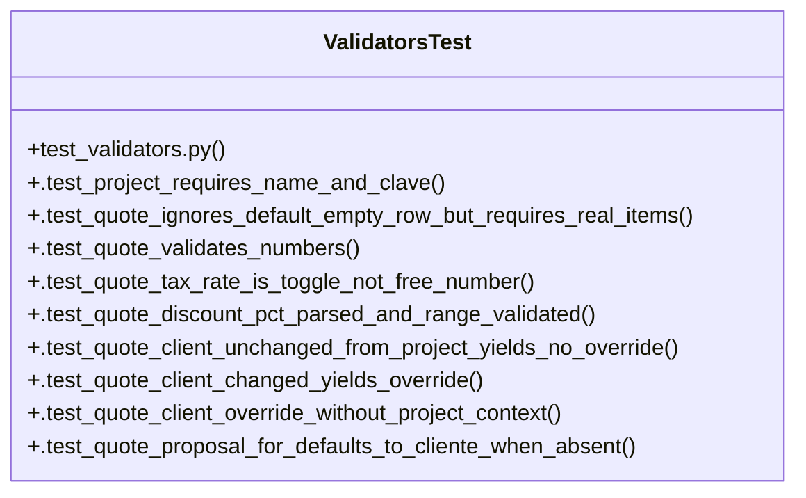

# Community 15

> 31 nodes · cohesion 0.12

## Key Concepts

- [validate_quote_form()](file:///Users/macbook/ProjectTracker/tracker/validators.py#L87) (26 connections)
- [ValidatorsTest](file:///Users/macbook/ProjectTracker/tests/test_validators.py#L8) (21 connections)
- [validators.py](file:///Users/macbook/ProjectTracker/tracker/validators.py#L1) (15 connections)
- [validate_ldm_form()](file:///Users/macbook/ProjectTracker/tracker/validators.py#L212) (10 connections)
- [_parse_ldm_items()](file:///Users/macbook/ProjectTracker/tracker/validators.py#L372) (7 connections)
- [_parse_quote_items()](file:///Users/macbook/ProjectTracker/tracker/validators.py#L251) (7 connections)
- [_is_blank()](file:///Users/macbook/ProjectTracker/tracker/validators.py#L24) (4 connections)
- [_validate_iso_date()](file:///Users/macbook/ProjectTracker/tracker/validators.py#L28) (4 connections)
- [validate_project_form()](file:///Users/macbook/ProjectTracker/tracker/validators.py#L60) (4 connections)
- [_validate_optional_iso_date()](file:///Users/macbook/ProjectTracker/tracker/validators.py#L46) (3 connections)
- [.test_ldm_accepts_valid_item()](file:///Users/macbook/ProjectTracker/tests/test_validators.py#L375) (2 connections)
- [.test_ldm_preserves_deleted_catalog_snapshot()](file:///Users/macbook/ProjectTracker/tests/test_validators.py#L390) (2 connections)
- [.test_ldm_requires_supplier_and_real_items()](file:///Users/macbook/ProjectTracker/tests/test_validators.py#L356) (2 connections)
- [.test_project_requires_name_and_clave()](file:///Users/macbook/ProjectTracker/tests/test_validators.py#L9) (2 connections)
- [.test_quote_accepts_valid_item_and_computes_subtotal()](file:///Users/macbook/ProjectTracker/tests/test_validators.py#L228) (2 connections)
- [.test_quote_allows_section_without_items()](file:///Users/macbook/ProjectTracker/tests/test_validators.py#L335) (2 connections)
- [.test_quote_assigns_items_to_section_rows()](file:///Users/macbook/ProjectTracker/tests/test_validators.py#L305) (2 connections)
- [.test_quote_client_changed_yields_override()](file:///Users/macbook/ProjectTracker/tests/test_validators.py#L129) (2 connections)
- [.test_quote_client_override_without_project_context()](file:///Users/macbook/ProjectTracker/tests/test_validators.py#L146) (2 connections)
- [.test_quote_client_unchanged_from_project_yields_no_override()](file:///Users/macbook/ProjectTracker/tests/test_validators.py#L108) (2 connections)
- [.test_quote_discount_pct_parsed_and_range_validated()](file:///Users/macbook/ProjectTracker/tests/test_validators.py#L84) (2 connections)
- [.test_quote_ignores_default_empty_row_but_requires_real_items()](file:///Users/macbook/ProjectTracker/tests/test_validators.py#L20) (2 connections)
- [.test_quote_parses_integrantes()](file:///Users/macbook/ProjectTracker/tests/test_validators.py#L249) (2 connections)
- [.test_quote_preserves_deleted_catalog_snapshot()](file:///Users/macbook/ProjectTracker/tests/test_validators.py#L279) (2 connections)
- [.test_quote_proposal_for_defaults_to_cliente_when_absent()](file:///Users/macbook/ProjectTracker/tests/test_validators.py#L161) (2 connections)
- *... and 6 more nodes in this community*

## Class Diagram

```mermaid
classDiagram
    class ValidatorsTest {
        +test_validators.py()
        +.test_project_requires_name_and_clave()
        +.test_quote_ignores_default_empty_row_but_requires_real_items()
        +.test_quote_validates_numbers()
        +.test_quote_tax_rate_is_toggle_not_free_number()
        +.test_quote_discount_pct_parsed_and_range_validated()
        +.test_quote_client_unchanged_from_project_yields_no_override()
        +.test_quote_client_changed_yields_override()
        +.test_quote_client_override_without_project_context()
        +.test_quote_proposal_for_defaults_to_cliente_when_absent()
    }
```

## Relationships

- No strong cross-community connections detected

## Source Files

- [/Users/macbook/ProjectTracker/tests/test_validators.py](file:///Users/macbook/ProjectTracker/tests/test_validators.py)
- [/Users/macbook/ProjectTracker/tracker/validators.py](file:///Users/macbook/ProjectTracker/tracker/validators.py)

## Audit Trail

- EXTRACTED: 79 (56%)
- INFERRED: 63 (44%)
- AMBIGUOUS: 0 (0%)

---

*Part of the graphify knowledge wiki. See [[index]] to navigate.*