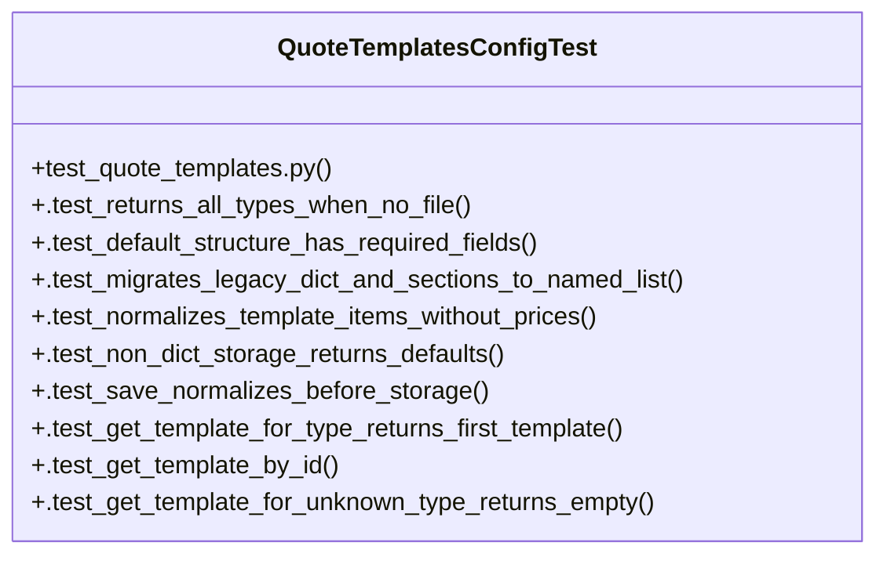

# Community 15

> 26 nodes · cohesion 0.15

## Key Concepts

- [quote_templates_config.py](file:///Users/macbook/ProjectTracker/tracker/quote_templates_config.py#L1) (17 connections)
- [get_quote_templates()](file:///Users/macbook/ProjectTracker/tracker/quote_templates_config.py#L196) (12 connections)
- [QuoteTemplatesConfigTest](file:///Users/macbook/ProjectTracker/tests/test_quote_templates.py#L5) (10 connections)
- [_make_default_template()](file:///Users/macbook/ProjectTracker/tracker/quote_templates_config.py#L153) (6 connections)
- [_normalize_template()](file:///Users/macbook/ProjectTracker/tracker/quote_templates_config.py#L166) (6 connections)
- [get_template_for_type()](file:///Users/macbook/ProjectTracker/tracker/quote_templates_config.py#L210) (5 connections)
- [_normalize()](file:///Users/macbook/ProjectTracker/tracker/quote_templates_config.py#L179) (5 connections)
- [normalize_contact_rows()](file:///Users/macbook/ProjectTracker/tracker/quote_templates_config.py#L104) (5 connections)
- [save_quote_templates()](file:///Users/macbook/ProjectTracker/tracker/quote_templates_config.py#L206) (5 connections)
- [_normalize_contacts()](file:///Users/macbook/ProjectTracker/tracker/quote_templates_config.py#L91) (4 connections)
- [_normalize_sections()](file:///Users/macbook/ProjectTracker/tracker/quote_templates_config.py#L143) (4 connections)
- [get_template_by_id()](file:///Users/macbook/ProjectTracker/tracker/quote_templates_config.py#L215) (3 connections)
- [_new_id()](file:///Users/macbook/ProjectTracker/tracker/quote_templates_config.py#L87) (3 connections)
- [_normalize_section()](file:///Users/macbook/ProjectTracker/tracker/quote_templates_config.py#L126) (3 connections)
- [_normalize_template_item()](file:///Users/macbook/ProjectTracker/tracker/quote_templates_config.py#L108) (2 connections)
- [.test_default_structure_has_required_fields()](file:///Users/macbook/ProjectTracker/tests/test_quote_templates.py#L15) (2 connections)
- [.test_get_template_by_id()](file:///Users/macbook/ProjectTracker/tests/test_quote_templates.py#L133) (2 connections)
- [.test_get_template_for_type_returns_first_template()](file:///Users/macbook/ProjectTracker/tests/test_quote_templates.py#L117) (2 connections)
- [.test_get_template_for_unknown_type_returns_empty()](file:///Users/macbook/ProjectTracker/tests/test_quote_templates.py#L145) (2 connections)
- [.test_migrates_legacy_dict_and_sections_to_named_list()](file:///Users/macbook/ProjectTracker/tests/test_quote_templates.py#L38) (2 connections)
- [.test_non_dict_storage_returns_defaults()](file:///Users/macbook/ProjectTracker/tests/test_quote_templates.py#L102) (2 connections)
- [.test_normalizes_template_items_without_prices()](file:///Users/macbook/ProjectTracker/tests/test_quote_templates.py#L69) (2 connections)
- [.test_returns_all_types_when_no_file()](file:///Users/macbook/ProjectTracker/tests/test_quote_templates.py#L7) (2 connections)
- [.test_save_normalizes_before_storage()](file:///Users/macbook/ProjectTracker/tests/test_quote_templates.py#L109) (2 connections)
- [_default_contacts()](file:///Users/macbook/ProjectTracker/tracker/quote_templates_config.py#L57) (1 connections)
- *... and 1 more nodes in this community*

## Class Diagram

```mermaid
classDiagram
    class QuoteTemplatesConfigTest {
        +test_quote_templates.py()
        +.test_returns_all_types_when_no_file()
        +.test_default_structure_has_required_fields()
        +.test_migrates_legacy_dict_and_sections_to_named_list()
        +.test_normalizes_template_items_without_prices()
        +.test_non_dict_storage_returns_defaults()
        +.test_save_normalizes_before_storage()
        +.test_get_template_for_type_returns_first_template()
        +.test_get_template_by_id()
        +.test_get_template_for_unknown_type_returns_empty()
    }
```

## Relationships

- No strong cross-community connections detected

## Source Files

- [/Users/macbook/ProjectTracker/tests/test_quote_templates.py](file:///Users/macbook/ProjectTracker/tests/test_quote_templates.py)
- [/Users/macbook/ProjectTracker/tracker/quote_templates_config.py](file:///Users/macbook/ProjectTracker/tracker/quote_templates_config.py)

## Audit Trail

- EXTRACTED: 83 (75%)
- INFERRED: 27 (25%)
- AMBIGUOUS: 0 (0%)

---

*Part of the graphify knowledge wiki. See [[index]] to navigate.*