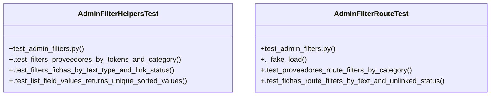

# Community 16

> 23 nodes · cohesion 0.13

## Key Concepts

- [admin_filters.py](file:///Users/macbook/ProjectTracker/tracker/admin_filters.py#L1) (9 connections)
- [filter_fichas()](file:///Users/macbook/ProjectTracker/tracker/admin_filters.py#L54) (6 connections)
- [filter_proveedores()](file:///Users/macbook/ProjectTracker/tracker/admin_filters.py#L41) (6 connections)
- [_normalize()](file:///Users/macbook/ProjectTracker/tracker/admin_filters.py#L9) (6 connections)
- [list_field_values()](file:///Users/macbook/ProjectTracker/tracker/admin_filters.py#L31) (5 connections)
- [_matches_tokens()](file:///Users/macbook/ProjectTracker/tracker/admin_filters.py#L23) (5 connections)
- [AdminFilterHelpersTest](file:///Users/macbook/ProjectTracker/tests/test_admin_filters.py#L9) (4 connections)
- [AdminFilterRouteTest](file:///Users/macbook/ProjectTracker/tests/test_admin_filters.py#L74) (4 connections)
- [test_admin_filters.py](file:///Users/macbook/ProjectTracker/tests/test_admin_filters.py#L1) (4 connections)
- [_indexed()](file:///Users/macbook/ProjectTracker/tracker/admin_filters.py#L19) (3 connections)
- [_tokens()](file:///Users/macbook/ProjectTracker/tracker/admin_filters.py#L15) (3 connections)
- [.test_filters_fichas_by_text_type_and_link_status()](file:///Users/macbook/ProjectTracker/tests/test_admin_filters.py#L34) (2 connections)
- [.test_filters_proveedores_by_tokens_and_category()](file:///Users/macbook/ProjectTracker/tests/test_admin_filters.py#L10) (2 connections)
- [.test_list_field_values_returns_unique_sorted_values()](file:///Users/macbook/ProjectTracker/tests/test_admin_filters.py#L60) (2 connections)
- [Filtros puros para vistas administrativas con listas largas.](file:///Users/macbook/ProjectTracker/tracker/admin_filters.py#L1) (1 connections)
- [Valores únicos no vacíos de un campo, ordenados sin distinguir acentos.](file:///Users/macbook/ProjectTracker/tracker/admin_filters.py#L32) (1 connections)
- [Filtra proveedores por búsqueda libre y categoría exacta.](file:///Users/macbook/ProjectTracker/tracker/admin_filters.py#L42) (1 connections)
- [Filtra fichas por texto, tipo y estado de vinculación a proyectos.](file:///Users/macbook/ProjectTracker/tracker/admin_filters.py#L55) (1 connections)
- [._fake_load()](file:///Users/macbook/ProjectTracker/tests/test_admin_filters.py#L84) (1 connections)
- [.test_fichas_route_filters_by_text_and_unlinked_status()](file:///Users/macbook/ProjectTracker/tests/test_admin_filters.py#L148) (1 connections)
- [.test_proveedores_route_filters_by_category()](file:///Users/macbook/ProjectTracker/tests/test_admin_filters.py#L139) (1 connections)
- [Pruebas de filtros administrativos para proveedores y fichas.](file:///Users/macbook/ProjectTracker/tests/test_admin_filters.py#L1) (1 connections)
- [setUpClass()](file:///Users/macbook/ProjectTracker/tests/test_admin_filters.py#L76) (1 connections)

## Class Diagram

## Relationships

- No strong cross-community connections detected

## Source Files

- [/Users/macbook/ProjectTracker/tests/test_admin_filters.py](file:///Users/macbook/ProjectTracker/tests/test_admin_filters.py)
- [/Users/macbook/ProjectTracker/tracker/admin_filters.py](file:///Users/macbook/ProjectTracker/tracker/admin_filters.py)

## Audit Trail

- EXTRACTED: 61 (87%)
- INFERRED: 9 (13%)
- AMBIGUOUS: 0 (0%)

---

*Part of the graphify knowledge wiki. See [[index]] to navigate.*