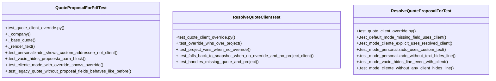

# Community 16

> 26 nodes · cohesion 0.13

## Key Concepts

- [resolve_quote_proposal_for()](file:///Users/macbook/ProjectTracker/tracker/catalog.py#L386) (11 connections)
- [resolve_quote_client()](file:///Users/macbook/ProjectTracker/tracker/catalog.py#L365) (8 connections)
- [QuoteProposalForPdfTest](file:///Users/macbook/ProjectTracker/tests/test_quote_client_override.py#L205) (8 connections)
- [._render_text()](file:///Users/macbook/ProjectTracker/tests/test_quote_client_override.py#L229) (7 connections)
- [ResolveQuoteProposalForTest](file:///Users/macbook/ProjectTracker/tests/test_quote_client_override.py#L60) (7 connections)
- [._base_quote()](file:///Users/macbook/ProjectTracker/tests/test_quote_client_override.py#L212) (5 connections)
- [ResolveQuoteClientTest](file:///Users/macbook/ProjectTracker/tests/test_quote_client_override.py#L39) (5 connections)
- [test_quote_client_override.py](file:///Users/macbook/ProjectTracker/tests/test_quote_client_override.py#L1) (5 connections)
- [.test_cliente_mode_with_override_shows_override()](file:///Users/macbook/ProjectTracker/tests/test_quote_client_override.py#L253) (3 connections)
- [.test_legacy_quote_without_proposal_fields_behaves_like_before()](file:///Users/macbook/ProjectTracker/tests/test_quote_client_override.py#L261) (3 connections)
- [.test_personalizado_shows_custom_addressee_not_client()](file:///Users/macbook/ProjectTracker/tests/test_quote_client_override.py#L238) (3 connections)
- [.test_vacio_hides_propuesta_para_block()](file:///Users/macbook/ProjectTracker/tests/test_quote_client_override.py#L246) (3 connections)
- [._company()](file:///Users/macbook/ProjectTracker/tests/test_quote_client_override.py#L206) (2 connections)
- [.test_falls_back_to_snapshot_when_no_override_and_no_project_client()](file:///Users/macbook/ProjectTracker/tests/test_quote_client_override.py#L50) (2 connections)
- [.test_handles_missing_quote_and_project()](file:///Users/macbook/ProjectTracker/tests/test_quote_client_override.py#L55) (2 connections)
- [.test_override_wins_over_project()](file:///Users/macbook/ProjectTracker/tests/test_quote_client_override.py#L40) (2 connections)
- [.test_project_wins_when_no_override()](file:///Users/macbook/ProjectTracker/tests/test_quote_client_override.py#L45) (2 connections)
- [.test_default_mode_missing_field_uses_client()](file:///Users/macbook/ProjectTracker/tests/test_quote_client_override.py#L61) (2 connections)
- [.test_mode_cliente_explicit_uses_resolved_client()](file:///Users/macbook/ProjectTracker/tests/test_quote_client_override.py#L67) (2 connections)
- [.test_mode_cliente_without_any_client_hides_line()](file:///Users/macbook/ProjectTracker/tests/test_quote_client_override.py#L89) (2 connections)
- [.test_mode_personalizado_uses_custom_text()](file:///Users/macbook/ProjectTracker/tests/test_quote_client_override.py#L73) (2 connections)
- [.test_mode_personalizado_without_text_hides_line()](file:///Users/macbook/ProjectTracker/tests/test_quote_client_override.py#L79) (2 connections)
- [.test_mode_vacio_hides_line_even_with_client()](file:///Users/macbook/ProjectTracker/tests/test_quote_client_override.py#L84) (2 connections)
- [Cliente a mostrar en PDF/Excel/vistas de una cotización.      Prioridad: 1) over](file:///Users/macbook/ProjectTracker/tracker/catalog.py#L366) (1 connections)
- [Etiqueta y valor de la línea "Propuesta para" de la portada.      proposal_for_m](file:///Users/macbook/ProjectTracker/tracker/catalog.py#L387) (1 connections)
- *... and 1 more nodes in this community*

## Class Diagram

```mermaid
classDiagram
    class QuoteProposalForPdfTest {
        +test_quote_client_override.py()
        +._company()
        +._base_quote()
        +._render_text()
        +.test_personalizado_shows_custom_addressee_not_client()
        +.test_vacio_hides_propuesta_para_block()
        +.test_cliente_mode_with_override_shows_override()
        +.test_legacy_quote_without_proposal_fields_behaves_like_before()
    }
    class ResolveQuoteClientTest {
        +test_quote_client_override.py()
        +.test_override_wins_over_project()
        +.test_project_wins_when_no_override()
        +.test_falls_back_to_snapshot_when_no_override_and_no_project_client()
        +.test_handles_missing_quote_and_project()
    }
    class ResolveQuoteProposalForTest {
        +test_quote_client_override.py()
        +.test_default_mode_missing_field_uses_client()
        +.test_mode_cliente_explicit_uses_resolved_client()
        +.test_mode_personalizado_uses_custom_text()
        +.test_mode_personalizado_without_text_hides_line()
        +.test_mode_vacio_hides_line_even_with_client()
        +.test_mode_cliente_without_any_client_hides_line()
    }
```

## Relationships

- [[Community 15]] (3 shared connections)

## Source Files

- [/Users/macbook/ProjectTracker/tests/test_quote_client_override.py](file:///Users/macbook/ProjectTracker/tests/test_quote_client_override.py)
- [/Users/macbook/ProjectTracker/tracker/catalog.py](file:///Users/macbook/ProjectTracker/tracker/catalog.py)

## Audit Trail

- EXTRACTED: 69 (74%)
- INFERRED: 24 (26%)
- AMBIGUOUS: 0 (0%)

---

*Part of the graphify knowledge wiki. See [[index]] to navigate.*