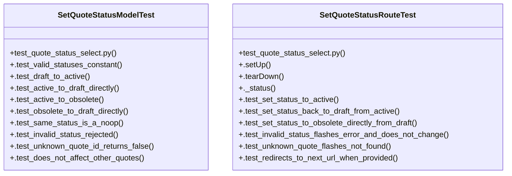

# Community 16

> 29 nodes · cohesion 0.10

## Key Concepts

- [SetQuoteStatusRouteTest](file:///Users/macbook/ProjectTracker/tests/test_quote_status_select.py#L108) (13 connections)
- [set_quote_status()](file:///Users/macbook/ProjectTracker/tracker/catalog.py#L147) (11 connections)
- [SetQuoteStatusModelTest](file:///Users/macbook/ProjectTracker/tests/test_quote_status_select.py#L57) (10 connections)
- [._status()](file:///Users/macbook/ProjectTracker/tests/test_quote_status_select.py#L124) (6 connections)
- [set_quote_status_route()](file:///Users/macbook/ProjectTracker/tracker/routes/quotes.py#L489) (5 connections)
- [.setUp()](file:///Users/macbook/ProjectTracker/tests/test_quote_status_select.py#L109) (4 connections)
- [.test_closed_project_shows_readonly_badge_not_select()](file:///Users/macbook/ProjectTracker/tests/test_quote_status_select.py#L190) (3 connections)
- [test_quote_status_select.py](file:///Users/macbook/ProjectTracker/tests/test_quote_status_select.py#L1) (3 connections)
- [.test_active_to_draft_directly()](file:///Users/macbook/ProjectTracker/tests/test_quote_status_select.py#L66) (2 connections)
- [.test_active_to_obsolete()](file:///Users/macbook/ProjectTracker/tests/test_quote_status_select.py#L72) (2 connections)
- [.test_does_not_affect_other_quotes()](file:///Users/macbook/ProjectTracker/tests/test_quote_status_select.py#L96) (2 connections)
- [.test_draft_to_active()](file:///Users/macbook/ProjectTracker/tests/test_quote_status_select.py#L61) (2 connections)
- [.test_invalid_status_rejected()](file:///Users/macbook/ProjectTracker/tests/test_quote_status_select.py#L87) (2 connections)
- [.test_obsolete_to_draft_directly()](file:///Users/macbook/ProjectTracker/tests/test_quote_status_select.py#L77) (2 connections)
- [.test_same_status_is_a_noop()](file:///Users/macbook/ProjectTracker/tests/test_quote_status_select.py#L82) (2 connections)
- [.test_unknown_quote_id_returns_false()](file:///Users/macbook/ProjectTracker/tests/test_quote_status_select.py#L92) (2 connections)
- [.tearDown()](file:///Users/macbook/ProjectTracker/tests/test_quote_status_select.py#L120) (2 connections)
- [.test_invalid_status_flashes_error_and_does_not_change()](file:///Users/macbook/ProjectTracker/tests/test_quote_status_select.py#L151) (2 connections)
- [.test_set_status_back_to_draft_from_active()](file:///Users/macbook/ProjectTracker/tests/test_quote_status_select.py#L136) (2 connections)
- [.test_set_status_to_active()](file:///Users/macbook/ProjectTracker/tests/test_quote_status_select.py#L127) (2 connections)
- [.test_set_status_to_obsolete_directly_from_draft()](file:///Users/macbook/ProjectTracker/tests/test_quote_status_select.py#L142) (2 connections)
- [Cambia el approval_status de una cotización a cualquiera de los 3     estados vá](file:///Users/macbook/ProjectTracker/tracker/catalog.py#L148) (1 connections)
- [Cambia el estado de una cotización libremente a borrador/activa/obsoleta,     el](file:///Users/macbook/ProjectTracker/tracker/routes/quotes.py#L490) (1 connections)
- [Selector libre de estado de cotización en la columna Estado.  Antes sólo existía](file:///Users/macbook/ProjectTracker/tests/test_quote_status_select.py#L1) (1 connections)
- [.test_valid_statuses_constant()](file:///Users/macbook/ProjectTracker/tests/test_quote_status_select.py#L58) (1 connections)
- *... and 4 more nodes in this community*

## Class Diagram

```mermaid
classDiagram
    class SetQuoteStatusModelTest {
        +test_quote_status_select.py()
        +.test_valid_statuses_constant()
        +.test_draft_to_active()
        +.test_active_to_draft_directly()
        +.test_active_to_obsolete()
        +.test_obsolete_to_draft_directly()
        +.test_same_status_is_a_noop()
        +.test_invalid_status_rejected()
        +.test_unknown_quote_id_returns_false()
        +.test_does_not_affect_other_quotes()
    }
    class SetQuoteStatusRouteTest {
        +test_quote_status_select.py()
        +.setUp()
        +.tearDown()
        +._status()
        +.test_set_status_to_active()
        +.test_set_status_back_to_draft_from_active()
        +.test_set_status_to_obsolete_directly_from_draft()
        +.test_invalid_status_flashes_error_and_does_not_change()
        +.test_unknown_quote_flashes_not_found()
        +.test_redirects_to_next_url_when_provided()
    }
```

## Relationships

- No strong cross-community connections detected

## Source Files

- [/Users/macbook/ProjectTracker/tests/test_quote_status_select.py](file:///Users/macbook/ProjectTracker/tests/test_quote_status_select.py)
- [/Users/macbook/ProjectTracker/tracker/catalog.py](file:///Users/macbook/ProjectTracker/tracker/catalog.py)
- [/Users/macbook/ProjectTracker/tracker/routes/quotes.py](file:///Users/macbook/ProjectTracker/tracker/routes/quotes.py)

## Audit Trail

- EXTRACTED: 62 (70%)
- INFERRED: 27 (30%)
- AMBIGUOUS: 0 (0%)

---

*Part of the graphify knowledge wiki. See [[index]] to navigate.*