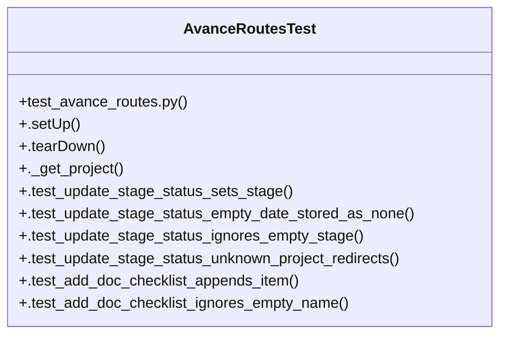

# Community 17

> 19 nodes · cohesion 0.17

## Key Concepts

- [AvanceRoutesTest](file:///Users/macbook/ProjectTracker/tests/test_avance_routes.py#L25) (19 connections)
- [._get_project()](file:///Users/macbook/ProjectTracker/tests/test_avance_routes.py#L41) (13 connections)
- [.test_update_stage_budget_skips_without_template()](file:///Users/macbook/ProjectTracker/tests/test_avance_routes.py#L180) (4 connections)
- [.tearDown()](file:///Users/macbook/ProjectTracker/tests/test_avance_routes.py#L38) (2 connections)
- [.test_add_doc_checklist_appends_item()](file:///Users/macbook/ProjectTracker/tests/test_avance_routes.py#L83) (2 connections)
- [.test_add_doc_checklist_ignores_empty_name()](file:///Users/macbook/ProjectTracker/tests/test_avance_routes.py#L95) (2 connections)
- [.test_add_multiple_docs_independent()](file:///Users/macbook/ProjectTracker/tests/test_avance_routes.py#L137) (2 connections)
- [.test_delete_doc_checklist_removes_item()](file:///Users/macbook/ProjectTracker/tests/test_avance_routes.py#L125) (2 connections)
- [.test_toggle_doc_checklist_flips_done()](file:///Users/macbook/ProjectTracker/tests/test_avance_routes.py#L104) (2 connections)
- [.test_update_stage_budget_handles_missing_values_as_zero()](file:///Users/macbook/ProjectTracker/tests/test_avance_routes.py#L168) (2 connections)
- [.test_update_stage_budget_persists_values()](file:///Users/macbook/ProjectTracker/tests/test_avance_routes.py#L147) (2 connections)
- [.test_update_stage_status_empty_date_stored_as_none()](file:///Users/macbook/ProjectTracker/tests/test_avance_routes.py#L56) (2 connections)
- [.test_update_stage_status_ignores_empty_stage()](file:///Users/macbook/ProjectTracker/tests/test_avance_routes.py#L65) (2 connections)
- [.test_update_stage_status_sets_stage()](file:///Users/macbook/ProjectTracker/tests/test_avance_routes.py#L46) (2 connections)
- [.test_progress_pdf_returns_pdf_content()](file:///Users/macbook/ProjectTracker/tests/test_avance_routes.py#L201) (1 connections)
- [.test_progress_pdf_unknown_project_404()](file:///Users/macbook/ProjectTracker/tests/test_avance_routes.py#L207) (1 connections)
- [.test_update_stage_budget_unknown_project_redirects()](file:///Users/macbook/ProjectTracker/tests/test_avance_routes.py#L195) (1 connections)
- [.test_update_stage_status_unknown_project_redirects()](file:///Users/macbook/ProjectTracker/tests/test_avance_routes.py#L74) (1 connections)
- [test_avance_routes.py](file:///Users/macbook/ProjectTracker/tests/test_avance_routes.py#L1) (1 connections)

## Class Diagram

## Relationships

- No strong cross-community connections detected

## Source Files

- [/Users/macbook/ProjectTracker/tests/test_avance_routes.py](file:///Users/macbook/ProjectTracker/tests/test_avance_routes.py)

## Audit Trail

- EXTRACTED: 59 (94%)
- INFERRED: 4 (6%)
- AMBIGUOUS: 0 (0%)

---

*Part of the graphify knowledge wiki. See [[index]] to navigate.*