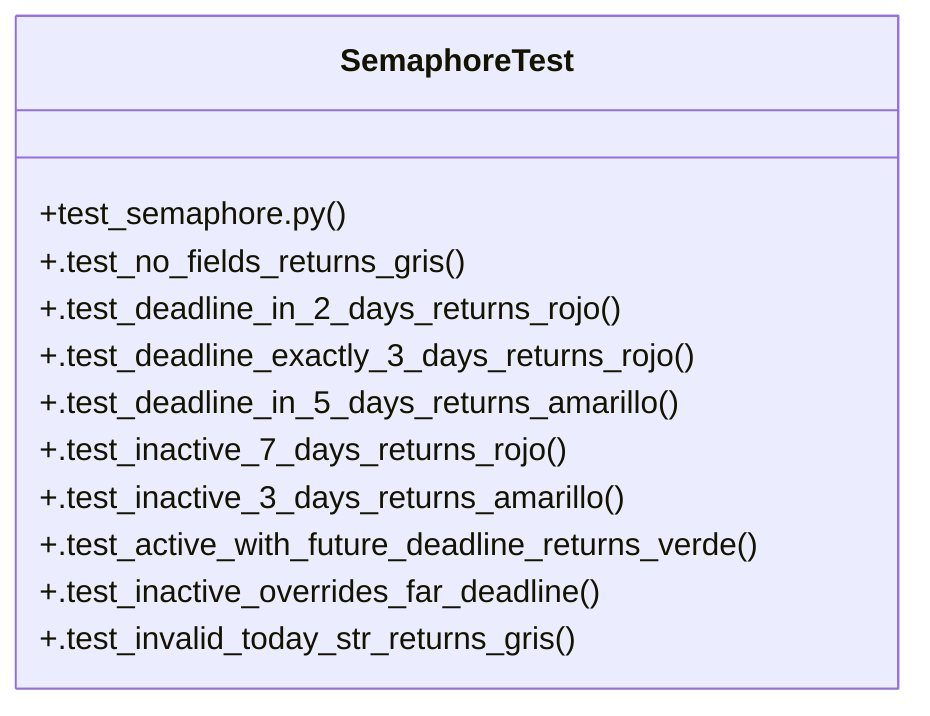

# Community 17

> 26 nodes · cohesion 0.12

## Key Concepts

- [domain.py](file:///Users/macbook/ProjectTracker/tracker/domain.py#L1) (20 connections)
- [project_semaphore()](file:///Users/macbook/ProjectTracker/tracker/domain.py#L145) (14 connections)
- [SemaphoreTest](file:///Users/macbook/ProjectTracker/tests/test_semaphore.py#L8) (12 connections)
- [get_alcances()](file:///Users/macbook/ProjectTracker/tracker/domain.py#L24) (5 connections)
- [check_blocked()](file:///Users/macbook/ProjectTracker/tracker/domain.py#L66) (4 connections)
- [get_alcances_by_id()](file:///Users/macbook/ProjectTracker/tracker/domain.py#L31) (4 connections)
- [alcances_admin()](file:///Users/macbook/ProjectTracker/tracker/routes/admin.py#L1046) (2 connections)
- [fdate_short()](file:///Users/macbook/ProjectTracker/tracker/domain.py#L124) (2 connections)
- [get_info_ext_excluded()](file:///Users/macbook/ProjectTracker/tracker/domain.py#L35) (2 connections)
- [today_short()](file:///Users/macbook/ProjectTracker/tracker/domain.py#L141) (2 connections)
- [.test_active_with_future_deadline_returns_verde()](file:///Users/macbook/ProjectTracker/tests/test_semaphore.py#L33) (2 connections)
- [.test_deadline_exactly_3_days_returns_rojo()](file:///Users/macbook/ProjectTracker/tests/test_semaphore.py#L17) (2 connections)
- [.test_deadline_in_2_days_returns_rojo()](file:///Users/macbook/ProjectTracker/tests/test_semaphore.py#L13) (2 connections)
- [.test_deadline_in_5_days_returns_amarillo()](file:///Users/macbook/ProjectTracker/tests/test_semaphore.py#L21) (2 connections)
- [.test_inactive_3_days_returns_amarillo()](file:///Users/macbook/ProjectTracker/tests/test_semaphore.py#L29) (2 connections)
- [.test_inactive_7_days_returns_rojo()](file:///Users/macbook/ProjectTracker/tests/test_semaphore.py#L25) (2 connections)
- [.test_inactive_overrides_far_deadline()](file:///Users/macbook/ProjectTracker/tests/test_semaphore.py#L37) (2 connections)
- [.test_invalid_deadline_falls_back_to_inactivity()](file:///Users/macbook/ProjectTracker/tests/test_semaphore.py#L46) (2 connections)
- [.test_invalid_today_str_returns_gris()](file:///Users/macbook/ProjectTracker/tests/test_semaphore.py#L42) (2 connections)
- [.test_no_fields_returns_gris()](file:///Users/macbook/ProjectTracker/tests/test_semaphore.py#L10) (2 connections)
- [.test_only_updated_at_no_deadline_active_returns_gris()](file:///Users/macbook/ProjectTracker/tests/test_semaphore.py#L50) (2 connections)
- [currency()](file:///Users/macbook/ProjectTracker/tracker/domain.py#L134) (1 connections)
- [fdate()](file:///Users/macbook/ProjectTracker/tracker/domain.py#L115) (1 connections)
- [dd-mm-aa — para campos compactos (ej: 22-08-26).](file:///Users/macbook/ProjectTracker/tracker/domain.py#L125) (1 connections)
- [Returns 'verde', 'amarillo', 'rojo', or 'gris' based on deadline and inactivity.](file:///Users/macbook/ProjectTracker/tracker/domain.py#L146) (1 connections)
- *... and 1 more nodes in this community*

## Class Diagram

```mermaid
classDiagram
    class SemaphoreTest {
        +test_semaphore.py()
        +.test_no_fields_returns_gris()
        +.test_deadline_in_2_days_returns_rojo()
        +.test_deadline_exactly_3_days_returns_rojo()
        +.test_deadline_in_5_days_returns_amarillo()
        +.test_inactive_7_days_returns_rojo()
        +.test_inactive_3_days_returns_amarillo()
        +.test_active_with_future_deadline_returns_verde()
        +.test_inactive_overrides_far_deadline()
        +.test_invalid_today_str_returns_gris()
    }
```

## Relationships

- No strong cross-community connections detected

## Source Files

- [/Users/macbook/ProjectTracker/tests/test_semaphore.py](file:///Users/macbook/ProjectTracker/tests/test_semaphore.py)
- [/Users/macbook/ProjectTracker/tracker/domain.py](file:///Users/macbook/ProjectTracker/tracker/domain.py)
- [/Users/macbook/ProjectTracker/tracker/routes/admin.py](file:///Users/macbook/ProjectTracker/tracker/routes/admin.py)

## Audit Trail

- EXTRACTED: 64 (68%)
- INFERRED: 30 (32%)
- AMBIGUOUS: 0 (0%)

---

*Part of the graphify knowledge wiki. See [[index]] to navigate.*