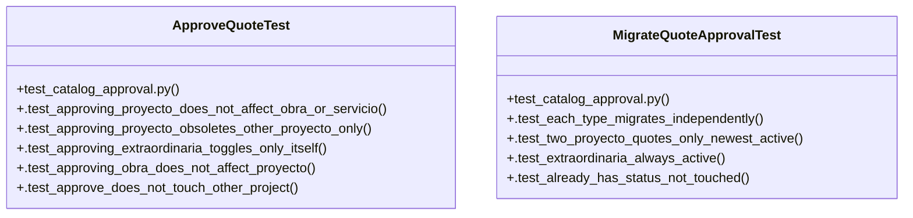

# Community 18

> 17 nodes · cohesion 0.24

## Key Concepts

- [_q()](file:///Users/macbook/ProjectTracker/tests/test_catalog_approval.py#L13) (10 connections)
- [approve_quote()](file:///Users/macbook/ProjectTracker/tracker/catalog.py#L126) (9 connections)
- [migrate_quote_approval()](file:///Users/macbook/ProjectTracker/tracker/catalog.py#L88) (9 connections)
- [ApproveQuoteTest](file:///Users/macbook/ProjectTracker/tests/test_catalog_approval.py#L20) (6 connections)
- [MigrateQuoteApprovalTest](file:///Users/macbook/ProjectTracker/tests/test_catalog_approval.py#L75) (5 connections)
- [test_catalog_approval.py](file:///Users/macbook/ProjectTracker/tests/test_catalog_approval.py#L1) (4 connections)
- [.test_approve_does_not_touch_other_project()](file:///Users/macbook/ProjectTracker/tests/test_catalog_approval.py#L65) (3 connections)
- [.test_approving_extraordinaria_toggles_only_itself()](file:///Users/macbook/ProjectTracker/tests/test_catalog_approval.py#L43) (3 connections)
- [.test_approving_obra_does_not_affect_proyecto()](file:///Users/macbook/ProjectTracker/tests/test_catalog_approval.py#L53) (3 connections)
- [.test_approving_proyecto_does_not_affect_obra_or_servicio()](file:///Users/macbook/ProjectTracker/tests/test_catalog_approval.py#L21) (3 connections)
- [.test_approving_proyecto_obsoletes_other_proyecto_only()](file:///Users/macbook/ProjectTracker/tests/test_catalog_approval.py#L33) (3 connections)
- [.test_already_has_status_not_touched()](file:///Users/macbook/ProjectTracker/tests/test_catalog_approval.py#L108) (3 connections)
- [.test_each_type_migrates_independently()](file:///Users/macbook/ProjectTracker/tests/test_catalog_approval.py#L76) (3 connections)
- [.test_extraordinaria_always_active()](file:///Users/macbook/ProjectTracker/tests/test_catalog_approval.py#L99) (3 connections)
- [.test_two_proyecto_quotes_only_newest_active()](file:///Users/macbook/ProjectTracker/tests/test_catalog_approval.py#L89) (3 connections)
- [Marca la cotización target_id como active.      Si es General/Preliminar, pasa l](file:///Users/macbook/ProjectTracker/tracker/catalog.py#L127) (1 connections)
- [Migración idempotente: asigna approval_status a cotizaciones que no lo tienen.](file:///Users/macbook/ProjectTracker/tracker/catalog.py#L89) (1 connections)

## Class Diagram

## Relationships

- No strong cross-community connections detected

## Source Files

- [/Users/macbook/ProjectTracker/tests/test_catalog_approval.py](file:///Users/macbook/ProjectTracker/tests/test_catalog_approval.py)
- [/Users/macbook/ProjectTracker/tracker/catalog.py](file:///Users/macbook/ProjectTracker/tracker/catalog.py)

## Audit Trail

- EXTRACTED: 52 (72%)
- INFERRED: 20 (28%)
- AMBIGUOUS: 0 (0%)

---

*Part of the graphify knowledge wiki. See [[index]] to navigate.*