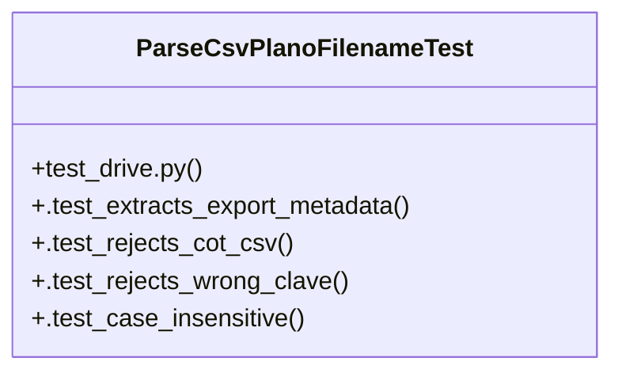

# Community 19

> 16 nodes · cohesion 0.18

## Key Concepts

- [utils.py](file:///Users/macbook/ProjectTracker/tracker/utils.py#L1) (10 connections)
- [parse_csv_plano_filename()](file:///Users/macbook/ProjectTracker/tracker/utils.py#L37) (6 connections)
- [ParseCsvPlanoFilenameTest](file:///Users/macbook/ProjectTracker/tests/test_drive.py#L6) (5 connections)
- [clean()](file:///Users/macbook/ProjectTracker/tracker/utils.py#L6) (4 connections)
- [deleted_catalog_item_at()](file:///Users/macbook/ProjectTracker/tracker/utils.py#L60) (4 connections)
- [parse_float()](file:///Users/macbook/ProjectTracker/tracker/utils.py#L26) (4 connections)
- [parse_form_float()](file:///Users/macbook/ProjectTracker/tracker/utils.py#L10) (3 connections)
- [.test_case_insensitive()](file:///Users/macbook/ProjectTracker/tests/test_drive.py#L22) (2 connections)
- [.test_extracts_export_metadata()](file:///Users/macbook/ProjectTracker/tests/test_drive.py#L7) (2 connections)
- [.test_rejects_cot_csv()](file:///Users/macbook/ProjectTracker/tests/test_drive.py#L16) (2 connections)
- [.test_rejects_wrong_clave()](file:///Users/macbook/ProjectTracker/tests/test_drive.py#L19) (2 connections)
- [test_drive.py](file:///Users/macbook/ProjectTracker/tests/test_drive.py#L1) (1 connections)
- [Helpers compartidos entre validators, form_models, admin y rutas.](file:///Users/macbook/ProjectTracker/tracker/utils.py#L1) (1 connections)
- [Convierte a float con reporte de errores en lista `errors`. Usado en validadores](file:///Users/macbook/ProjectTracker/tracker/utils.py#L11) (1 connections)
- [Convierte a float silenciosamente. Usado donde no se necesita reporte de error.](file:///Users/macbook/ProjectTracker/tracker/utils.py#L27) (1 connections)
- [Construye el snapshot de un artículo de catálogo eliminado desde listas de campo](file:///Users/macbook/ProjectTracker/tracker/utils.py#L61) (1 connections)

## Class Diagram

## Relationships

- No strong cross-community connections detected

## Source Files

- [/Users/macbook/ProjectTracker/tests/test_drive.py](file:///Users/macbook/ProjectTracker/tests/test_drive.py)
- [/Users/macbook/ProjectTracker/tracker/utils.py](file:///Users/macbook/ProjectTracker/tracker/utils.py)

## Audit Trail

- EXTRACTED: 40 (82%)
- INFERRED: 9 (18%)
- AMBIGUOUS: 0 (0%)

---

*Part of the graphify knowledge wiki. See [[index]] to navigate.*