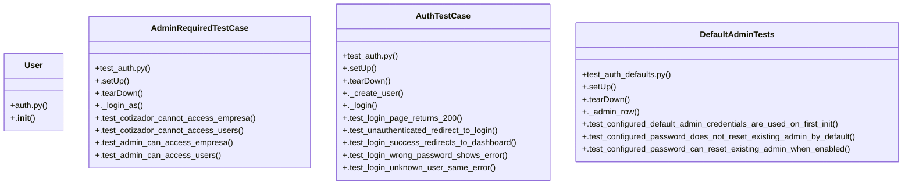

# Community 2

> 71 nodes · cohesion 0.05

## Key Concepts

- [auth.py](file:///Users/macbook/ProjectTracker/tracker/auth.py#L1) (30 connections)
- [auth_routes.py](file:///Users/macbook/ProjectTracker/tracker/routes/auth_routes.py#L1) (16 connections)
- [AuthTestCase](file:///Users/macbook/ProjectTracker/tests/test_auth.py#L7) (12 connections)
- [_db_execute()](file:///Users/macbook/ProjectTracker/tracker/auth.py#L154) (9 connections)
- [init_db()](file:///Users/macbook/ProjectTracker/tracker/auth.py#L25) (9 connections)
- [AdminRequiredTestCase](file:///Users/macbook/ProjectTracker/tests/test_auth.py#L107) (8 connections)
- [DefaultAdminTests](file:///Users/macbook/ProjectTracker/tests/test_auth_defaults.py#L12) (8 connections)
- [verify_credentials()](file:///Users/macbook/ProjectTracker/tracker/auth.py#L175) (6 connections)
- [._create_user()](file:///Users/macbook/ProjectTracker/tests/test_auth.py#L35) (6 connections)
- [create_user()](file:///Users/macbook/ProjectTracker/tracker/auth.py#L190) (5 connections)
- [User](file:///Users/macbook/ProjectTracker/tracker/auth.py#L101) (5 connections)
- [._login_as()](file:///Users/macbook/ProjectTracker/tests/test_auth.py#L133) (5 connections)
- [_db_query()](file:///Users/macbook/ProjectTracker/tracker/auth.py#L148) (4 connections)
- [get_user_by_username()](file:///Users/macbook/ProjectTracker/tracker/auth.py#L167) (4 connections)
- [reset_user_password()](file:///Users/macbook/ProjectTracker/tracker/auth.py#L201) (4 connections)
- [set_user_active()](file:///Users/macbook/ProjectTracker/tracker/auth.py#L197) (4 connections)
- [.test_inactive_user_cannot_login()](file:///Users/macbook/ProjectTracker/tests/test_auth.py#L82) (4 connections)
- [._admin_row()](file:///Users/macbook/ProjectTracker/tests/test_auth_defaults.py#L29) (4 connections)
- [_default_admin_config()](file:///Users/macbook/ProjectTracker/tracker/auth.py#L56) (3 connections)
- [delete_user()](file:///Users/macbook/ProjectTracker/tracker/auth.py#L226) (3 connections)
- [_ensure_default_admin()](file:///Users/macbook/ProjectTracker/tracker/auth.py#L63) (3 connections)
- [get_all_users()](file:///Users/macbook/ProjectTracker/tracker/auth.py#L161) (3 connections)
- [init_auth()](file:///Users/macbook/ProjectTracker/tracker/auth.py#L249) (3 connections)
- [record_login()](file:///Users/macbook/ProjectTracker/tracker/auth.py#L212) (3 connections)
- [change_own_password()](file:///Users/macbook/ProjectTracker/tracker/routes/auth_routes.py#L175) (3 connections)
- *... and 46 more nodes in this community*

## Class Diagram

## Relationships

- [[Community 1]] (1 shared connections)

## Source Files

- [/Users/macbook/ProjectTracker/tests/test_auth.py](file:///Users/macbook/ProjectTracker/tests/test_auth.py)
- [/Users/macbook/ProjectTracker/tests/test_auth_defaults.py](file:///Users/macbook/ProjectTracker/tests/test_auth_defaults.py)
- [/Users/macbook/ProjectTracker/tracker/auth.py](file:///Users/macbook/ProjectTracker/tracker/auth.py)
- [/Users/macbook/ProjectTracker/tracker/routes/admin.py](file:///Users/macbook/ProjectTracker/tracker/routes/admin.py)
- [/Users/macbook/ProjectTracker/tracker/routes/auth_routes.py](file:///Users/macbook/ProjectTracker/tracker/routes/auth_routes.py)

## Audit Trail

- EXTRACTED: 204 (81%)
- INFERRED: 48 (19%)
- AMBIGUOUS: 0 (0%)

---

*Part of the graphify knowledge wiki. See [[index]] to navigate.*