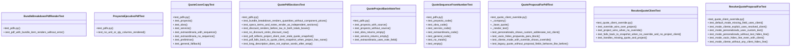

# Community 2

> 91 nodes · cohesion 0.04

## Key Concepts

- [build_quote_pdf()](file:///Users/macbook/Documents/ProjectTracker/tracker/pdfs.py#L261) (33 connections)
- [pdfs.py](file:///Users/macbook/Documents/ProjectTracker/tracker/pdfs.py#L1) (26 connections)
- [build_ldm_pdf()](file:///Users/macbook/Documents/ProjectTracker/tracker/pdfs.py#L1405) (13 connections)
- [quote_cover_copy()](file:///Users/macbook/Documents/ProjectTracker/tracker/pdfs.py#L218) (12 connections)
- [resolve_quote_proposal_for()](file:///Users/macbook/Documents/ProjectTracker/tracker/catalog.py#L397) (11 connections)
- [_safe_text()](file:///Users/macbook/Documents/ProjectTracker/tracker/pdfs.py#L52) (10 connections)
- [build_progress_pdf()](file:///Users/macbook/Documents/ProjectTracker/tracker/pdfs.py#L1891) (9 connections)
- [quote_sequence_from_number()](file:///Users/macbook/Documents/ProjectTracker/tracker/pdfs.py#L213) (9 connections)
- [resolve_quote_client()](file:///Users/macbook/Documents/ProjectTracker/tracker/catalog.py#L376) (8 connections)
- [quote_project_basis_note()](file:///Users/macbook/Documents/ProjectTracker/tracker/pdfs.py#L238) (8 connections)
- [QuoteCoverCopyTest](file:///Users/macbook/Documents/ProjectTracker/tests/test_pdfs.py#L13) (8 connections)
- [QuotePdfSectionsTest](file:///Users/macbook/Documents/ProjectTracker/tests/test_pdfs.py#L147) (8 connections)
- [QuoteSequenceFromNumberTest](file:///Users/macbook/Documents/ProjectTracker/tests/test_pdfs.py#L77) (8 connections)
- [QuoteProposalForPdfTest](file:///Users/macbook/Documents/ProjectTracker/tests/test_quote_client_override.py#L205) (8 connections)
- [_load_company()](file:///Users/macbook/Documents/ProjectTracker/tracker/pdfs.py#L146) (7 connections)
- [._render_text()](file:///Users/macbook/Documents/ProjectTracker/tests/test_quote_client_override.py#L229) (7 connections)
- [ResolveQuoteProposalForTest](file:///Users/macbook/Documents/ProjectTracker/tests/test_quote_client_override.py#L60) (7 connections)
- [QuoteProjectBasisNoteTest](file:///Users/macbook/Documents/ProjectTracker/tests/test_pdfs.py#L52) (6 connections)
- [test_pdfs.py](file:///Users/macbook/Documents/ProjectTracker/tests/test_pdfs.py#L1) (6 connections)
- [quote_logo_path()](file:///Users/macbook/Documents/ProjectTracker/tracker/pdfs.py#L160) (5 connections)
- [_register_dejavu()](file:///Users/macbook/Documents/ProjectTracker/tracker/pdfs.py#L71) (5 connections)
- [._base_quote()](file:///Users/macbook/Documents/ProjectTracker/tests/test_quote_client_override.py#L212) (5 connections)
- [ResolveQuoteClientTest](file:///Users/macbook/Documents/ProjectTracker/tests/test_quote_client_override.py#L39) (5 connections)
- [test_quote_client_override.py](file:///Users/macbook/Documents/ProjectTracker/tests/test_quote_client_override.py#L1) (5 connections)
- [format_date_long()](file:///Users/macbook/Documents/ProjectTracker/tracker/pdfs.py#L104) (4 connections)
- *... and 66 more nodes in this community*

## Class Diagram

```mermaid
classDiagram
    class BundleBreakdownPdfRenderTest {
        +test_pdfs.py()
        +.test_pdf_with_bundle_item_renders_without_error()
    }
    class ProyectoEjecutivoPdfTest {
        +test_pdfs.py()
        +.test_no_unit_or_qty_columns_rendered()
    }
    class QuoteCoverCopyTest {
        +test_pdfs.py()
        +.test_proyecto()
        +.test_obra()
        +.test_servicio()
        +.test_extraordinaria_with_sequence()
        +.test_extraordinaria_no_sequence()
        +.test_preliminar()
        +.test_general_fallback()
    }
    class QuotePdfSectionsTest {
        +test_pdfs.py()
        +.test_bundle_breakdown_renders_quantities_without_component_prices()
        +.test_specs_terms_and_notes_render_as_independent_sections()
        +.test_discount_renders_before_tax_in_both_totals_boxes()
        +.test_no_discount_omits_discount_row()
        +.test_pdf_reflects_project_client_over_stale_quote_snapshot()
        +.test_pdf_falls_back_to_quote_client_snapshot_when_project_has_none()
        +.test_long_description_does_not_orphan_words_after_wrap()
    }
    class QuoteProjectBasisNoteTest {
        +test_pdfs.py()
        +.test_proyecto_with_source()
        +.test_proyecto_without_source()
        +.test_obra_returns_empty()
        +.test_servicio_returns_empty()
        +.test_extraordinaria_uses_note_field()
    }
    class QuoteSequenceFromNumberTest {
        +test_pdfs.py()
        +.test_proyecto_code()
        +.test_obra_code()
        +.test_servicio_code()
        +.test_extraordinaria_code()
        +.test_general_code()
        +.test_no_match()
        +.test_empty()
    }
    class QuoteProposalForPdfTest {
        +test_quote_client_override.py()
        +._company()
        +._base_quote()
        +._render_text()
        +.test_personalizado_shows_custom_addressee_not_client()
        +.test_vacio_hides_propuesta_para_block()
        +.test_cliente_mode_with_override_shows_override()
        +.test_legacy_quote_without_proposal_fields_behaves_like_before()
    }
    class ResolveQuoteClientTest {
        +test_quote_client_override.py()
        +.test_override_wins_over_project()
        +.test_project_wins_when_no_override()
        +.test_falls_back_to_snapshot_when_no_override_and_no_project_client()
        +.test_handles_missing_quote_and_project()
    }
    class ResolveQuoteProposalForTest {
        +test_quote_client_override.py()
        +.test_default_mode_missing_field_uses_client()
        +.test_mode_cliente_explicit_uses_resolved_client()
        +.test_mode_personalizado_uses_custom_text()
        +.test_mode_personalizado_without_text_hides_line()
        +.test_mode_vacio_hides_line_even_with_client()
        +.test_mode_cliente_without_any_client_hides_line()
    }
```

## Relationships

- [[Community 8]] (3 shared connections)
- [[Community 18]] (1 shared connections)

## Source Files

- [/Users/macbook/Documents/ProjectTracker/tests/test_pdfs.py](file:///Users/macbook/Documents/ProjectTracker/tests/test_pdfs.py)
- [/Users/macbook/Documents/ProjectTracker/tests/test_quote_client_override.py](file:///Users/macbook/Documents/ProjectTracker/tests/test_quote_client_override.py)
- [/Users/macbook/Documents/ProjectTracker/tracker/catalog.py](file:///Users/macbook/Documents/ProjectTracker/tracker/catalog.py)
- [/Users/macbook/Documents/ProjectTracker/tracker/pdfs.py](file:///Users/macbook/Documents/ProjectTracker/tracker/pdfs.py)
- [/Users/macbook/ProjectTracker/tests/test_pdfs.py](file:///Users/macbook/ProjectTracker/tests/test_pdfs.py)
- [/Users/macbook/ProjectTracker/tests/test_quote_client_override.py](file:///Users/macbook/ProjectTracker/tests/test_quote_client_override.py)

## Audit Trail

- EXTRACTED: 270 (73%)
- INFERRED: 102 (27%)
- AMBIGUOUS: 0 (0%)

---

*Part of the graphify knowledge wiki. See [[index]] to navigate.*