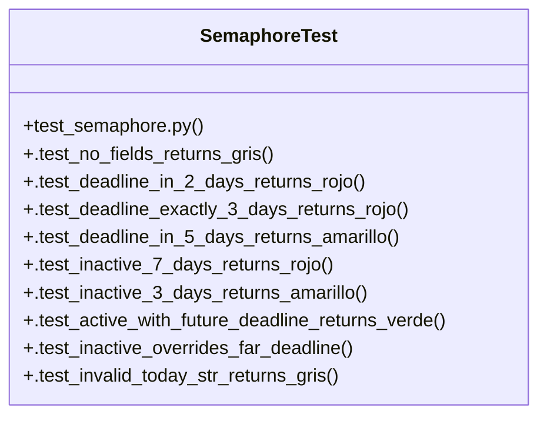

# Community 20

> 15 nodes · cohesion 0.23

## Key Concepts

- [project_semaphore()](file:///Users/macbook/ProjectTracker/tracker/domain.py#L131) (13 connections)
- [SemaphoreTest](file:///Users/macbook/ProjectTracker/tests/test_semaphore.py#L8) (12 connections)
- [.test_active_with_future_deadline_returns_verde()](file:///Users/macbook/ProjectTracker/tests/test_semaphore.py#L33) (2 connections)
- [.test_deadline_exactly_3_days_returns_rojo()](file:///Users/macbook/ProjectTracker/tests/test_semaphore.py#L17) (2 connections)
- [.test_deadline_in_2_days_returns_rojo()](file:///Users/macbook/ProjectTracker/tests/test_semaphore.py#L13) (2 connections)
- [.test_deadline_in_5_days_returns_amarillo()](file:///Users/macbook/ProjectTracker/tests/test_semaphore.py#L21) (2 connections)
- [.test_inactive_3_days_returns_amarillo()](file:///Users/macbook/ProjectTracker/tests/test_semaphore.py#L29) (2 connections)
- [.test_inactive_7_days_returns_rojo()](file:///Users/macbook/ProjectTracker/tests/test_semaphore.py#L25) (2 connections)
- [.test_inactive_overrides_far_deadline()](file:///Users/macbook/ProjectTracker/tests/test_semaphore.py#L37) (2 connections)
- [.test_invalid_deadline_falls_back_to_inactivity()](file:///Users/macbook/ProjectTracker/tests/test_semaphore.py#L46) (2 connections)
- [.test_invalid_today_str_returns_gris()](file:///Users/macbook/ProjectTracker/tests/test_semaphore.py#L42) (2 connections)
- [.test_no_fields_returns_gris()](file:///Users/macbook/ProjectTracker/tests/test_semaphore.py#L10) (2 connections)
- [.test_only_updated_at_no_deadline_active_returns_gris()](file:///Users/macbook/ProjectTracker/tests/test_semaphore.py#L50) (2 connections)
- [Returns 'verde', 'amarillo', 'rojo', or 'gris' based on deadline and inactivity.](file:///Users/macbook/ProjectTracker/tracker/domain.py#L132) (1 connections)
- [test_semaphore.py](file:///Users/macbook/ProjectTracker/tests/test_semaphore.py#L1) (1 connections)

## Class Diagram

## Relationships

- No strong cross-community connections detected

## Source Files

- [/Users/macbook/ProjectTracker/tests/test_semaphore.py](file:///Users/macbook/ProjectTracker/tests/test_semaphore.py)
- [/Users/macbook/ProjectTracker/tracker/domain.py](file:///Users/macbook/ProjectTracker/tracker/domain.py)

## Audit Trail

- EXTRACTED: 27 (55%)
- INFERRED: 22 (45%)
- AMBIGUOUS: 0 (0%)

---

*Part of the graphify knowledge wiki. See [[index]] to navigate.*