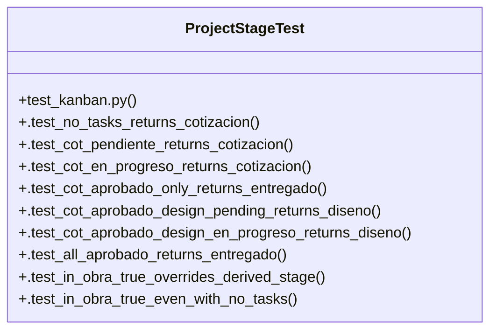

# Community 21

> 15 nodes · cohesion 0.30

## Key Concepts

- [project_stage()](file:///Users/macbook/ProjectTracker/tracker/domain.py#L70) (12 connections)
- [ProjectStageTest](file:///Users/macbook/ProjectTracker/tests/test_kanban.py#L39) (11 connections)
- [_task()](file:///Users/macbook/ProjectTracker/tests/test_kanban.py#L23) (9 connections)
- [.test_all_aprobado_returns_entregado()](file:///Users/macbook/ProjectTracker/tests/test_kanban.py#L71) (3 connections)
- [.test_cot_aprobado_design_en_progreso_returns_diseno()](file:///Users/macbook/ProjectTracker/tests/test_kanban.py#L63) (3 connections)
- [.test_cot_aprobado_design_pending_returns_diseno()](file:///Users/macbook/ProjectTracker/tests/test_kanban.py#L56) (3 connections)
- [.test_cot_aprobado_only_returns_entregado()](file:///Users/macbook/ProjectTracker/tests/test_kanban.py#L52) (3 connections)
- [.test_cot_en_progreso_returns_cotizacion()](file:///Users/macbook/ProjectTracker/tests/test_kanban.py#L48) (3 connections)
- [.test_cot_pendiente_returns_cotizacion()](file:///Users/macbook/ProjectTracker/tests/test_kanban.py#L44) (3 connections)
- [.test_in_obra_true_overrides_derived_stage()](file:///Users/macbook/ProjectTracker/tests/test_kanban.py#L79) (3 connections)
- [.test_subtasks_not_counted()](file:///Users/macbook/ProjectTracker/tests/test_kanban.py#L88) (3 connections)
- [.test_in_obra_true_even_with_no_tasks()](file:///Users/macbook/ProjectTracker/tests/test_kanban.py#L84) (2 connections)
- [.test_no_tasks_returns_cotizacion()](file:///Users/macbook/ProjectTracker/tests/test_kanban.py#L41) (2 connections)
- [test_kanban.py](file:///Users/macbook/ProjectTracker/tests/test_kanban.py#L1) (2 connections)
- [Derive the portfolio stage from existing task data + the in_obra flag.      Stag](file:///Users/macbook/ProjectTracker/tracker/domain.py#L71) (1 connections)

## Class Diagram

## Relationships

- No strong cross-community connections detected

## Source Files

- [/Users/macbook/ProjectTracker/tests/test_kanban.py](file:///Users/macbook/ProjectTracker/tests/test_kanban.py)
- [/Users/macbook/ProjectTracker/tracker/domain.py](file:///Users/macbook/ProjectTracker/tracker/domain.py)

## Audit Trail

- EXTRACTED: 43 (68%)
- INFERRED: 20 (32%)
- AMBIGUOUS: 0 (0%)

---

*Part of the graphify knowledge wiki. See [[index]] to navigate.*