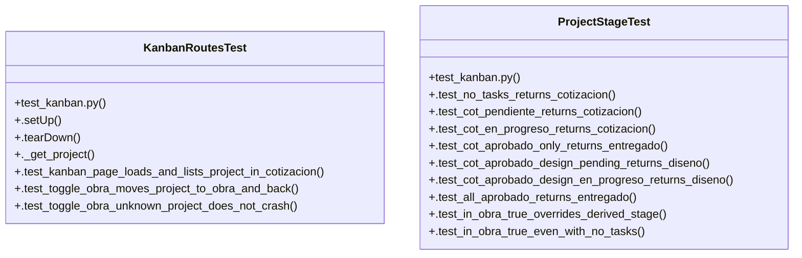

# Community 21

> 23 nodes · cohesion 0.16

## Key Concepts

- [project_stage()](file:///Users/macbook/ProjectTracker/tracker/domain.py#L74) (13 connections)
- [ProjectStageTest](file:///Users/macbook/ProjectTracker/tests/test_kanban.py#L39) (11 connections)
- [_task()](file:///Users/macbook/ProjectTracker/tests/test_kanban.py#L23) (9 connections)
- [KanbanRoutesTest](file:///Users/macbook/ProjectTracker/tests/test_kanban.py#L95) (8 connections)
- [.setUp()](file:///Users/macbook/ProjectTracker/tests/test_kanban.py#L99) (4 connections)
- [._get_project()](file:///Users/macbook/ProjectTracker/tests/test_kanban.py#L112) (3 connections)
- [.test_all_aprobado_returns_entregado()](file:///Users/macbook/ProjectTracker/tests/test_kanban.py#L71) (3 connections)
- [.test_cot_aprobado_design_en_progreso_returns_diseno()](file:///Users/macbook/ProjectTracker/tests/test_kanban.py#L63) (3 connections)
- [.test_cot_aprobado_design_pending_returns_diseno()](file:///Users/macbook/ProjectTracker/tests/test_kanban.py#L56) (3 connections)
- [.test_cot_aprobado_only_returns_entregado()](file:///Users/macbook/ProjectTracker/tests/test_kanban.py#L52) (3 connections)
- [.test_cot_en_progreso_returns_cotizacion()](file:///Users/macbook/ProjectTracker/tests/test_kanban.py#L48) (3 connections)
- [.test_cot_pendiente_returns_cotizacion()](file:///Users/macbook/ProjectTracker/tests/test_kanban.py#L44) (3 connections)
- [.test_in_obra_true_overrides_derived_stage()](file:///Users/macbook/ProjectTracker/tests/test_kanban.py#L79) (3 connections)
- [.test_subtasks_not_counted()](file:///Users/macbook/ProjectTracker/tests/test_kanban.py#L88) (3 connections)
- [test_kanban.py](file:///Users/macbook/ProjectTracker/tests/test_kanban.py#L1) (3 connections)
- [.tearDown()](file:///Users/macbook/ProjectTracker/tests/test_kanban.py#L109) (2 connections)
- [.test_toggle_obra_moves_project_to_obra_and_back()](file:///Users/macbook/ProjectTracker/tests/test_kanban.py#L122) (2 connections)
- [.test_in_obra_true_even_with_no_tasks()](file:///Users/macbook/ProjectTracker/tests/test_kanban.py#L84) (2 connections)
- [.test_no_tasks_returns_cotizacion()](file:///Users/macbook/ProjectTracker/tests/test_kanban.py#L41) (2 connections)
- [Derive the portfolio stage from existing task data + the in_obra flag.      Stag](file:///Users/macbook/ProjectTracker/tracker/domain.py#L75) (1 connections)
- [.test_kanban_page_loads_and_lists_project_in_cotizacion()](file:///Users/macbook/ProjectTracker/tests/test_kanban.py#L115) (1 connections)
- [.test_toggle_obra_unknown_project_does_not_crash()](file:///Users/macbook/ProjectTracker/tests/test_kanban.py#L134) (1 connections)
- [Cubre las rutas /kanban y toggle_obra restauradas (el template     kanban.html h](file:///Users/macbook/ProjectTracker/tests/test_kanban.py#L96) (1 connections)

## Class Diagram

```mermaid
classDiagram
    class KanbanRoutesTest {
        +test_kanban.py()
        +.setUp()
        +.tearDown()
        +._get_project()
        +.test_kanban_page_loads_and_lists_project_in_cotizacion()
        +.test_toggle_obra_moves_project_to_obra_and_back()
        +.test_toggle_obra_unknown_project_does_not_crash()
    }
    class ProjectStageTest {
        +test_kanban.py()
        +.test_no_tasks_returns_cotizacion()
        +.test_cot_pendiente_returns_cotizacion()
        +.test_cot_en_progreso_returns_cotizacion()
        +.test_cot_aprobado_only_returns_entregado()
        +.test_cot_aprobado_design_pending_returns_diseno()
        +.test_cot_aprobado_design_en_progreso_returns_diseno()
        +.test_all_aprobado_returns_entregado()
        +.test_in_obra_true_overrides_derived_stage()
        +.test_in_obra_true_even_with_no_tasks()
    }
```

## Relationships

- No strong cross-community connections detected

## Source Files

- [/Users/macbook/ProjectTracker/tests/test_kanban.py](file:///Users/macbook/ProjectTracker/tests/test_kanban.py)
- [/Users/macbook/ProjectTracker/tracker/domain.py](file:///Users/macbook/ProjectTracker/tracker/domain.py)

## Audit Trail

- EXTRACTED: 61 (70%)
- INFERRED: 26 (30%)
- AMBIGUOUS: 0 (0%)

---

*Part of the graphify knowledge wiki. See [[index]] to navigate.*