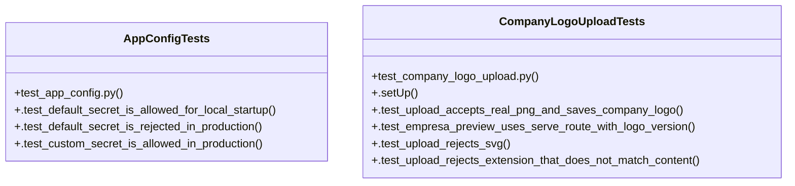

# Community 22

> 14 nodes · cohesion 0.16

## Key Concepts

- [CompanyLogoUploadTests](file:///Users/macbook/ProjectTracker/tests/test_company_logo_upload.py#L8) (7 connections)
- [_requires_configured_secret_key()](file:///Users/macbook/ProjectTracker/tracker/__init__.py#L43) (6 connections)
- [AppConfigTests](file:///Users/macbook/ProjectTracker/tests/test_app_config.py#L8) (5 connections)
- **TestCase** (3 connections)
- [.test_custom_secret_is_allowed_in_production()](file:///Users/macbook/ProjectTracker/tests/test_app_config.py#L17) (2 connections)
- [.test_default_secret_is_allowed_for_local_startup()](file:///Users/macbook/ProjectTracker/tests/test_app_config.py#L9) (2 connections)
- [.test_default_secret_is_rejected_in_production()](file:///Users/macbook/ProjectTracker/tests/test_app_config.py#L13) (2 connections)
- [.setUp()](file:///Users/macbook/ProjectTracker/tests/test_company_logo_upload.py#L9) (1 connections)
- [.test_empresa_preview_uses_serve_route_with_logo_version()](file:///Users/macbook/ProjectTracker/tests/test_company_logo_upload.py#L33) (1 connections)
- [.test_upload_accepts_real_png_and_saves_company_logo()](file:///Users/macbook/ProjectTracker/tests/test_company_logo_upload.py#L17) (1 connections)
- [.test_upload_rejects_extension_that_does_not_match_content()](file:///Users/macbook/ProjectTracker/tests/test_company_logo_upload.py#L57) (1 connections)
- [.test_upload_rejects_svg()](file:///Users/macbook/ProjectTracker/tests/test_company_logo_upload.py#L42) (1 connections)
- [test_app_config.py](file:///Users/macbook/ProjectTracker/tests/test_app_config.py#L1) (1 connections)
- [test_company_logo_upload.py](file:///Users/macbook/ProjectTracker/tests/test_company_logo_upload.py#L1) (1 connections)

## Class Diagram

## Relationships

- No strong cross-community connections detected

## Source Files

- [/Users/macbook/ProjectTracker/tests/test_app_config.py](file:///Users/macbook/ProjectTracker/tests/test_app_config.py)
- [/Users/macbook/ProjectTracker/tests/test_company_logo_upload.py](file:///Users/macbook/ProjectTracker/tests/test_company_logo_upload.py)
- [/Users/macbook/ProjectTracker/tracker/__init__.py](file:///Users/macbook/ProjectTracker/tracker/__init__.py)

## Audit Trail

- EXTRACTED: 28 (82%)
- INFERRED: 6 (18%)
- AMBIGUOUS: 0 (0%)

---

*Part of the graphify knowledge wiki. See [[index]] to navigate.*