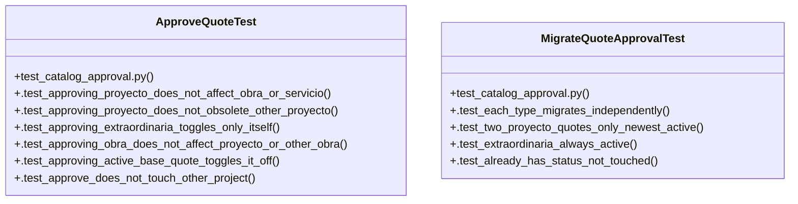

# Community 22

> 20 nodes · cohesion 0.19

## Key Concepts

- [_q()](file:///Users/macbook/ProjectTracker/tests/test_catalog_approval.py#L13) (11 connections)
- [approve_quote()](file:///Users/macbook/ProjectTracker/tracker/catalog.py#L126) (9 connections)
- [migrate_quote_approval()](file:///Users/macbook/ProjectTracker/tracker/catalog.py#L88) (9 connections)
- [ApproveQuoteTest](file:///Users/macbook/ProjectTracker/tests/test_catalog_approval.py#L20) (7 connections)
- [approve_quote_route()](file:///Users/macbook/ProjectTracker/tracker/routes/quotes.py#L471) (5 connections)
- [MigrateQuoteApprovalTest](file:///Users/macbook/ProjectTracker/tests/test_catalog_approval.py#L84) (5 connections)
- [test_catalog_approval.py](file:///Users/macbook/ProjectTracker/tests/test_catalog_approval.py#L1) (4 connections)
- [.test_approve_does_not_touch_other_project()](file:///Users/macbook/ProjectTracker/tests/test_catalog_approval.py#L74) (3 connections)
- [.test_approving_active_base_quote_toggles_it_off()](file:///Users/macbook/ProjectTracker/tests/test_catalog_approval.py#L67) (3 connections)
- [.test_approving_extraordinaria_toggles_only_itself()](file:///Users/macbook/ProjectTracker/tests/test_catalog_approval.py#L45) (3 connections)
- [.test_approving_obra_does_not_affect_proyecto_or_other_obra()](file:///Users/macbook/ProjectTracker/tests/test_catalog_approval.py#L55) (3 connections)
- [.test_approving_proyecto_does_not_affect_obra_or_servicio()](file:///Users/macbook/ProjectTracker/tests/test_catalog_approval.py#L21) (3 connections)
- [.test_approving_proyecto_does_not_obsolete_other_proyecto()](file:///Users/macbook/ProjectTracker/tests/test_catalog_approval.py#L33) (3 connections)
- [.test_already_has_status_not_touched()](file:///Users/macbook/ProjectTracker/tests/test_catalog_approval.py#L117) (3 connections)
- [.test_each_type_migrates_independently()](file:///Users/macbook/ProjectTracker/tests/test_catalog_approval.py#L85) (3 connections)
- [.test_extraordinaria_always_active()](file:///Users/macbook/ProjectTracker/tests/test_catalog_approval.py#L108) (3 connections)
- [.test_two_proyecto_quotes_only_newest_active()](file:///Users/macbook/ProjectTracker/tests/test_catalog_approval.py#L98) (3 connections)
- [Marca la cotización target_id como active.      Si es General/Preliminar, pasa l](file:///Users/macbook/ProjectTracker/tracker/catalog.py#L127) (1 connections)
- [Migración idempotente: asigna approval_status a cotizaciones que no lo tienen.](file:///Users/macbook/ProjectTracker/tracker/catalog.py#L89) (1 connections)
- [Aprueba/activa o desactiva una cotización.      Toggle libre e independiente par](file:///Users/macbook/ProjectTracker/tracker/routes/quotes.py#L472) (1 connections)

## Class Diagram

```mermaid
classDiagram
    class ApproveQuoteTest {
        +test_catalog_approval.py()
        +.test_approving_proyecto_does_not_affect_obra_or_servicio()
        +.test_approving_proyecto_does_not_obsolete_other_proyecto()
        +.test_approving_extraordinaria_toggles_only_itself()
        +.test_approving_obra_does_not_affect_proyecto_or_other_obra()
        +.test_approving_active_base_quote_toggles_it_off()
        +.test_approve_does_not_touch_other_project()
    }
    class MigrateQuoteApprovalTest {
        +test_catalog_approval.py()
        +.test_each_type_migrates_independently()
        +.test_two_proyecto_quotes_only_newest_active()
        +.test_extraordinaria_always_active()
        +.test_already_has_status_not_touched()
    }
```

## Relationships

- [[Community 0]] (1 shared connections)

## Source Files

- [/Users/macbook/ProjectTracker/tests/test_catalog_approval.py](file:///Users/macbook/ProjectTracker/tests/test_catalog_approval.py)
- [/Users/macbook/ProjectTracker/tracker/catalog.py](file:///Users/macbook/ProjectTracker/tracker/catalog.py)
- [/Users/macbook/ProjectTracker/tracker/routes/quotes.py](file:///Users/macbook/ProjectTracker/tracker/routes/quotes.py)

## Audit Trail

- EXTRACTED: 58 (70%)
- INFERRED: 25 (30%)
- AMBIGUOUS: 0 (0%)

---

*Part of the graphify knowledge wiki. See [[index]] to navigate.*