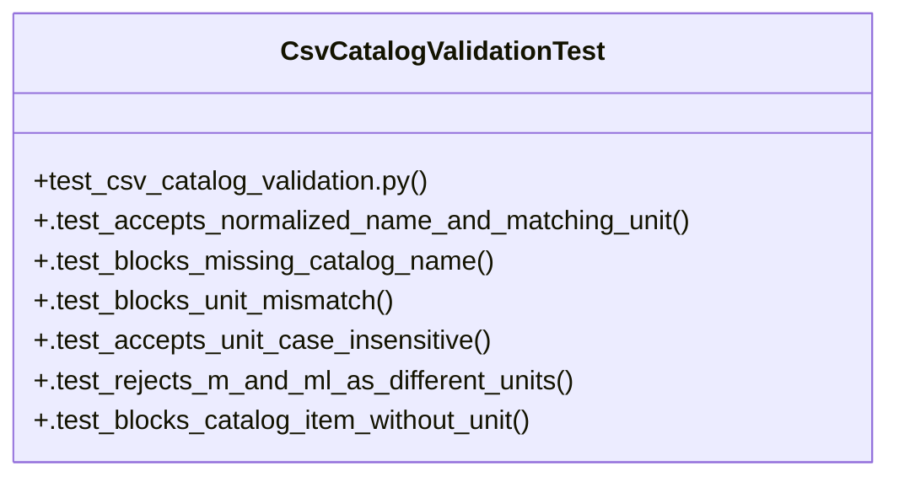

# Community 23

> 14 nodes · cohesion 0.24

## Key Concepts

- [validate_csv_catalog_items()](file:///Users/macbook/ProjectTracker/tracker/csv_catalog_validation.py#L21) (14 connections)
- [CsvCatalogValidationTest](file:///Users/macbook/ProjectTracker/tests/test_csv_catalog_validation.py#L30) (7 connections)
- [csv_catalog_validation.py](file:///Users/macbook/ProjectTracker/tracker/csv_catalog_validation.py#L1) (7 connections)
- [_catalog_index()](file:///Users/macbook/ProjectTracker/tracker/csv_catalog_validation.py#L12) (3 connections)
- [_clean()](file:///Users/macbook/ProjectTracker/tracker/csv_catalog_validation.py#L4) (3 connections)
- [_unit_key()](file:///Users/macbook/ProjectTracker/tracker/csv_catalog_validation.py#L8) (3 connections)
- [.test_accepts_normalized_name_and_matching_unit()](file:///Users/macbook/ProjectTracker/tests/test_csv_catalog_validation.py#L31) (2 connections)
- [.test_accepts_unit_case_insensitive()](file:///Users/macbook/ProjectTracker/tests/test_csv_catalog_validation.py#L60) (2 connections)
- [.test_blocks_catalog_item_without_unit()](file:///Users/macbook/ProjectTracker/tests/test_csv_catalog_validation.py#L77) (2 connections)
- [.test_blocks_missing_catalog_name()](file:///Users/macbook/ProjectTracker/tests/test_csv_catalog_validation.py#L41) (2 connections)
- [.test_blocks_unit_mismatch()](file:///Users/macbook/ProjectTracker/tests/test_csv_catalog_validation.py#L51) (2 connections)
- [.test_rejects_m_and_ml_as_different_units()](file:///Users/macbook/ProjectTracker/tests/test_csv_catalog_validation.py#L68) (2 connections)
- [Validate parsed CSV rows against catalog name and unit.      Matching intentiona](file:///Users/macbook/ProjectTracker/tracker/csv_catalog_validation.py#L22) (1 connections)
- [test_csv_catalog_validation.py](file:///Users/macbook/ProjectTracker/tests/test_csv_catalog_validation.py#L1) (1 connections)

## Class Diagram

## Relationships

- [[Community 22]] (1 shared connections)

## Source Files

- [/Users/macbook/ProjectTracker/tests/test_csv_catalog_validation.py](file:///Users/macbook/ProjectTracker/tests/test_csv_catalog_validation.py)
- [/Users/macbook/ProjectTracker/tracker/csv_catalog_validation.py](file:///Users/macbook/ProjectTracker/tracker/csv_catalog_validation.py)

## Audit Trail

- EXTRACTED: 35 (69%)
- INFERRED: 16 (31%)
- AMBIGUOUS: 0 (0%)

---

*Part of the graphify knowledge wiki. See [[index]] to navigate.*