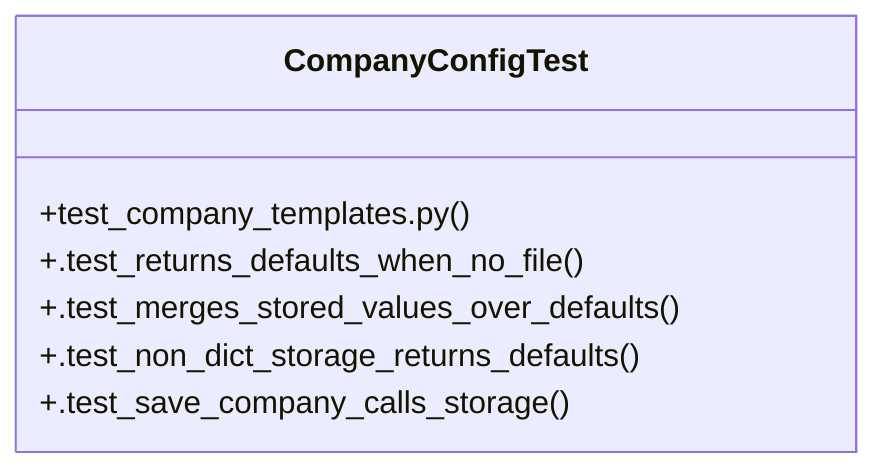

# Community 25

> 12 nodes · cohesion 0.23

## Key Concepts

- [get_company()](file:///Users/macbook/ProjectTracker/tracker/company_config.py#L15) (7 connections)
- [CompanyConfigTest](file:///Users/macbook/ProjectTracker/tests/test_company_templates.py#L5) (5 connections)
- [empresa()](file:///Users/macbook/ProjectTracker/tracker/routes/admin.py#L815) (4 connections)
- [save_company()](file:///Users/macbook/ProjectTracker/tracker/company_config.py#L25) (4 connections)
- [company_config.py](file:///Users/macbook/ProjectTracker/tracker/company_config.py#L1) (4 connections)
- [_company_logo_version()](file:///Users/macbook/ProjectTracker/tracker/routes/admin.py#L789) (2 connections)
- [empresa_logo_file()](file:///Users/macbook/ProjectTracker/tracker/routes/admin.py#L801) (2 connections)
- [.test_merges_stored_values_over_defaults()](file:///Users/macbook/ProjectTracker/tests/test_company_templates.py#L18) (2 connections)
- [.test_non_dict_storage_returns_defaults()](file:///Users/macbook/ProjectTracker/tests/test_company_templates.py#L28) (2 connections)
- [.test_returns_defaults_when_no_file()](file:///Users/macbook/ProjectTracker/tests/test_company_templates.py#L7) (2 connections)
- [.test_save_company_calls_storage()](file:///Users/macbook/ProjectTracker/tests/test_company_templates.py#L34) (2 connections)
- [test_company_templates.py](file:///Users/macbook/ProjectTracker/tests/test_company_templates.py#L1) (2 connections)

## Class Diagram

## Relationships

- No strong cross-community connections detected

## Source Files

- [/Users/macbook/ProjectTracker/tests/test_company_templates.py](file:///Users/macbook/ProjectTracker/tests/test_company_templates.py)
- [/Users/macbook/ProjectTracker/tracker/company_config.py](file:///Users/macbook/ProjectTracker/tracker/company_config.py)
- [/Users/macbook/ProjectTracker/tracker/routes/admin.py](file:///Users/macbook/ProjectTracker/tracker/routes/admin.py)

## Audit Trail

- EXTRACTED: 22 (58%)
- INFERRED: 16 (42%)
- AMBIGUOUS: 0 (0%)

---

*Part of the graphify knowledge wiki. See [[index]] to navigate.*