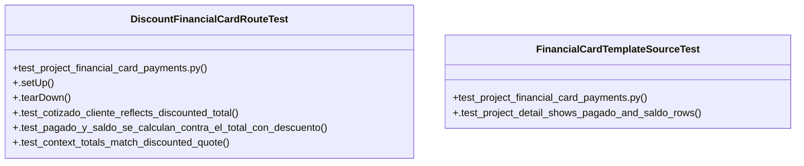

# Community 26

> 12 nodes · cohesion 0.17

## Key Concepts

- [DiscountFinancialCardRouteTest](file:///Users/macbook/Documents/ProjectTracker/tests/test_project_financial_card_payments.py#L134) (7 connections)
- [.setUp()](file:///Users/macbook/Documents/ProjectTracker/tests/test_project_financial_card_payments.py#L139) (4 connections)
- [test_project_financial_card_payments.py](file:///Users/macbook/Documents/ProjectTracker/tests/test_project_financial_card_payments.py#L1) (4 connections)
- [.test_context_totals_match_discounted_quote()](file:///Users/macbook/Documents/ProjectTracker/tests/test_project_financial_card_payments.py#L174) (3 connections)
- [.tearDown()](file:///Users/macbook/Documents/ProjectTracker/tests/test_project_financial_card_payments.py#L152) (2 connections)
- [.test_pagado_y_saldo_se_calculan_contra_el_total_con_descuento()](file:///Users/macbook/Documents/ProjectTracker/tests/test_project_financial_card_payments.py#L165) (2 connections)
- [FinancialCardTemplateSourceTest](file:///Users/macbook/Documents/ProjectTracker/tests/test_project_financial_card_payments.py#L49) (2 connections)
- [.test_cotizado_cliente_reflects_discounted_total()](file:///Users/macbook/Documents/ProjectTracker/tests/test_project_financial_card_payments.py#L157) (1 connections)
- [.test_project_detail_shows_pagado_and_saldo_rows()](file:///Users/macbook/Documents/ProjectTracker/tests/test_project_financial_card_payments.py#L50) (1 connections)
- [La caja financiera del header de project_detail.html ("Cotizado cliente" / "Cost](file:///Users/macbook/ProjectTracker/tests/test_project_financial_card_payments.py#L1) (1 connections)
- [La cotización de este proyecto tiene descuento_pct=10 — la tarjeta debe     usar](file:///Users/macbook/ProjectTracker/tests/test_project_financial_card_payments.py#L135) (1 connections)
- [Verifica los mismos números a nivel de contexto (sin depender del         render](file:///Users/macbook/ProjectTracker/tests/test_project_financial_card_payments.py#L175) (1 connections)

## Class Diagram

## Relationships

- [[Community 4]] (3 shared connections)

## Source Files

- [/Users/macbook/Documents/ProjectTracker/tests/test_project_financial_card_payments.py](file:///Users/macbook/Documents/ProjectTracker/tests/test_project_financial_card_payments.py)
- [/Users/macbook/ProjectTracker/tests/test_project_financial_card_payments.py](file:///Users/macbook/ProjectTracker/tests/test_project_financial_card_payments.py)

## Audit Trail

- EXTRACTED: 23 (79%)
- INFERRED: 6 (21%)
- AMBIGUOUS: 0 (0%)

---

*Part of the graphify knowledge wiki. See [[index]] to navigate.*