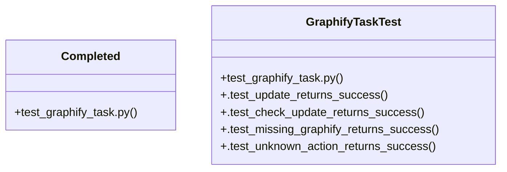

# Community 27

> 9 nodes · cohesion 0.36

## Key Concepts

- [main()](file:///Users/macbook/ProjectTracker/scripts/migrate_add_deadline.py#L16) (7 connections)
- [GraphifyTaskTest](file:///Users/macbook/ProjectTracker/tests/test_graphify_task.py#L10) (5 connections)
- [Completed](file:///Users/macbook/ProjectTracker/tests/test_graphify_task.py#L6) (3 connections)
- [.test_check_update_returns_success()](file:///Users/macbook/ProjectTracker/tests/test_graphify_task.py#L24) (3 connections)
- [.test_update_returns_success()](file:///Users/macbook/ProjectTracker/tests/test_graphify_task.py#L12) (3 connections)
- [.test_missing_graphify_returns_success()](file:///Users/macbook/ProjectTracker/tests/test_graphify_task.py#L36) (2 connections)
- [.test_unknown_action_returns_success()](file:///Users/macbook/ProjectTracker/tests/test_graphify_task.py#L41) (2 connections)
- [test_graphify_task.py](file:///Users/macbook/ProjectTracker/tests/test_graphify_task.py#L1) (2 connections)
- [migrate_add_deadline.py](file:///Users/macbook/ProjectTracker/scripts/migrate_add_deadline.py#L1) (1 connections)

## Class Diagram

## Relationships

- No strong cross-community connections detected

## Source Files

- [/Users/macbook/ProjectTracker/scripts/migrate_add_deadline.py](file:///Users/macbook/ProjectTracker/scripts/migrate_add_deadline.py)
- [/Users/macbook/ProjectTracker/tests/test_graphify_task.py](file:///Users/macbook/ProjectTracker/tests/test_graphify_task.py)

## Audit Trail

- EXTRACTED: 18 (64%)
- INFERRED: 10 (36%)
- AMBIGUOUS: 0 (0%)

---

*Part of the graphify knowledge wiki. See [[index]] to navigate.*