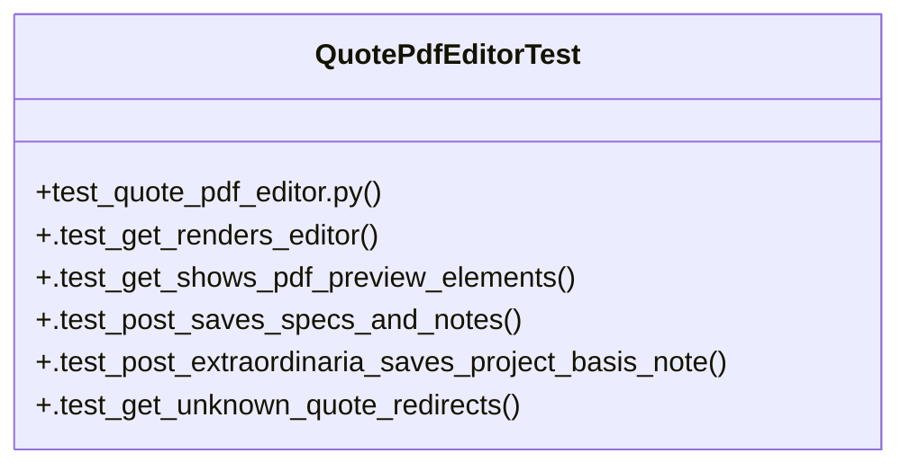

# Community 28

> 9 nodes · cohesion 0.22

## Key Concepts

- [QuotePdfEditorTest](file:///Users/macbook/ProjectTracker/tests/test_quote_pdf_editor.py#L62) (6 connections)
- [test_quote_pdf_editor.py](file:///Users/macbook/ProjectTracker/tests/test_quote_pdf_editor.py#L1) (3 connections)
- [_fake_load()](file:///Users/macbook/ProjectTracker/tests/test_quote_pdf_editor.py#L58) (1 connections)
- [.test_get_renders_editor()](file:///Users/macbook/ProjectTracker/tests/test_quote_pdf_editor.py#L72) (1 connections)
- [.test_get_shows_pdf_preview_elements()](file:///Users/macbook/ProjectTracker/tests/test_quote_pdf_editor.py#L86) (1 connections)
- [.test_get_unknown_quote_redirects()](file:///Users/macbook/ProjectTracker/tests/test_quote_pdf_editor.py#L155) (1 connections)
- [.test_post_extraordinaria_saves_project_basis_note()](file:///Users/macbook/ProjectTracker/tests/test_quote_pdf_editor.py#L131) (1 connections)
- [.test_post_saves_specs_and_notes()](file:///Users/macbook/ProjectTracker/tests/test_quote_pdf_editor.py#L97) (1 connections)
- [setUpClass()](file:///Users/macbook/ProjectTracker/tests/test_quote_pdf_editor.py#L64) (1 connections)

## Class Diagram

## Relationships

- No strong cross-community connections detected

## Source Files

- [/Users/macbook/ProjectTracker/tests/test_quote_pdf_editor.py](file:///Users/macbook/ProjectTracker/tests/test_quote_pdf_editor.py)

## Audit Trail

- EXTRACTED: 16 (100%)
- INFERRED: 0 (0%)
- AMBIGUOUS: 0 (0%)

---

*Part of the graphify knowledge wiki. See [[index]] to navigate.*