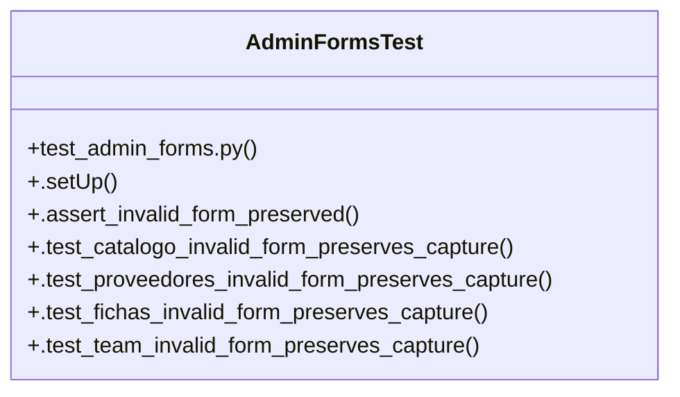

# Community 29

> 8 nodes · cohesion 0.39

## Key Concepts

- [AdminFormsTest](file:///Users/macbook/ProjectTracker/tests/test_admin_forms.py#L6) (7 connections)
- [.assert_invalid_form_preserved()](file:///Users/macbook/ProjectTracker/tests/test_admin_forms.py#L13) (5 connections)
- [.test_catalogo_invalid_form_preserves_capture()](file:///Users/macbook/ProjectTracker/tests/test_admin_forms.py#L20) (2 connections)
- [.test_fichas_invalid_form_preserves_capture()](file:///Users/macbook/ProjectTracker/tests/test_admin_forms.py#L34) (2 connections)
- [.test_proveedores_invalid_form_preserves_capture()](file:///Users/macbook/ProjectTracker/tests/test_admin_forms.py#L27) (2 connections)
- [.test_team_invalid_form_preserves_capture()](file:///Users/macbook/ProjectTracker/tests/test_admin_forms.py#L41) (2 connections)
- [.setUp()](file:///Users/macbook/ProjectTracker/tests/test_admin_forms.py#L7) (1 connections)
- [test_admin_forms.py](file:///Users/macbook/ProjectTracker/tests/test_admin_forms.py#L1) (1 connections)

## Class Diagram

## Relationships

- No strong cross-community connections detected

## Source Files

- [/Users/macbook/ProjectTracker/tests/test_admin_forms.py](file:///Users/macbook/ProjectTracker/tests/test_admin_forms.py)

## Audit Trail

- EXTRACTED: 22 (100%)
- INFERRED: 0 (0%)
- AMBIGUOUS: 0 (0%)

---

*Part of the graphify knowledge wiki. See [[index]] to navigate.*