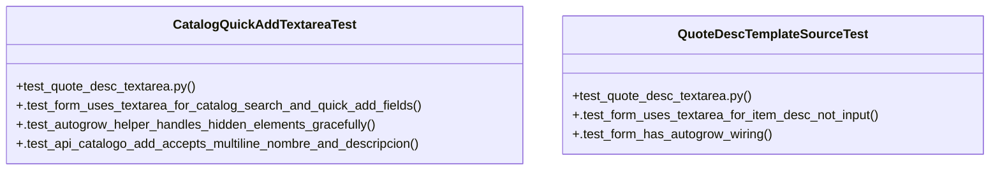

# Community 29

> 10 nodes · cohesion 0.20

## Key Concepts

- [CatalogQuickAddTextareaTest](file:///Users/macbook/ProjectTracker/tests/test_quote_desc_textarea.py#L134) (5 connections)
- [.test_api_catalogo_add_accepts_multiline_nombre_and_descripcion()](file:///Users/macbook/ProjectTracker/tests/test_quote_desc_textarea.py#L155) (4 connections)
- [test_quote_desc_textarea.py](file:///Users/macbook/ProjectTracker/tests/test_quote_desc_textarea.py#L1) (4 connections)
- [QuoteDescTemplateSourceTest](file:///Users/macbook/ProjectTracker/tests/test_quote_desc_textarea.py#L52) (3 connections)
- [.test_autogrow_helper_handles_hidden_elements_gracefully()](file:///Users/macbook/ProjectTracker/tests/test_quote_desc_textarea.py#L149) (1 connections)
- [.test_form_uses_textarea_for_catalog_search_and_quick_add_fields()](file:///Users/macbook/ProjectTracker/tests/test_quote_desc_textarea.py#L139) (1 connections)
- [.test_form_has_autogrow_wiring()](file:///Users/macbook/ProjectTracker/tests/test_quote_desc_textarea.py#L59) (1 connections)
- [.test_form_uses_textarea_for_item_desc_not_input()](file:///Users/macbook/ProjectTracker/tests/test_quote_desc_textarea.py#L53) (1 connections)
- [item_desc[] (columna "Nombre / Descripción" de cada partida) es un <textarea> au](file:///Users/macbook/ProjectTracker/tests/test_quote_desc_textarea.py#L1) (1 connections)
- [Buscador de catálogo (catalogSearch) y mini-formulario "Agregar nuevo     artícu](file:///Users/macbook/ProjectTracker/tests/test_quote_desc_textarea.py#L135) (1 connections)

## Class Diagram

```mermaid
classDiagram
    class CatalogQuickAddTextareaTest {
        +test_quote_desc_textarea.py()
        +.test_form_uses_textarea_for_catalog_search_and_quick_add_fields()
        +.test_autogrow_helper_handles_hidden_elements_gracefully()
        +.test_api_catalogo_add_accepts_multiline_nombre_and_descripcion()
    }
    class QuoteDescTemplateSourceTest {
        +test_quote_desc_textarea.py()
        +.test_form_uses_textarea_for_item_desc_not_input()
        +.test_form_has_autogrow_wiring()
    }
```

## Relationships

- No strong cross-community connections detected

## Source Files

- [/Users/macbook/ProjectTracker/tests/test_quote_desc_textarea.py](file:///Users/macbook/ProjectTracker/tests/test_quote_desc_textarea.py)

## Audit Trail

- EXTRACTED: 19 (86%)
- INFERRED: 3 (14%)
- AMBIGUOUS: 0 (0%)

---

*Part of the graphify knowledge wiki. See [[index]] to navigate.*