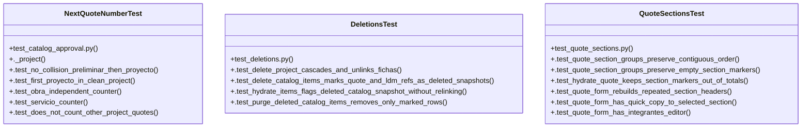

# Community 3

> 69 nodes · cohesion 0.06

## Key Concepts

- [catalog.py](file:///Users/macbook/ProjectTracker/tracker/catalog.py#L1) (38 connections)
- [quotes.py](file:///Users/macbook/ProjectTracker/tracker/routes/quotes.py#L1) (36 connections)
- [catalog_maps()](file:///Users/macbook/ProjectTracker/tracker/catalog.py#L172) (27 connections)
- [hydrate_quote()](file:///Users/macbook/ProjectTracker/tracker/catalog.py#L332) (19 connections)
- [quote_type_key()](file:///Users/macbook/ProjectTracker/tracker/catalog.py#L65) (15 connections)
- [safe_float()](file:///Users/macbook/ProjectTracker/tracker/catalog.py#L185) (13 connections)
- [next_quote_number()](file:///Users/macbook/ProjectTracker/tracker/catalog.py#L405) (12 connections)
- [hydrate_ldm()](file:///Users/macbook/ProjectTracker/tracker/catalog.py#L392) (11 connections)
- [sync_ldm_bundles()](file:///Users/macbook/ProjectTracker/tracker/routes/materials.py#L442) (11 connections)
- [export_data()](file:///Users/macbook/ProjectTracker/tracker/routes/admin.py#L1006) (10 connections)
- [hydrate_quote_item()](file:///Users/macbook/ProjectTracker/tracker/catalog.py#L271) (10 connections)
- [new_quote()](file:///Users/macbook/ProjectTracker/tracker/routes/quotes.py#L127) (10 connections)
- [quote_pdf_editor()](file:///Users/macbook/ProjectTracker/tracker/routes/quotes.py#L859) (10 connections)
- [import_quote_csv()](file:///Users/macbook/ProjectTracker/tracker/routes/quotes.py#L190) (9 connections)
- [_render_quote_form()](file:///Users/macbook/ProjectTracker/tracker/routes/quotes.py#L21) (9 connections)
- [quote_section_groups()](file:///Users/macbook/ProjectTracker/tracker/catalog.py#L228) (8 connections)
- [_build_resumen()](file:///Users/macbook/ProjectTracker/tracker/routes/quotes.py#L113) (8 connections)
- [edit_quote()](file:///Users/macbook/ProjectTracker/tracker/routes/quotes.py#L251) (8 connections)
- [_quote_preview_from_csv()](file:///Users/macbook/ProjectTracker/tracker/routes/quotes.py#L76) (8 connections)
- [hydrate_ldm_item()](file:///Users/macbook/ProjectTracker/tracker/catalog.py#L361) (7 connections)
- [is_quote_section_marker()](file:///Users/macbook/ProjectTracker/tracker/catalog.py#L224) (7 connections)
- [_build_quote_workbook()](file:///Users/macbook/ProjectTracker/tracker/routes/quotes.py#L413) (7 connections)
- [purge_deleted_item()](file:///Users/macbook/ProjectTracker/tracker/routes/quotes.py#L612) (7 connections)
- [NextQuoteNumberTest](file:///Users/macbook/ProjectTracker/tests/test_catalog_approval.py#L117) (7 connections)
- [QuoteSectionsTest](file:///Users/macbook/ProjectTracker/tests/test_quote_sections.py#L7) (7 connections)
- *... and 44 more nodes in this community*

## Class Diagram

## Relationships

- No strong cross-community connections detected

## Source Files

- [/Users/macbook/ProjectTracker/tests/test_catalog_approval.py](file:///Users/macbook/ProjectTracker/tests/test_catalog_approval.py)
- [/Users/macbook/ProjectTracker/tests/test_deletions.py](file:///Users/macbook/ProjectTracker/tests/test_deletions.py)
- [/Users/macbook/ProjectTracker/tests/test_quote_sections.py](file:///Users/macbook/ProjectTracker/tests/test_quote_sections.py)
- [/Users/macbook/ProjectTracker/tracker/catalog.py](file:///Users/macbook/ProjectTracker/tracker/catalog.py)
- [/Users/macbook/ProjectTracker/tracker/deletions.py](file:///Users/macbook/ProjectTracker/tracker/deletions.py)
- [/Users/macbook/ProjectTracker/tracker/form_models.py](file:///Users/macbook/ProjectTracker/tracker/form_models.py)
- [/Users/macbook/ProjectTracker/tracker/routes/admin.py](file:///Users/macbook/ProjectTracker/tracker/routes/admin.py)
- [/Users/macbook/ProjectTracker/tracker/routes/materials.py](file:///Users/macbook/ProjectTracker/tracker/routes/materials.py)
- [/Users/macbook/ProjectTracker/tracker/routes/quotes.py](file:///Users/macbook/ProjectTracker/tracker/routes/quotes.py)

## Audit Trail

- EXTRACTED: 250 (56%)
- INFERRED: 194 (44%)
- AMBIGUOUS: 0 (0%)

---

*Part of the graphify knowledge wiki. See [[index]] to navigate.*