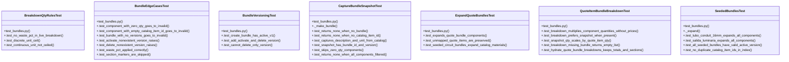

# Community 3

> 87 nodes · cohesion 0.05

## Key Concepts

- [bundles.py](file:///Users/macbook/ProjectTracker/tracker/bundles.py#L1) (24 connections)
- [create_bundle()](file:///Users/macbook/ProjectTracker/tracker/bundles.py#L267) (22 connections)
- [expand_quote_bundles()](file:///Users/macbook/ProjectTracker/tracker/bundles.py#L339) (19 connections)
- [bundle_by_catalog_item_id()](file:///Users/macbook/ProjectTracker/tracker/bundles.py#L96) (18 connections)
- [quotes_mobile.py](file:///Users/macbook/ProjectTracker/tracker/routes/quotes_mobile.py#L1) (16 connections)
- [quote_item_bundle_breakdown()](file:///Users/macbook/ProjectTracker/tracker/bundles.py#L148) (15 connections)
- [capture_bundle_snapshot()](file:///Users/macbook/ProjectTracker/tracker/bundles.py#L211) (13 connections)
- [normalize_bundle()](file:///Users/macbook/ProjectTracker/tracker/bundles.py#L46) (13 connections)
- [mobile_generate_pdf()](file:///Users/macbook/ProjectTracker/tracker/routes/quotes_mobile.py#L166) (12 connections)
- [normalize_component()](file:///Users/macbook/ProjectTracker/tracker/bundles.py#L72) (11 connections)
- [add_bundle_version()](file:///Users/macbook/ProjectTracker/tracker/bundles.py#L290) (10 connections)
- [_clean()](file:///Users/macbook/ProjectTracker/tracker/bundles.py#L42) (10 connections)
- [get_active_bundle_version()](file:///Users/macbook/ProjectTracker/tracker/bundles.py#L82) (10 connections)
- [delete_bundle_version()](file:///Users/macbook/ProjectTracker/tracker/bundles.py#L323) (9 connections)
- [hydrate_quote_bundle_breakdowns()](file:///Users/macbook/ProjectTracker/tracker/bundles.py#L193) (9 connections)
- [_safe_float()](file:///Users/macbook/ProjectTracker/tracker/bundles.py#L31) (9 connections)
- [BundleEdgeCasesTest](file:///Users/macbook/ProjectTracker/tests/test_bundles.py#L217) (9 connections)
- [CaptureBundleSnapshotTest](file:///Users/macbook/ProjectTracker/tests/test_bundles.py#L318) (8 connections)
- [test_bundles.py](file:///Users/macbook/ProjectTracker/tests/test_bundles.py#L1) (8 connections)
- [activate_bundle_version()](file:///Users/macbook/ProjectTracker/tracker/bundles.py#L306) (7 connections)
- [_hydrate_quote_for_display()](file:///Users/macbook/ProjectTracker/tracker/routes/quotes_mobile.py#L31) (7 connections)
- [mobile_items()](file:///Users/macbook/ProjectTracker/tracker/routes/quotes_mobile.py#L69) (7 connections)
- [SeededBundlesTest](file:///Users/macbook/ProjectTracker/tests/test_bundles.py#L165) (7 connections)
- [_component_row()](file:///Users/macbook/ProjectTracker/tracker/bundles.py#L120) (6 connections)
- [_find_project()](file:///Users/macbook/ProjectTracker/tracker/routes/quotes_mobile.py#L20) (6 connections)
- *... and 62 more nodes in this community*

## Class Diagram

```mermaid
classDiagram
    class BreakdownQtyRulesTest {
        +test_bundles.py()
        +.test_no_waste_pct_in_live_breakdown()
        +.test_discrete_unit_ceil()
        +.test_continuous_unit_not_ceiled()
    }
    class BundleEdgeCasesTest {
        +test_bundles.py()
        +.test_component_with_zero_qty_goes_to_invalid()
        +.test_component_with_empty_catalog_item_id_goes_to_invalid()
        +.test_bundle_with_no_versions_goes_to_invalid()
        +.test_activate_nonexistent_version_raises()
        +.test_delete_nonexistent_version_raises()
        +.test_waste_pct_applied_correctly()
        +.test_section_markers_are_skipped()
    }
    class BundleVersioningTest {
        +test_bundles.py()
        +.test_create_bundle_has_active_v1()
        +.test_add_activate_and_delete_version()
        +.test_cannot_delete_only_version()
    }
    class CaptureBundleSnapshotTest {
        +test_bundles.py()
        +._make_bundle()
        +.test_returns_none_when_no_bundle()
        +.test_returns_none_when_no_catalog_item_id()
        +.test_captures_description_and_unit_from_catalog()
        +.test_snapshot_has_bundle_id_and_version()
        +.test_skips_zero_qty_components()
        +.test_returns_none_when_all_components_filtered()
    }
    class ExpandQuoteBundlesTest {
        +test_bundles.py()
        +.test_expands_quote_bundle_components()
        +.test_unmapped_quote_items_are_preserved()
        +.test_seeded_circuit_bundles_expand_catalog_materials()
    }
    class QuoteItemBundleBreakdownTest {
        +test_bundles.py()
        +.test_breakdown_multiplies_component_quantities_without_prices()
        +.test_breakdown_prefers_snapshot_when_present()
        +.test_snapshot_qty_scales_by_quote_item_qty()
        +.test_breakdown_missing_bundle_returns_empty_list()
        +.test_hydrate_quote_bundle_breakdowns_keeps_totals_and_sections()
    }
    class SeededBundlesTest {
        +test_bundles.py()
        +._expand()
        +.test_tubo_conduit_16mm_expands_all_components()
        +.test_salida_luminaria_expands_all_components()
        +.test_all_seeded_bundles_have_valid_active_version()
        +.test_no_duplicate_catalog_item_ids_in_index()
    }
```

## Relationships

- No strong cross-community connections detected

## Source Files

- [/Users/macbook/ProjectTracker/tests/test_bundles.py](file:///Users/macbook/ProjectTracker/tests/test_bundles.py)
- [/Users/macbook/ProjectTracker/tracker/bundles.py](file:///Users/macbook/ProjectTracker/tracker/bundles.py)
- [/Users/macbook/ProjectTracker/tracker/routes/quotes_mobile.py](file:///Users/macbook/ProjectTracker/tracker/routes/quotes_mobile.py)

## Audit Trail

- EXTRACTED: 298 (66%)
- INFERRED: 156 (34%)
- AMBIGUOUS: 0 (0%)

---

*Part of the graphify knowledge wiki. See [[index]] to navigate.*