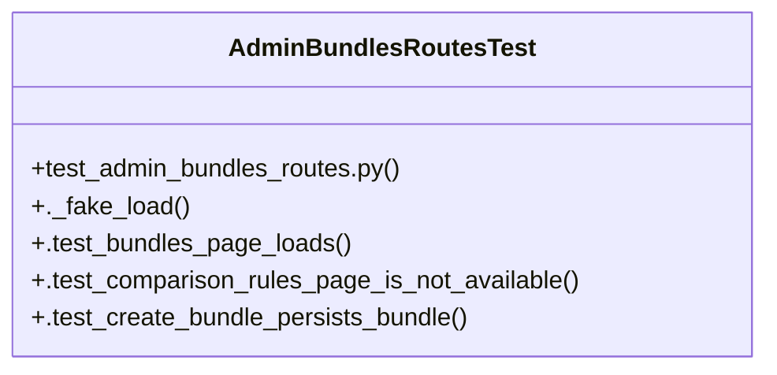

# Community 30

> 8 nodes · cohesion 0.25

## Key Concepts

- [AdminBundlesRoutesTest](file:///Users/macbook/ProjectTracker/tests/test_admin_bundles_routes.py#L14) (5 connections)
- [test_admin_bundles_routes.py](file:///Users/macbook/ProjectTracker/tests/test_admin_bundles_routes.py#L1) (3 connections)
- [._fake_load()](file:///Users/macbook/ProjectTracker/tests/test_admin_bundles_routes.py#L23) (1 connections)
- [.test_bundles_page_loads()](file:///Users/macbook/ProjectTracker/tests/test_admin_bundles_routes.py#L36) (1 connections)
- [.test_comparison_rules_page_is_not_available()](file:///Users/macbook/ProjectTracker/tests/test_admin_bundles_routes.py#L42) (1 connections)
- [.test_create_bundle_persists_bundle()](file:///Users/macbook/ProjectTracker/tests/test_admin_bundles_routes.py#L46) (1 connections)
- [Smoke tests de UI Admin para bundles.](file:///Users/macbook/ProjectTracker/tests/test_admin_bundles_routes.py#L1) (1 connections)
- [setUpClass()](file:///Users/macbook/ProjectTracker/tests/test_admin_bundles_routes.py#L16) (1 connections)

## Class Diagram

## Relationships

- No strong cross-community connections detected

## Source Files

- [/Users/macbook/ProjectTracker/tests/test_admin_bundles_routes.py](file:///Users/macbook/ProjectTracker/tests/test_admin_bundles_routes.py)

## Audit Trail

- EXTRACTED: 14 (100%)
- INFERRED: 0 (0%)
- AMBIGUOUS: 0 (0%)

---

*Part of the graphify knowledge wiki. See [[index]] to navigate.*