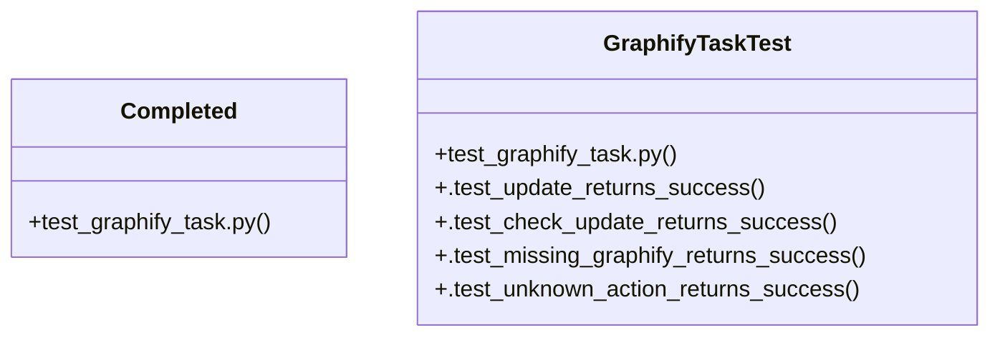

# Community 30

> 11 nodes · cohesion 0.29

## Key Concepts

- [main()](file:///Users/macbook/Documents/ProjectTracker/tools/check_syntax.py#L22) (6 connections)
- [GraphifyTaskTest](file:///Users/macbook/Documents/ProjectTracker/tests/test_graphify_task.py#L10) (5 connections)
- [Completed](file:///Users/macbook/Documents/ProjectTracker/tests/test_graphify_task.py#L6) (3 connections)
- [.test_check_update_returns_success()](file:///Users/macbook/Documents/ProjectTracker/tests/test_graphify_task.py#L24) (3 connections)
- [.test_update_returns_success()](file:///Users/macbook/Documents/ProjectTracker/tests/test_graphify_task.py#L12) (3 connections)
- [check_syntax.py](file:///Users/macbook/Documents/ProjectTracker/tools/check_syntax.py#L1) (3 connections)
- [iter_python_files()](file:///Users/macbook/Documents/ProjectTracker/tools/check_syntax.py#L12) (2 connections)
- [.test_missing_graphify_returns_success()](file:///Users/macbook/Documents/ProjectTracker/tests/test_graphify_task.py#L36) (2 connections)
- [.test_unknown_action_returns_success()](file:///Users/macbook/Documents/ProjectTracker/tests/test_graphify_task.py#L41) (2 connections)
- [test_graphify_task.py](file:///Users/macbook/Documents/ProjectTracker/tests/test_graphify_task.py#L1) (2 connections)
- [Parse project Python files without writing bytecode.](file:///Users/macbook/ProjectTracker/tools/check_syntax.py#L1) (1 connections)

## Class Diagram

```mermaid
classDiagram
    class Completed {
        +test_graphify_task.py()
    }
    class GraphifyTaskTest {
        +test_graphify_task.py()
        +.test_update_returns_success()
        +.test_check_update_returns_success()
        +.test_missing_graphify_returns_success()
        +.test_unknown_action_returns_success()
    }
```

## Relationships

- No strong cross-community connections detected

## Source Files

- [/Users/macbook/Documents/ProjectTracker/tests/test_graphify_task.py](file:///Users/macbook/Documents/ProjectTracker/tests/test_graphify_task.py)
- [/Users/macbook/Documents/ProjectTracker/tools/check_syntax.py](file:///Users/macbook/Documents/ProjectTracker/tools/check_syntax.py)
- [/Users/macbook/ProjectTracker/tools/check_syntax.py](file:///Users/macbook/ProjectTracker/tools/check_syntax.py)

## Audit Trail

- EXTRACTED: 24 (75%)
- INFERRED: 8 (25%)
- AMBIGUOUS: 0 (0%)

---

*Part of the graphify knowledge wiki. See [[index]] to navigate.*