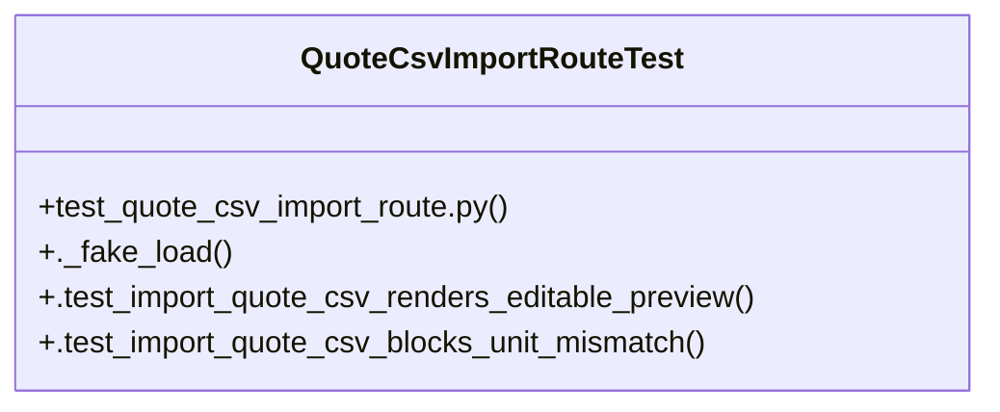

# Community 31

> 6 nodes · cohesion 0.33

## Key Concepts

- [QuoteCsvImportRouteTest](file:///Users/macbook/ProjectTracker/tests/test_quote_csv_import_route.py#L17) (4 connections)
- [test_quote_csv_import_route.py](file:///Users/macbook/ProjectTracker/tests/test_quote_csv_import_route.py#L1) (2 connections)
- [._fake_load()](file:///Users/macbook/ProjectTracker/tests/test_quote_csv_import_route.py#L27) (1 connections)
- [.test_import_quote_csv_blocks_unit_mismatch()](file:///Users/macbook/ProjectTracker/tests/test_quote_csv_import_route.py#L68) (1 connections)
- [.test_import_quote_csv_renders_editable_preview()](file:///Users/macbook/ProjectTracker/tests/test_quote_csv_import_route.py#L42) (1 connections)
- [setUpClass()](file:///Users/macbook/ProjectTracker/tests/test_quote_csv_import_route.py#L19) (1 connections)

## Class Diagram

## Relationships

- No strong cross-community connections detected

## Source Files

- [/Users/macbook/ProjectTracker/tests/test_quote_csv_import_route.py](file:///Users/macbook/ProjectTracker/tests/test_quote_csv_import_route.py)

## Audit Trail

- EXTRACTED: 10 (100%)
- INFERRED: 0 (0%)
- AMBIGUOUS: 0 (0%)

---

*Part of the graphify knowledge wiki. See [[index]] to navigate.*