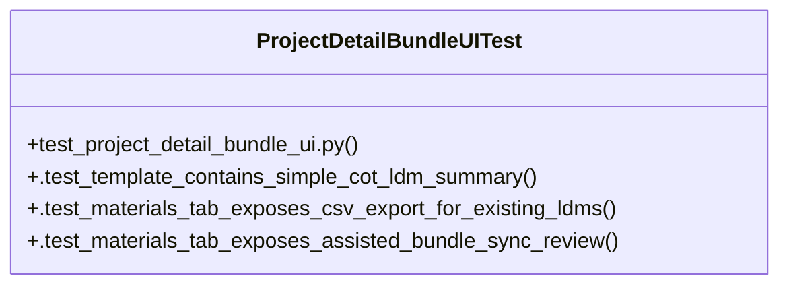

# Community 33

> 6 nodes · cohesion 0.33

## Key Concepts

- [ProjectDetailBundleUITest](file:///Users/macbook/ProjectTracker/tests/test_project_detail_bundle_ui.py#L7) (4 connections)
- [test_project_detail_bundle_ui.py](file:///Users/macbook/ProjectTracker/tests/test_project_detail_bundle_ui.py#L1) (2 connections)
- [.test_materials_tab_exposes_assisted_bundle_sync_review()](file:///Users/macbook/ProjectTracker/tests/test_project_detail_bundle_ui.py#L28) (1 connections)
- [.test_materials_tab_exposes_csv_export_for_existing_ldms()](file:///Users/macbook/ProjectTracker/tests/test_project_detail_bundle_ui.py#L22) (1 connections)
- [.test_template_contains_simple_cot_ldm_summary()](file:///Users/macbook/ProjectTracker/tests/test_project_detail_bundle_ui.py#L8) (1 connections)
- [Smoke tests for simplified project detail COT/LDM UI.](file:///Users/macbook/ProjectTracker/tests/test_project_detail_bundle_ui.py#L1) (1 connections)

## Class Diagram

## Relationships

- No strong cross-community connections detected

## Source Files

- [/Users/macbook/ProjectTracker/tests/test_project_detail_bundle_ui.py](file:///Users/macbook/ProjectTracker/tests/test_project_detail_bundle_ui.py)

## Audit Trail

- EXTRACTED: 10 (100%)
- INFERRED: 0 (0%)
- AMBIGUOUS: 0 (0%)

---

*Part of the graphify knowledge wiki. See [[index]] to navigate.*