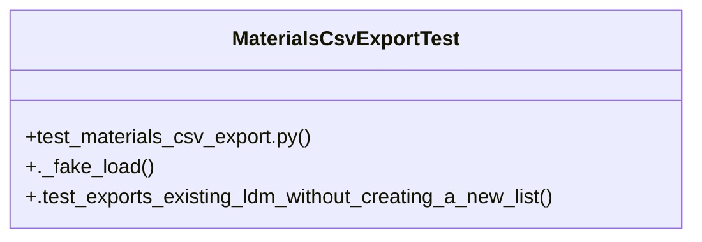

# Community 34

> 6 nodes · cohesion 0.33

## Key Concepts

- [MaterialsCsvExportTest](file:///Users/macbook/ProjectTracker/tests/test_materials_csv_export.py#L25) (3 connections)
- [test_materials_csv_export.py](file:///Users/macbook/ProjectTracker/tests/test_materials_csv_export.py#L1) (3 connections)
- [._fake_load()](file:///Users/macbook/ProjectTracker/tests/test_materials_csv_export.py#L35) (1 connections)
- [.test_exports_existing_ldm_without_creating_a_new_list()](file:///Users/macbook/ProjectTracker/tests/test_materials_csv_export.py#L42) (1 connections)
- [Tests for exporting an existing LDM as CSV.](file:///Users/macbook/ProjectTracker/tests/test_materials_csv_export.py#L1) (1 connections)
- [setUpClass()](file:///Users/macbook/ProjectTracker/tests/test_materials_csv_export.py#L27) (1 connections)

## Class Diagram

## Relationships

- No strong cross-community connections detected

## Source Files

- [/Users/macbook/ProjectTracker/tests/test_materials_csv_export.py](file:///Users/macbook/ProjectTracker/tests/test_materials_csv_export.py)

## Audit Trail

- EXTRACTED: 10 (100%)
- INFERRED: 0 (0%)
- AMBIGUOUS: 0 (0%)

---

*Part of the graphify knowledge wiki. See [[index]] to navigate.*