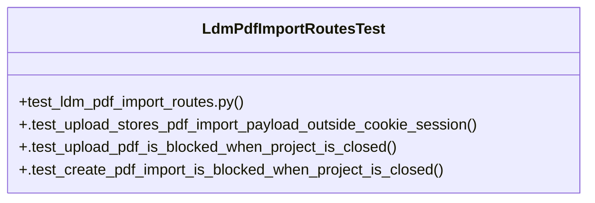

# Community 35

> 6 nodes · cohesion 0.33

## Key Concepts

- [LdmPdfImportRoutesTest](file:///Users/macbook/ProjectTracker/tests/test_ldm_pdf_import_routes.py#L14) (4 connections)
- [.test_upload_stores_pdf_import_payload_outside_cookie_session()](file:///Users/macbook/ProjectTracker/tests/test_ldm_pdf_import_routes.py#L24) (3 connections)
- [test_ldm_pdf_import_routes.py](file:///Users/macbook/ProjectTracker/tests/test_ldm_pdf_import_routes.py#L1) (2 connections)
- [.test_create_pdf_import_is_blocked_when_project_is_closed()](file:///Users/macbook/ProjectTracker/tests/test_ldm_pdf_import_routes.py#L83) (1 connections)
- [.test_upload_pdf_is_blocked_when_project_is_closed()](file:///Users/macbook/ProjectTracker/tests/test_ldm_pdf_import_routes.py#L68) (1 connections)
- [setUpClass()](file:///Users/macbook/ProjectTracker/tests/test_ldm_pdf_import_routes.py#L16) (1 connections)

## Class Diagram

## Relationships

- No strong cross-community connections detected

## Source Files

- [/Users/macbook/ProjectTracker/tests/test_ldm_pdf_import_routes.py](file:///Users/macbook/ProjectTracker/tests/test_ldm_pdf_import_routes.py)

## Audit Trail

- EXTRACTED: 10 (83%)
- INFERRED: 2 (17%)
- AMBIGUOUS: 0 (0%)

---

*Part of the graphify knowledge wiki. See [[index]] to navigate.*