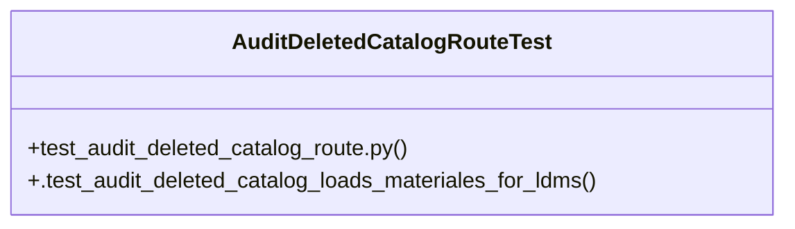

# Community 36

> 5 nodes · cohesion 0.40

## Key Concepts

- [test_audit_deleted_catalog_route.py](file:///Users/macbook/ProjectTracker/tests/test_audit_deleted_catalog_route.py#L1) (3 connections)
- [AuditDeletedCatalogRouteTest](file:///Users/macbook/ProjectTracker/tests/test_audit_deleted_catalog_route.py#L7) (2 connections)
- [.test_audit_deleted_catalog_loads_materiales_for_ldms()](file:///Users/macbook/ProjectTracker/tests/test_audit_deleted_catalog_route.py#L17) (1 connections)
- [Tests for the deleted catalog audit route.](file:///Users/macbook/ProjectTracker/tests/test_audit_deleted_catalog_route.py#L1) (1 connections)
- [setUpClass()](file:///Users/macbook/ProjectTracker/tests/test_audit_deleted_catalog_route.py#L9) (1 connections)

## Class Diagram

## Relationships

- No strong cross-community connections detected

## Source Files

- [/Users/macbook/ProjectTracker/tests/test_audit_deleted_catalog_route.py](file:///Users/macbook/ProjectTracker/tests/test_audit_deleted_catalog_route.py)

## Audit Trail

- EXTRACTED: 8 (100%)
- INFERRED: 0 (0%)
- AMBIGUOUS: 0 (0%)

---

*Part of the graphify knowledge wiki. See [[index]] to navigate.*